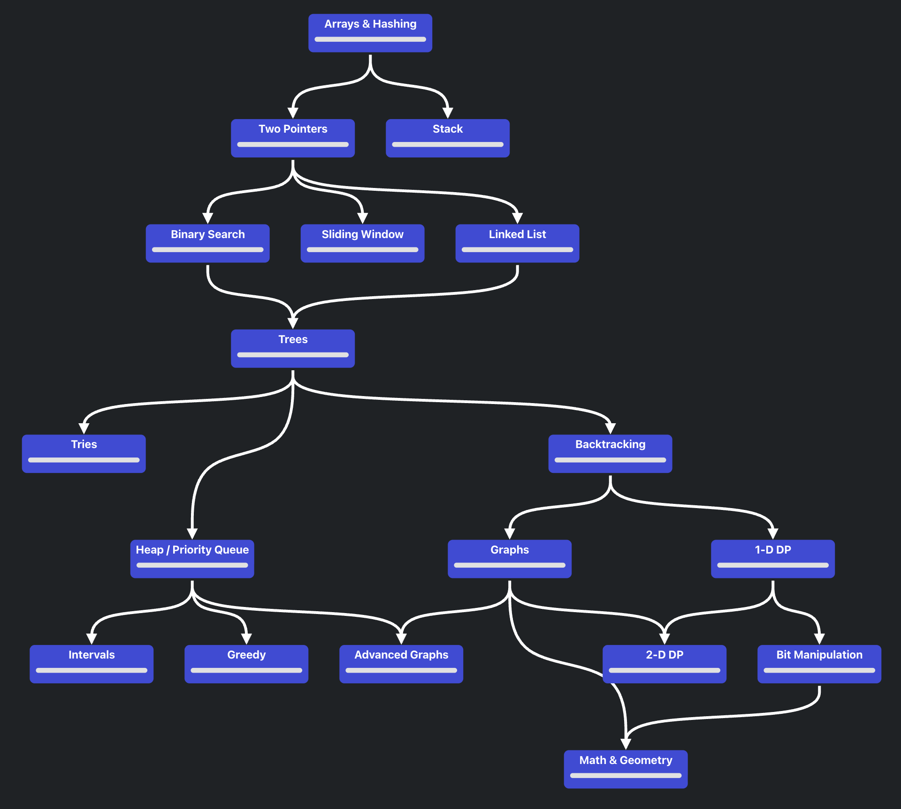
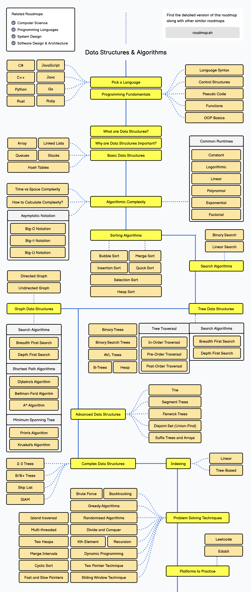

[#0000-00-overview]
[#overview]
= 总览

思考题：如何用代码实现针对代码计算其时间复杂度？

== 需要深入学习的问题

. 背包问题
. 滑动窗口算法
. 马拉车回文判定算法
. 树的迭代遍历（不使用递归）

== 附加题

. 将树打印到控制台。

[%hardbreaks]
如果问最短，最少，BFS
如果问连通性，静态就是 DFS、BFS，动态就 UF
如果问依赖性就 Topological Sort
DAG 的问题就 dfs + memo
矩阵和 Array 通常都是 DP
问数量的通常都是 DP
问是否可以，也很有可能 DP
求所有解的，基本 backtracking
排序总是可以想一想的
万事总可以想 HashMap
找规律试试 Stack

== 参考资料

. https://neetcode.io/roadmap[Roadmap^]
. https://roadmap.sh/datastructures-and-algorithms[Data Structures and Algorithms Roadmap^]

