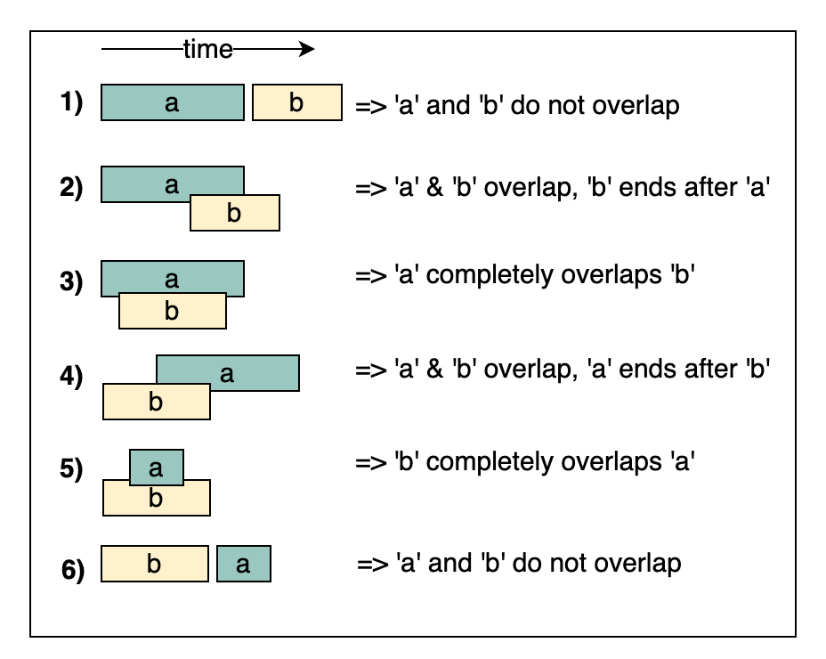

[#0000-04-merge-intervals]
= Merge Intervals 区间合并

区间合并模式是一个用来处理有区间重叠的很高效的技术。在涉及到区间的很多问题中，通常咱们需要要么判断是否有重叠，要么合并区间，如果他们重叠的话。这个模式是这么起作用的。

给两个区间，一个是 a，另外一个是 b。别小看就两个区间，他们之间的关系能跑出来6种情况。详细的就看图啦。

怎么识别啥时候用合并区间模式呀？

* 当你需要产生一堆相互之间没有交集的区间的时候
* 当你听到重叠区间的时候

== 经典题目

. xref:0056-merge-intervals.adoc[56. Merge Intervals]
. xref:0057-insert-interval.adoc[57. Insert Interval]
. xref:0986-interval-list-intersections.adoc[986. Interval List Intersections]
. xref:0223-rectangle-area.adoc[223. 矩形面积] -- 这道题不是区间合并类型的题目。但是，在处理相交面积时的手段和区间合并的手段是类似的！
. xref:0252-meeting-rooms.adoc[252. Meeting Rooms]
. xref:0253-meeting-rooms-ii.adoc[253. Meeting Rooms II]
. xref:0452-minimum-number-of-arrows-to-burst-balloons.adoc[452. Minimum Number of Arrows to Burst Balloons]
. xref:0759-employee-free-time.adoc[759. Employee Free Time]
. xref:0763-partition-labels.adoc[763. Partition Labels]
. xref:1094-car-pooling.adoc[1094. Car Pooling]

Conflicting Appointments (medium)
