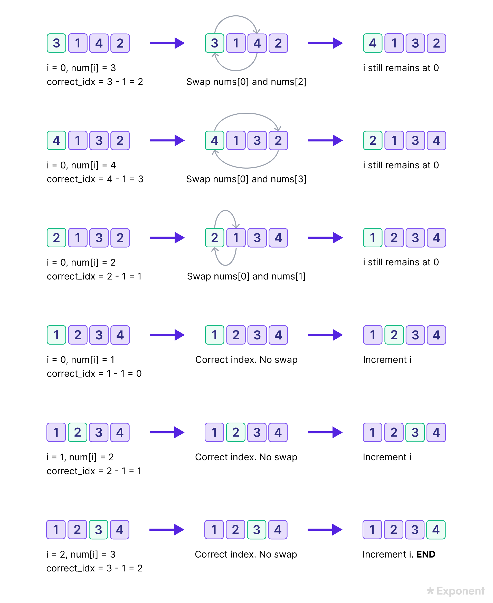

[#0000-12-cyclic-sort]
= Cyclic Sort 循环排序

这种模式讲述的是一直很好玩的方法：可以用来处理数组中的数值限定在一定的区间的问题。这种模式一个个遍历数组中的元素，如果当前这个数它不在其应该在的位置的话，咱们就把它和它应该在的那个位置上的数交换一下。你可以尝试将该数放到其正确的位置上，但这复杂度就会是O(n^2^)。这样的话，可能就不是最优解了。因此循环排序的优势就体现出来了。

循环排序适用的场景：

* 包含连续数字的数组（如 1 到 n 或 0 到 n-1）
* 需要找出缺失/重复数字的问题
* 需要原地排序且时间复杂度要求高的情况

怎么鉴别这种模式？

* 这些问题一般设计到排序好的数组，而且数值一般满足于一定的区间
* 如果问题让你需要在排好序/翻转过的数组中，寻找丢失的/重复的/最小的元素

== 代码模板

[{java_src_attr}]
----
include::{sortdir}/CyclicSort.java[tag=answer]
----

== 经典题目

. xref:0041-first-missing-positive.adoc[41. First Missing Positive]
. xref:0268-missing-number.adoc[268. Missing Number]
. xref:0287-find-the-duplicate-number.adoc[287. Find the Duplicate Number]
. xref:0442-find-all-duplicates-in-an-array.adoc[442. Find All Duplicates in an Array]
. xref:0448-find-all-numbers-disappeared-in-an-array.adoc[448. Find All Numbers Disappeared in an Array]
. xref:1539-kth-missing-positive-number.adoc[1539. Kth Missing Positive Number]

Cyclic Sort (easy)

Find the Missing Number (easy)

Find all Missing Numbers (easy)

Find the Duplicate Number (easy)

Find all Duplicate Numbers (easy)

== 参考资料

. https://www.tryexponent.com/courses/swe-practice/cyclic-sort[Cyclic Sort - Exponent^]
