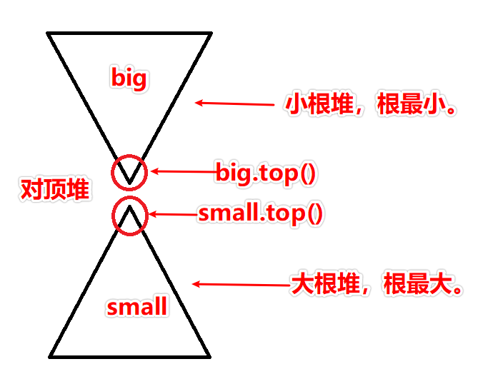
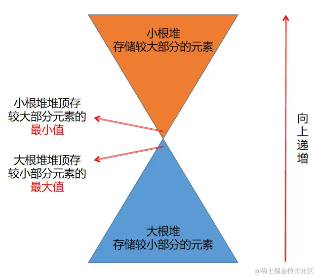
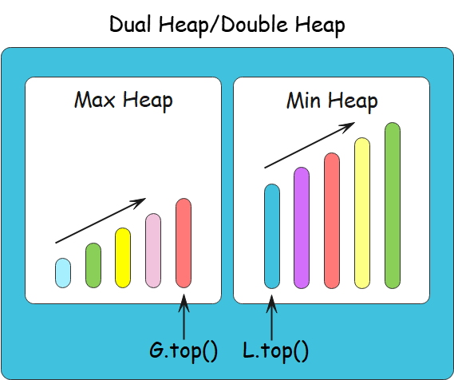

[#0000-13-two-heaps]
= Two Heaps 对顶堆

很多问题中，我们被告知，我们拿到一大把可以分成两队的数字。为了解决这个问题，我们感兴趣的是，怎么把数字分成两半？使得：小的数字都放在一起，大的放在另外一半。双堆模式就能高效解决此类问题。

正如名字所示，该模式用到了两个堆，是不是很难猜？一个最小堆用来找最小元素；一个最大堆，拿到最大元素。这种模式将一半的元素放在最大堆中，这样你可以从这一堆中秒找到最大元素。同理，把剩下一半丢到最小堆中，stem:[O(1)] 时间找到他们中的最小元素。通过这样的方式，这一大堆元素的中位数就可以从两个堆的堆顶拿到数字，从而计算出来。

NOTE: 从上面两个图可以看出，“对顶堆”这个名字更形象。所以，将本节标题也改一下。

判断双堆模式的秘诀：

* 这种模式在优先队列，计划安排问题（Scheduling）中有奇效
* 如果问题让你找一组数中的最大/最小/中位数
* 有时候，这种模式在涉及到二叉树数据结构时也特别有用

TIP: 每次添加，都要在两个堆之间倒腾一下，这样才能保证，小的沉下去，大的升上去。

== 经典题目

. xref:0295-find-median-from-data-stream.adoc[295. Find Median from Data Stream]
. xref:0436-find-right-interval.adoc[436. Find Right Interval]
. xref:0480-sliding-window-median.adoc[480. Sliding Window Median]
. xref:0502-ipo.adoc[502. IPO]

Find the Median of a Number Stream (medium)

Sliding Window Median (hard)

Maximize Capital (hard)

== 参考资料

. https://juejin.cn/post/7133856208842129422[求解中位数神器——对顶堆^]
