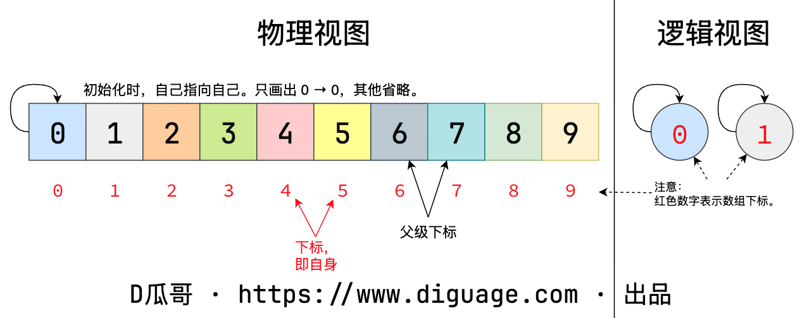
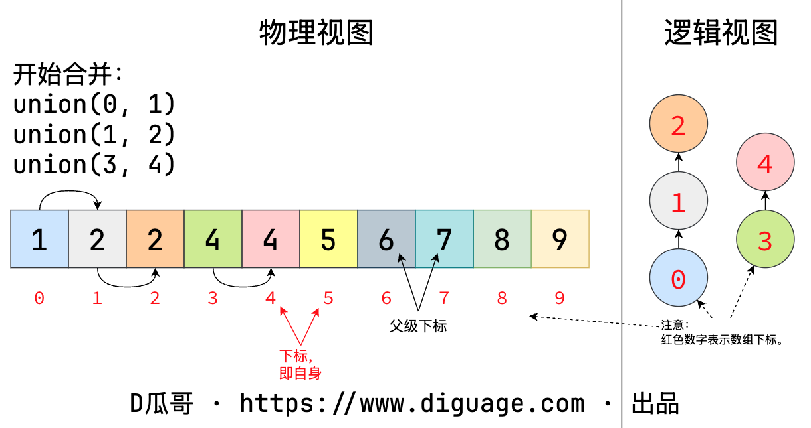
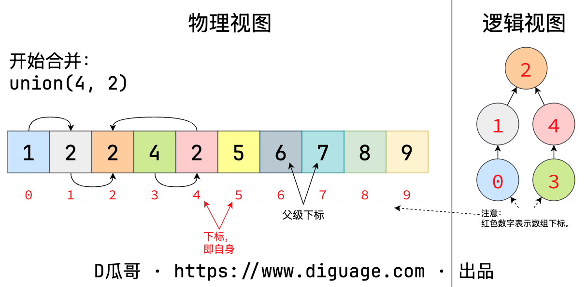
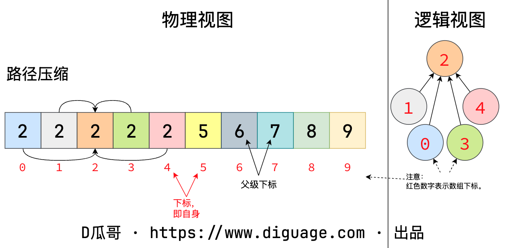

[#0000-18-union-find-set]
= Union Find Set 并查集

并查集算法，英文是 Union-Find，是解决动态连通性（Dynamic Conectivity）问题的一种算法。动态连通性是计算机图论中的一种数据结构，动态维护图结构中相连信息。简单的说就是，图中各个节点之间是否相连、如何将两个节点连接，连接后还剩多少个连通分量。

动态连通性其实可以抽象成给一幅图连线。假设用一个数组表示一堆节点，每个节点都是一个连通分量。初始化视图如下：

并查集的一个重要操作是 `union(a, b)`，就是将节点 `a` 和节点 `b` 建立连接。如图所示：

`union(a, b)` 还可以将已经建立的两个“子网”进行连接：

TIP: 在合并时，是修改根节点的指针 `parent[ap] = bp`，而不是修改节点的指针 `parent[a] = bp`。

并查集除了 `union`，还有一个重要操作是 `connnected(a, b)`。判断方法也很简单，从节点 `a` 和 `b` 开始，向上查找，直到两个节点的根节点，判断两个根节点是否相等即可判断两个节点是否已经连接。为了加快这个判断速度，可以对其进行“路径压缩”，直白点说，就是将所有树的节点，都直接指向根节点，这样只需要一步即可到达根节点。路径压缩如图所示：

简单代码实现如下：

[{java_src_attr}]
----
include::{labdir}/UnionFind.java[]
----

== 经典题目

. xref:0128-longest-consecutive-sequence.adoc[128. Longest Consecutive Sequence]
. xref:0130-surrounded-regions.adoc[130. Surrounded Regions]
. xref:0200-number-of-islands.adoc[200. Number of Islands]
. xref:0261-graph-valid-tree.adoc[261. Graph Valid Tree]
. xref:0305-number-of-islands-ii.adoc[305. Number of Islands II]
. xref:0323-number-of-connected-components-in-an-undirected-graph.adoc[323. Number of Connected Components in an Undirected Graph]
. xref:0399-evaluate-division.adoc[399. Evaluate Division]
. xref:0547-number-of-provinces.adoc[547. Number of Provinces]
. xref:0684-redundant-connection.adoc[684. Redundant Connection]
. xref:0685-redundant-connection-ii.adoc[685. Redundant Connection II]
. xref:0694-number-of-distinct-islands.adoc[694. Number of Distinct Islands]
. xref:0695-max-area-of-island.adoc[695. Max Area of Island]
. xref:0711-number-of-distinct-islands-ii.adoc[711. Number of Distinct Islands II]
. xref:0721-accounts-merge.adoc[721. Accounts Merge]
. xref:0737-sentence-similarity-ii.adoc[737. Sentence Similarity II]
. xref:0765-couples-holding-hands.adoc[765. Couples Holding Hands]
. xref:0778-swim-in-rising-water.adoc[778. Swim in Rising Water]
. xref:0785-is-graph-bipartite.adoc[785. Is Graph Bipartite?]
. xref:0803-bricks-falling-when-hit.adoc[803. Bricks Falling When Hit]
. xref:0827-making-a-large-island.adoc[827. Making A Large Island]
. xref:0839-similar-string-groups.adoc[839. Similar String Groups]
. xref:0886-possible-bipartition.adoc[886. Possible Bipartition]
. xref:0924-minimize-malware-spread.adoc[924. Minimize Malware Spread]
. xref:0928-minimize-malware-spread-ii.adoc[928. Minimize Malware Spread II]
. xref:0947-most-stones-removed-with-same-row-or-column.adoc[947. Most Stones Removed with Same Row or Column]
. xref:0952-largest-component-size-by-common-factor.adoc[952. Largest Component Size by Common Factor]
. xref:0959-regions-cut-by-slashes.adoc[959. Regions Cut By Slashes]
. xref:0990-satisfiability-of-equality-equations.adoc[990. Satisfiability of Equality Equations]
. xref:1020-number-of-enclaves.adoc[1020. Number of Enclaves]
. xref:1061-lexicographically-smallest-equivalent-string.adoc[1061. Lexicographically Smallest Equivalent String]
. xref:1101-the-earliest-moment-when-everyone-become-friends.adoc[1101. The Earliest Moment When Everyone Become Friends]
. xref:1102-path-with-maximum-minimum-value.adoc[1102. Path With Maximum Minimum Value]
. xref:1135-connecting-cities-with-minimum-cost.adoc[1135. Connecting Cities With Minimum Cost]
. xref:1168-optimize-water-distribution-in-a-village.adoc[1168. Optimize Water Distribution in a Village]
. xref:1202-smallest-string-with-swaps.adoc[1202. Smallest String With Swaps]
. xref:1254-number-of-closed-islands.adoc[1254. Number of Closed Islands]
. xref:1258-synonymous-sentences.adoc[1258. Synonymous Sentences]
. xref:1267-count-servers-that-communicate.adoc[1267. Count Servers that Communicate]
. xref:1319-number-of-operations-to-make-network-connected.adoc[1319. Number of Operations to Make Network Connected]
. xref:1361-validate-binary-tree-nodes.adoc[1361. Validate Binary Tree Nodes]
. xref:1391-check-if-there-is-a-valid-path-in-a-grid.adoc[1391. Check if There is a Valid Path in a Grid]
. xref:1489-find-critical-and-pseudo-critical-edges-in-minimum-spanning-tree.adoc[1489. Find Critical and Pseudo-Critical Edges in Minimum Spanning Tree]
. xref:1559-detect-cycles-in-2d-grid.adoc[1559. Detect Cycles in 2D Grid]
. xref:1569-number-of-ways-to-reorder-array-to-get-same-bst.adoc[1569. Number of Ways to Reorder Array to Get Same BST]
. xref:1579-remove-max-number-of-edges-to-keep-graph-fully-traversable.adoc[1579. Remove Max Number of Edges to Keep Graph Fully Traversable]
. xref:1584-min-cost-to-connect-all-points.adoc[1584. Min Cost to Connect All Points]
. xref:1627-graph-connectivity-with-threshold.adoc[1627. Graph Connectivity With Threshold]
. xref:1631-path-with-minimum-effort.adoc[1631. Path With Minimum Effort]
. xref:1632-rank-transform-of-a-matrix.adoc[1632. Rank Transform of a Matrix]
. xref:1697-checking-existence-of-edge-length-limited-paths.adoc[1697. Checking Existence of Edge Length Limited Paths]
. xref:1722-minimize-hamming-distance-after-swap-operations.adoc[1722. Minimize Hamming Distance After Swap Operations]
. xref:1724-checking-existence-of-edge-length-limited-paths-ii.adoc[1724. Checking Existence of Edge Length Limited Paths II]
. xref:1905-count-sub-islands.adoc[1905. Count Sub Islands]
. xref:1970-last-day-where-you-can-still-cross.adoc[1970. Last Day Where You Can Still Cross]
. xref:1971-find-if-path-exists-in-graph.adoc[1971. Find if Path Exists in Graph]
. xref:1998-gcd-sort-of-an-array.adoc[1998. GCD Sort of an Array]
. xref:2003-smallest-missing-genetic-value-in-each-subtree.adoc[2003. Smallest Missing Genetic Value in Each Subtree]
. xref:2076-process-restricted-friend-requests.adoc[2076. Process Restricted Friend Requests]
. xref:2092-find-all-people-with-secret.adoc[2092. Find All People With Secret]
. xref:2157-groups-of-strings.adoc[2157. Groups of Strings]
. xref:2204-distance-to-a-cycle-in-undirected-graph.adoc[2204. Distance to a Cycle in Undirected Graph]
. xref:2307-check-for-contradictions-in-equations.adoc[2307. Check for Contradictions in Equations]
. xref:2316-count-unreachable-pairs-of-nodes-in-an-undirected-graph.adoc[2316. Count Unreachable Pairs of Nodes in an Undirected Graph]
. xref:2334-subarray-with-elements-greater-than-varying-threshold.adoc[2334. Subarray With Elements Greater Than Varying Threshold]
. xref:2368-reachable-nodes-with-restrictions.adoc[2368. Reachable Nodes With Restrictions]
. xref:2371-minimize-maximum-value-in-a-grid.adoc[2371. Minimize Maximum Value in a Grid]
. xref:2382-maximum-segment-sum-after-removals.adoc[2382. Maximum Segment Sum After Removals]
. xref:2421-number-of-good-paths.adoc[2421. Number of Good Paths]
. xref:2424-longest-uploaded-prefix.adoc[2424. Longest Uploaded Prefix]
. xref:2492-minimum-score-of-a-path-between-two-cities.adoc[2492. Minimum Score of a Path Between Two Cities]
. xref:2493-divide-nodes-into-the-maximum-number-of-groups.adoc[2493. Divide Nodes Into the Maximum Number of Groups]
. xref:2503-maximum-number-of-points-from-grid-queries.adoc[2503. Maximum Number of Points From Grid Queries]
. xref:2573-find-the-string-with-lcp.adoc[2573. Find the String with LCP]
. xref:2617-minimum-number-of-visited-cells-in-a-grid.adoc[2617. Minimum Number of Visited Cells in a Grid]
. xref:2658-maximum-number-of-fish-in-a-grid.adoc[2658. Maximum Number of Fish in a Grid]
. xref:2685-count-the-number-of-complete-components.adoc[2685. Count the Number of Complete Components]
. xref:2709-greatest-common-divisor-traversal.adoc[2709. Greatest Common Divisor Traversal]
. xref:2782-number-of-unique-categories.adoc[2782. Number of Unique Categories]
. xref:2812-find-the-safest-path-in-a-grid.adoc[2812. Find the Safest Path in a Grid]
. xref:2852-sum-of-remoteness-of-all-cells.adoc[2852. Sum of Remoteness of All Cells]
. xref:2948-make-lexicographically-smallest-array-by-swapping-elements.adoc[2948. Make Lexicographically Smallest Array by Swapping Elements]
. xref:3108-minimum-cost-walk-in-weighted-graph.adoc[3108. Minimum Cost Walk in Weighted Graph]
. xref:3235-check-if-the-rectangle-corner-is-reachable.adoc[3235. Check if the Rectangle Corner Is Reachable]
. xref:3378-count-connected-components-in-lcm-graph.adoc[3378. Count Connected Components in LCM Graph]
. xref:3383-minimum-runes-to-add-to-cast-spell.adoc[3383. Minimum Runes to Add to Cast Spell]
. xref:3493-properties-graph.adoc[3493. Properties Graph]

== 参考资料

. https://leetcode.cn/problems/redundant-connection/solutions/372045/yi-wen-zhang-wo-bing-cha-ji-suan-fa-by-a-fei-8/[684. 冗余连接 - 一文掌握并查集算法^]
. https://blog.csdn.net/qq_57469718/article/details/125416286[并查集(Union-Find) (图文详解)^]
. https://www.cnblogs.com/gczr/p/12077934.html[Union-Find 并查集算法^]
