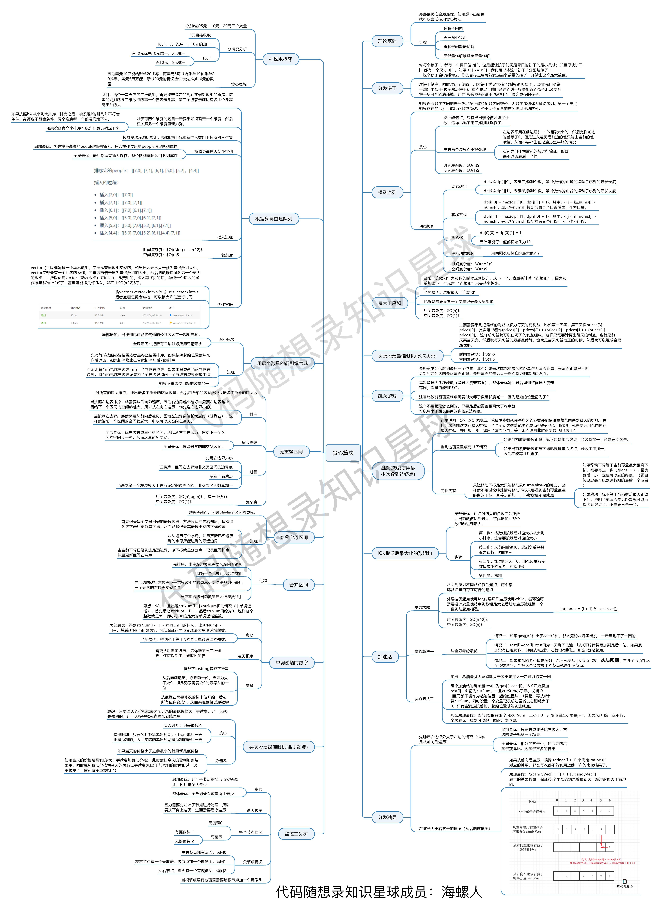

[#0000-27-greedy]
= Greedy Algorithms 贪心算法

== 经典例题

image::images/greedy-01.png[{image_attr}]

. xref:0011-container-with-most-water.adoc[11. Container With Most Water]
. xref:0044-wildcard-matching.adoc[44. Wildcard Matching]
. xref:0045-jump-game-ii.adoc[45. Jump Game II]
. xref:0055-jump-game.adoc[55. Jump Game]
. xref:0122-best-time-to-buy-and-sell-stock-ii.adoc[122. Best Time to Buy and Sell Stock II]
. xref:0134-gas-station.adoc[134. Gas Station]
. xref:0135-candy.adoc[135. Candy]
. xref:0179-largest-number.adoc[179. Largest Number]
. xref:0253-meeting-rooms-ii.adoc[253. Meeting Rooms II]
. xref:0280-wiggle-sort.adoc[280. Wiggle Sort]
. xref:0316-remove-duplicate-letters.adoc[316. Remove Duplicate Letters]
. xref:0321-create-maximum-number.adoc[321. Create Maximum Number]
. xref:0324-wiggle-sort-ii.adoc[324. Wiggle Sort II]
. xref:0330-patching-array.adoc[330. Patching Array]
. xref:0334-increasing-triplet-subsequence.adoc[334. Increasing Triplet Subsequence]
. xref:0358-rearrange-string-k-distance-apart.adoc[358. Rearrange String k Distance Apart]
. xref:0376-wiggle-subsequence.adoc[376. Wiggle Subsequence]
. xref:0397-integer-replacement.adoc[397. Integer Replacement]
. xref:0402-remove-k-digits.adoc[402. Remove K Digits]
. xref:0406-queue-reconstruction-by-height.adoc[406. Queue Reconstruction by Height]
. xref:0409-longest-palindrome.adoc[409. Longest Palindrome]
. xref:0410-split-array-largest-sum.adoc[410. Split Array Largest Sum]
. xref:0420-strong-password-checker.adoc[420. Strong Password Checker]
. xref:0435-non-overlapping-intervals.adoc[435. Non-overlapping Intervals]
. xref:0452-minimum-number-of-arrows-to-burst-balloons.adoc[452. Minimum Number of Arrows to Burst Balloons]
. xref:0455-assign-cookies.adoc[455. Assign Cookies]
. xref:0484-find-permutation.adoc[484. Find Permutation]
. xref:0502-ipo.adoc[502. IPO]
. xref:0517-super-washing-machines.adoc[517. Super Washing Machines]
. xref:0527-word-abbreviation.adoc[527. Word Abbreviation]
. xref:0555-split-concatenated-strings.adoc[555. Split Concatenated Strings]
. xref:0561-array-partition.adoc[561. Array Partition]
. xref:0581-shortest-unsorted-continuous-subarray.adoc[581. Shortest Unsorted Continuous Subarray]
. xref:0605-can-place-flowers.adoc[605. Can Place Flowers]
. xref:0611-valid-triangle-number.adoc[611. Valid Triangle Number]
. xref:0621-task-scheduler.adoc[621. Task Scheduler]
. xref:0624-maximum-distance-in-arrays.adoc[624. Maximum Distance in Arrays]
. xref:0625-minimum-factorization.adoc[625. Minimum Factorization]
. xref:0630-course-schedule-iii.adoc[630. Course Schedule III]
. xref:0632-smallest-range-covering-elements-from-k-lists.adoc[632. Smallest Range Covering Elements from K Lists]
. xref:0646-maximum-length-of-pair-chain.adoc[646. Maximum Length of Pair Chain]
. xref:0649-dota2-senate.adoc[649. Dota2 Senate]
. xref:0659-split-array-into-consecutive-subsequences.adoc[659. Split Array into Consecutive Subsequences]
. xref:0670-maximum-swap.adoc[670. Maximum Swap]
. xref:0678-valid-parenthesis-string.adoc[678. Valid Parenthesis String]
. xref:0680-valid-palindrome-ii.adoc[680. Valid Palindrome II]
. xref:0714-best-time-to-buy-and-sell-stock-with-transaction-fee.adoc[714. Best Time to Buy and Sell Stock with Transaction Fee]
. xref:0738-monotone-increasing-digits.adoc[738. Monotone Increasing Digits]
. xref:0757-set-intersection-size-at-least-two.adoc[757. Set Intersection Size At Least Two]
. xref:0763-partition-labels.adoc[763. Partition Labels]
. xref:0765-couples-holding-hands.adoc[765. Couples Holding Hands]
. xref:0767-reorganize-string.adoc[767. Reorganize String]
. xref:0768-max-chunks-to-make-sorted-ii.adoc[768. Max Chunks To Make Sorted II]
. xref:0769-max-chunks-to-make-sorted.adoc[769. Max Chunks To Make Sorted]
. xref:0781-rabbits-in-forest.adoc[781. Rabbits in Forest]
. xref:0807-max-increase-to-keep-city-skyline.adoc[807. Max Increase to Keep City Skyline]
. xref:0826-most-profit-assigning-work.adoc[826. Most Profit Assigning Work]
. xref:0846-hand-of-straights.adoc[846. Hand of Straights]
. xref:0857-minimum-cost-to-hire-k-workers.adoc[857. Minimum Cost to Hire K Workers]
. xref:0860-lemonade-change.adoc[860. Lemonade Change]
. xref:0861-score-after-flipping-matrix.adoc[861. Score After Flipping Matrix]
. xref:0870-advantage-shuffle.adoc[870. Advantage Shuffle]
. xref:0871-minimum-number-of-refueling-stops.adoc[871. Minimum Number of Refueling Stops]
. xref:0881-boats-to-save-people.adoc[881. Boats to Save People]
. xref:0910-smallest-range-ii.adoc[910. Smallest Range II]
. xref:0921-minimum-add-to-make-parentheses-valid.adoc[921. Minimum Add to Make Parentheses Valid]
. xref:0936-stamping-the-sequence.adoc[936. Stamping The Sequence]
. xref:0942-di-string-match.adoc[942. DI String Match]
. xref:0945-minimum-increment-to-make-array-unique.adoc[945. Minimum Increment to Make Array Unique]
. xref:0948-bag-of-tokens.adoc[948. Bag of Tokens]
. xref:0954-array-of-doubled-pairs.adoc[954. Array of Doubled Pairs]
. xref:0955-delete-columns-to-make-sorted-ii.adoc[955. Delete Columns to Make Sorted II]
. xref:0969-pancake-sorting.adoc[969. Pancake Sorting]
. xref:0976-largest-perimeter-triangle.adoc[976. Largest Perimeter Triangle]
. xref:0984-string-without-aaa-or-bbb.adoc[984. String Without AAA or BBB]
. xref:0991-broken-calculator.adoc[991. Broken Calculator]
. xref:1005-maximize-sum-of-array-after-k-negations.adoc[1005. Maximize Sum Of Array After K Negations]
. xref:1007-minimum-domino-rotations-for-equal-row.adoc[1007. Minimum Domino Rotations For Equal Row]
. xref:1013-partition-array-into-three-parts-with-equal-sum.adoc[1013. Partition Array Into Three Parts With Equal Sum]
. xref:1024-video-stitching.adoc[1024. Video Stitching]
. xref:1029-two-city-scheduling.adoc[1029. Two City Scheduling]
. xref:1053-previous-permutation-with-one-swap.adoc[1053. Previous Permutation With One Swap]
. xref:1054-distant-barcodes.adoc[1054. Distant Barcodes]
. xref:1055-shortest-way-to-form-string.adoc[1055. Shortest Way to Form String]
. xref:1058-minimize-rounding-error-to-meet-target.adoc[1058. Minimize Rounding Error to Meet Target]
. xref:1081-smallest-subsequence-of-distinct-characters.adoc[1081. Smallest Subsequence of Distinct Characters]
. xref:1090-largest-values-from-labels.adoc[1090. Largest Values From Labels]
. xref:1130-minimum-cost-tree-from-leaf-values.adoc[1130. Minimum Cost Tree From Leaf Values]
. xref:1144-decrease-elements-to-make-array-zigzag.adoc[1144. Decrease Elements To Make Array Zigzag]
. xref:1147-longest-chunked-palindrome-decomposition.adoc[1147. Longest Chunked Palindrome Decomposition]
. xref:1167-minimum-cost-to-connect-sticks.adoc[1167. Minimum Cost to Connect Sticks]
. xref:1183-maximum-number-of-ones.adoc[1183. Maximum Number of Ones]
. xref:1196-how-many-apples-can-you-put-into-the-basket.adoc[1196. How Many Apples Can You Put into the Basket]
. xref:1199-minimum-time-to-build-blocks.adoc[1199. Minimum Time to Build Blocks]
. xref:1217-minimum-cost-to-move-chips-to-the-same-position.adoc[1217. Minimum Cost to Move Chips to The Same Position]
. xref:1221-split-a-string-in-balanced-strings.adoc[1221. Split a String in Balanced Strings]
. xref:1247-minimum-swaps-to-make-strings-equal.adoc[1247. Minimum Swaps to Make Strings Equal]
. xref:1253-reconstruct-a-2-row-binary-matrix.adoc[1253. Reconstruct a 2-Row Binary Matrix]
. xref:1262-greatest-sum-divisible-by-three.adoc[1262. Greatest Sum Divisible by Three]
. xref:1282-group-the-people-given-the-group-size-they-belong-to.adoc[1282. Group the People Given the Group Size They Belong To]
. xref:1296-divide-array-in-sets-of-k-consecutive-numbers.adoc[1296. Divide Array in Sets of K Consecutive Numbers]
. xref:1323-maximum-69-number.adoc[1323. Maximum 69 Number]
. xref:1326-minimum-number-of-taps-to-open-to-water-a-garden.adoc[1326. Minimum Number of Taps to Open to Water a Garden]
. xref:1328-break-a-palindrome.adoc[1328. Break a Palindrome]
. xref:1330-reverse-subarray-to-maximize-array-value.adoc[1330. Reverse Subarray To Maximize Array Value]
. xref:1338-reduce-array-size-to-the-half.adoc[1338. Reduce Array Size to The Half]
. xref:1353-maximum-number-of-events-that-can-be-attended.adoc[1353. Maximum Number of Events That Can Be Attended]
. xref:1363-largest-multiple-of-three.adoc[1363. Largest Multiple of Three]
. xref:1382-balance-a-binary-search-tree.adoc[1382. Balance a Binary Search Tree]
. xref:1383-maximum-performance-of-a-team.adoc[1383. Maximum Performance of a Team]
. xref:1386-cinema-seat-allocation.adoc[1386. Cinema Seat Allocation]
. xref:1388-pizza-with-3n-slices.adoc[1388. Pizza With 3n Slices]
. xref:1400-construct-k-palindrome-strings.adoc[1400. Construct K Palindrome Strings]
. xref:1402-reducing-dishes.adoc[1402. Reducing Dishes]
. xref:1403-minimum-subsequence-in-non-increasing-order.adoc[1403. Minimum Subsequence in Non-Increasing Order]
. xref:1405-longest-happy-string.adoc[1405. Longest Happy String]
. xref:1414-find-the-minimum-number-of-fibonacci-numbers-whose-sum-is-k.adoc[1414. Find the Minimum Number of Fibonacci Numbers Whose Sum Is K]
. xref:1432-max-difference-you-can-get-from-changing-an-integer.adoc[1432. Max Difference You Can Get From Changing an Integer]
. xref:1433-check-if-a-string-can-break-another-string.adoc[1433. Check If a String Can Break Another String]
. xref:1465-maximum-area-of-a-piece-of-cake-after-horizontal-and-vertical-cuts.adoc[1465. Maximum Area of a Piece of Cake After Horizontal and Vertical Cuts]
. xref:1481-least-number-of-unique-integers-after-k-removals.adoc[1481. Least Number of Unique Integers after K Removals]
. xref:1488-avoid-flood-in-the-city.adoc[1488. Avoid Flood in The City]
. xref:1505-minimum-possible-integer-after-at-most-k-adjacent-swaps-on-digits.adoc[1505. Minimum Possible Integer After at Most K Adjacent Swaps On Digits]
. xref:1509-minimum-difference-between-largest-and-smallest-value-in-three-moves.adoc[1509. Minimum Difference Between Largest and Smallest Value in Three Moves]
. xref:1520-maximum-number-of-non-overlapping-substrings.adoc[1520. Maximum Number of Non-Overlapping Substrings]
. xref:1526-minimum-number-of-increments-on-subarrays-to-form-a-target-array.adoc[1526. Minimum Number of Increments on Subarrays to Form a Target Array]
. xref:1529-minimum-suffix-flips.adoc[1529. Minimum Suffix Flips]
. xref:1536-minimum-swaps-to-arrange-a-binary-grid.adoc[1536. Minimum Swaps to Arrange a Binary Grid]
. xref:1537-get-the-maximum-score.adoc[1537. Get the Maximum Score]
. xref:1541-minimum-insertions-to-balance-a-parentheses-string.adoc[1541. Minimum Insertions to Balance a Parentheses String]
. xref:1546-maximum-number-of-non-overlapping-subarrays-with-sum-equals-target.adoc[1546. Maximum Number of Non-Overlapping Subarrays With Sum Equals Target]
. xref:1558-minimum-numbers-of-function-calls-to-make-target-array.adoc[1558. Minimum Numbers of Function Calls to Make Target Array]
. xref:1561-maximum-number-of-coins-you-can-get.adoc[1561. Maximum Number of Coins You Can Get]
. xref:1564-put-boxes-into-the-warehouse-i.adoc[1564. Put Boxes Into the Warehouse I]
. xref:1567-maximum-length-of-subarray-with-positive-product.adoc[1567. Maximum Length of Subarray With Positive Product]
. xref:1578-minimum-time-to-make-rope-colorful.adoc[1578. Minimum Time to Make Rope Colorful]
. xref:1580-put-boxes-into-the-warehouse-ii.adoc[1580. Put Boxes Into the Warehouse II]
. xref:1585-check-if-string-is-transformable-with-substring-sort-operations.adoc[1585. Check If String Is Transformable With Substring Sort Operations]
. xref:1589-maximum-sum-obtained-of-any-permutation.adoc[1589. Maximum Sum Obtained of Any Permutation]
. xref:1605-find-valid-matrix-given-row-and-column-sums.adoc[1605. Find Valid Matrix Given Row and Column Sums]
. xref:1606-find-servers-that-handled-most-number-of-requests.adoc[1606. Find Servers That Handled Most Number of Requests]
. xref:1642-furthest-building-you-can-reach.adoc[1642. Furthest Building You Can Reach]
. xref:1647-minimum-deletions-to-make-character-frequencies-unique.adoc[1647. Minimum Deletions to Make Character Frequencies Unique]
. xref:1648-sell-diminishing-valued-colored-balls.adoc[1648. Sell Diminishing-Valued Colored Balls]
. xref:1663-smallest-string-with-a-given-numeric-value.adoc[1663. Smallest String With A Given Numeric Value]
. xref:1665-minimum-initial-energy-to-finish-tasks.adoc[1665. Minimum Initial Energy to Finish Tasks]
. xref:1671-minimum-number-of-removals-to-make-mountain-array.adoc[1671. Minimum Number of Removals to Make Mountain Array]
. xref:1673-find-the-most-competitive-subsequence.adoc[1673. Find the Most Competitive Subsequence]
. xref:1675-minimize-deviation-in-array.adoc[1675. Minimize Deviation in Array]
. xref:1686-stone-game-vi.adoc[1686. Stone Game VI]
. xref:1689-partitioning-into-minimum-number-of-deci-binary-numbers.adoc[1689. Partitioning Into Minimum Number Of Deci-Binary Numbers]
. xref:1702-maximum-binary-string-after-change.adoc[1702. Maximum Binary String After Change]
. xref:1703-minimum-adjacent-swaps-for-k-consecutive-ones.adoc[1703. Minimum Adjacent Swaps for K Consecutive Ones]
. xref:1705-maximum-number-of-eaten-apples.adoc[1705. Maximum Number of Eaten Apples]
. xref:1708-largest-subarray-length-k.adoc[1708. Largest Subarray Length K]
. xref:1710-maximum-units-on-a-truck.adoc[1710. Maximum Units on a Truck]
. xref:1713-minimum-operations-to-make-a-subsequence.adoc[1713. Minimum Operations to Make a Subsequence]
. xref:1717-maximum-score-from-removing-substrings.adoc[1717. Maximum Score From Removing Substrings]
. xref:1727-largest-submatrix-with-rearrangements.adoc[1727. Largest Submatrix With Rearrangements]
. xref:1733-minimum-number-of-people-to-teach.adoc[1733. Minimum Number of People to Teach]
. xref:1736-latest-time-by-replacing-hidden-digits.adoc[1736. Latest Time by Replacing Hidden Digits]
. xref:1739-building-boxes.adoc[1739. Building Boxes]
. xref:1753-maximum-score-from-removing-stones.adoc[1753. Maximum Score From Removing Stones]
. xref:1754-largest-merge-of-two-strings.adoc[1754. Largest Merge Of Two Strings]
. xref:1764-form-array-by-concatenating-subarrays-of-another-array.adoc[1764. Form Array by Concatenating Subarrays of Another Array]
. xref:1775-equal-sum-arrays-with-minimum-number-of-operations.adoc[1775. Equal Sum Arrays With Minimum Number of Operations]
. xref:1785-minimum-elements-to-add-to-form-a-given-sum.adoc[1785. Minimum Elements to Add to Form a Given Sum]
. xref:1788-maximize-the-beauty-of-the-garden.adoc[1788. Maximize the Beauty of the Garden]
. xref:1792-maximum-average-pass-ratio.adoc[1792. Maximum Average Pass Ratio]
. xref:1794-count-pairs-of-equal-substrings-with-minimum-difference.adoc[1794. Count Pairs of Equal Substrings With Minimum Difference]
. xref:1798-maximum-number-of-consecutive-values-you-can-make.adoc[1798. Maximum Number of Consecutive Values You Can Make]
. xref:1802-maximum-value-at-a-given-index-in-a-bounded-array.adoc[1802. Maximum Value at a Given Index in a Bounded Array]
. xref:1824-minimum-sideway-jumps.adoc[1824. Minimum Sideway Jumps]
. xref:1827-minimum-operations-to-make-the-array-increasing.adoc[1827. Minimum Operations to Make the Array Increasing]
. xref:1833-maximum-ice-cream-bars.adoc[1833. Maximum Ice Cream Bars]
. xref:1838-frequency-of-the-most-frequent-element.adoc[1838. Frequency of the Most Frequent Element]
. xref:1846-maximum-element-after-decreasing-and-rearranging.adoc[1846. Maximum Element After Decreasing and Rearranging]
. xref:1850-minimum-adjacent-swaps-to-reach-the-kth-smallest-number.adoc[1850. Minimum Adjacent Swaps to Reach the Kth Smallest Number]
. xref:1864-minimum-number-of-swaps-to-make-the-binary-string-alternating.adoc[1864. Minimum Number of Swaps to Make the Binary String Alternating]
. xref:1874-minimize-product-sum-of-two-arrays.adoc[1874. Minimize Product Sum of Two Arrays]
. xref:1877-minimize-maximum-pair-sum-in-array.adoc[1877. Minimize Maximum Pair Sum in Array]
. xref:1881-maximum-value-after-insertion.adoc[1881. Maximum Value after Insertion]
. xref:1888-minimum-number-of-flips-to-make-the-binary-string-alternating.adoc[1888. Minimum Number of Flips to Make the Binary String Alternating]
. xref:1899-merge-triplets-to-form-target-triplet.adoc[1899. Merge Triplets to Form Target Triplet]
. xref:1903-largest-odd-number-in-string.adoc[1903. Largest Odd Number in String]
. xref:1921-eliminate-maximum-number-of-monsters.adoc[1921. Eliminate Maximum Number of Monsters]
. xref:1927-sum-game.adoc[1927. Sum Game]
. xref:1936-add-minimum-number-of-rungs.adoc[1936. Add Minimum Number of Rungs]
. xref:1946-largest-number-after-mutating-substring.adoc[1946. Largest Number After Mutating Substring]
. xref:1953-maximum-number-of-weeks-for-which-you-can-work.adoc[1953. Maximum Number of Weeks for Which You Can Work]
. xref:1962-remove-stones-to-minimize-the-total.adoc[1962. Remove Stones to Minimize the Total]
. xref:1963-minimum-number-of-swaps-to-make-the-string-balanced.adoc[1963. Minimum Number of Swaps to Make the String Balanced]
. xref:1968-array-with-elements-not-equal-to-average-of-neighbors.adoc[1968. Array With Elements Not Equal to Average of Neighbors]
. xref:1969-minimum-non-zero-product-of-the-array-elements.adoc[1969. Minimum Non-Zero Product of the Array Elements]
. xref:1974-minimum-time-to-type-word-using-special-typewriter.adoc[1974. Minimum Time to Type Word Using Special Typewriter]
. xref:1975-maximum-matrix-sum.adoc[1975. Maximum Matrix Sum]
. xref:1989-maximum-number-of-people-that-can-be-caught-in-tag.adoc[1989. Maximum Number of People That Can Be Caught in Tag]
. xref:1996-the-number-of-weak-characters-in-the-game.adoc[1996. The Number of Weak Characters in the Game]
. xref:2007-find-original-array-from-doubled-array.adoc[2007. Find Original Array From Doubled Array]
. xref:2014-longest-subsequence-repeated-k-times.adoc[2014. Longest Subsequence Repeated k Times]
. xref:2015-average-height-of-buildings-in-each-segment.adoc[2015. Average Height of Buildings in Each Segment]
. xref:2027-minimum-moves-to-convert-string.adoc[2027. Minimum Moves to Convert String]
. xref:2029-stone-game-ix.adoc[2029. Stone Game IX]
. xref:2030-smallest-k-length-subsequence-with-occurrences-of-a-letter.adoc[2030. Smallest K-Length Subsequence With Occurrences of a Letter]
. xref:2037-minimum-number-of-moves-to-seat-everyone.adoc[2037. Minimum Number of Moves to Seat Everyone]
. xref:2038-remove-colored-pieces-if-both-neighbors-are-the-same-color.adoc[2038. Remove Colored Pieces if Both Neighbors are the Same Color]
. xref:2064-minimized-maximum-of-products-distributed-to-any-store.adoc[2064. Minimized Maximum of Products Distributed to Any Store]
. xref:2071-maximum-number-of-tasks-you-can-assign.adoc[2071. Maximum Number of Tasks You Can Assign]
. xref:2078-two-furthest-houses-with-different-colors.adoc[2078. Two Furthest Houses With Different Colors]
. xref:2086-minimum-number-of-food-buckets-to-feed-the-hamsters.adoc[2086. Minimum Number of Food Buckets to Feed the Hamsters]
. xref:2087-minimum-cost-homecoming-of-a-robot-in-a-grid.adoc[2087. Minimum Cost Homecoming of a Robot in a Grid]
. xref:2091-removing-minimum-and-maximum-from-array.adoc[2091. Removing Minimum and Maximum From Array]
. xref:2098-subsequence-of-size-k-with-the-largest-even-sum.adoc[2098. Subsequence of Size K With the Largest Even Sum]
. xref:2116-check-if-a-parentheses-string-can-be-valid.adoc[2116. Check if a Parentheses String Can Be Valid]
. xref:2126-destroying-asteroids.adoc[2126. Destroying Asteroids]
. xref:2131-longest-palindrome-by-concatenating-two-letter-words.adoc[2131. Longest Palindrome by Concatenating Two Letter Words]
. xref:2132-stamping-the-grid.adoc[2132. Stamping the Grid]
. xref:2136-earliest-possible-day-of-full-bloom.adoc[2136. Earliest Possible Day of Full Bloom]
. xref:2139-minimum-moves-to-reach-target-score.adoc[2139. Minimum Moves to Reach Target Score]
. xref:2141-maximum-running-time-of-n-computers.adoc[2141. Maximum Running Time of N Computers]
. xref:2144-minimum-cost-of-buying-candies-with-discount.adoc[2144. Minimum Cost of Buying Candies With Discount]
. xref:2160-minimum-sum-of-four-digit-number-after-splitting-digits.adoc[2160. Minimum Sum of Four Digit Number After Splitting Digits]
. xref:2170-minimum-operations-to-make-the-array-alternating.adoc[2170. Minimum Operations to Make the Array Alternating]
. xref:2171-removing-minimum-number-of-magic-beans.adoc[2171. Removing Minimum Number of Magic Beans]
. xref:2178-maximum-split-of-positive-even-integers.adoc[2178. Maximum Split of Positive Even Integers]
. xref:2182-construct-string-with-repeat-limit.adoc[2182. Construct String With Repeat Limit]
. xref:2193-minimum-number-of-moves-to-make-palindrome.adoc[2193. Minimum Number of Moves to Make Palindrome]
. xref:2195-append-k-integers-with-minimal-sum.adoc[2195. Append K Integers With Minimal Sum]
. xref:2202-maximize-the-topmost-element-after-k-moves.adoc[2202. Maximize the Topmost Element After K Moves]
. xref:2207-maximize-number-of-subsequences-in-a-string.adoc[2207. Maximize Number of Subsequences in a String]
. xref:2208-minimum-operations-to-halve-array-sum.adoc[2208. Minimum Operations to Halve Array Sum]
. xref:2214-minimum-health-to-beat-game.adoc[2214. Minimum Health to Beat Game]
. xref:2216-minimum-deletions-to-make-array-beautiful.adoc[2216. Minimum Deletions to Make Array Beautiful]
. xref:2224-minimum-number-of-operations-to-convert-time.adoc[2224. Minimum Number of Operations to Convert Time]
. xref:2233-maximum-product-after-k-increments.adoc[2233. Maximum Product After K Increments]
. xref:2234-maximum-total-beauty-of-the-gardens.adoc[2234. Maximum Total Beauty of the Gardens]
. xref:2241-design-an-atm-machine.adoc[2241. Design an ATM Machine]
. xref:2244-minimum-rounds-to-complete-all-tasks.adoc[2244. Minimum Rounds to Complete All Tasks]
. xref:2259-remove-digit-from-number-to-maximize-result.adoc[2259. Remove Digit From Number to Maximize Result]
. xref:2263-make-array-non-decreasing-or-non-increasing.adoc[2263. Make Array Non-decreasing or Non-increasing]
. xref:2268-minimum-number-of-keypresses.adoc[2268. Minimum Number of Keypresses]
. xref:2271-maximum-white-tiles-covered-by-a-carpet.adoc[2271. Maximum White Tiles Covered by a Carpet]
. xref:2279-maximum-bags-with-full-capacity-of-rocks.adoc[2279. Maximum Bags With Full Capacity of Rocks]
. xref:2285-maximum-total-importance-of-roads.adoc[2285. Maximum Total Importance of Roads]
. xref:2294-partition-array-such-that-maximum-difference-is-k.adoc[2294. Partition Array Such That Maximum Difference Is K]
. xref:2310-sum-of-numbers-with-units-digit-k.adoc[2310. Sum of Numbers With Units Digit K]
. xref:2311-longest-binary-subsequence-less-than-or-equal-to-k.adoc[2311. Longest Binary Subsequence Less Than or Equal to K]
. xref:2323-find-minimum-time-to-finish-all-jobs-ii.adoc[2323. Find Minimum Time to Finish All Jobs II]
. xref:2333-minimum-sum-of-squared-difference.adoc[2333. Minimum Sum of Squared Difference]
. xref:2335-minimum-amount-of-time-to-fill-cups.adoc[2335. Minimum Amount of Time to Fill Cups]
. xref:2340-minimum-adjacent-swaps-to-make-a-valid-array.adoc[2340. Minimum Adjacent Swaps to Make a Valid Array]
. xref:2350-shortest-impossible-sequence-of-rolls.adoc[2350. Shortest Impossible Sequence of Rolls]
. xref:2357-make-array-zero-by-subtracting-equal-amounts.adoc[2357. Make Array Zero by Subtracting Equal Amounts]
. xref:2358-maximum-number-of-groups-entering-a-competition.adoc[2358. Maximum Number of Groups Entering a Competition]
. xref:2366-minimum-replacements-to-sort-the-array.adoc[2366. Minimum Replacements to Sort the Array]
. xref:2375-construct-smallest-number-from-di-string.adoc[2375. Construct Smallest Number From DI String]
. xref:2383-minimum-hours-of-training-to-win-a-competition.adoc[2383. Minimum Hours of Training to Win a Competition]
. xref:2384-largest-palindromic-number.adoc[2384. Largest Palindromic Number]
. xref:2389-longest-subsequence-with-limited-sum.adoc[2389. Longest Subsequence With Limited Sum]
. xref:2405-optimal-partition-of-string.adoc[2405. Optimal Partition of String]
. xref:2406-divide-intervals-into-minimum-number-of-groups.adoc[2406. Divide Intervals Into Minimum Number of Groups]
. xref:2410-maximum-matching-of-players-with-trainers.adoc[2410. Maximum Matching of Players With Trainers]
. xref:2412-minimum-money-required-before-transactions.adoc[2412. Minimum Money Required Before Transactions]
. xref:2422-merge-operations-to-turn-array-into-a-palindrome.adoc[2422. Merge Operations to Turn Array Into a Palindrome]
. xref:2429-minimize-xor.adoc[2429. Minimize XOR]
. xref:2434-using-a-robot-to-print-the-lexicographically-smallest-string.adoc[2434. Using a Robot to Print the Lexicographically Smallest String]
. xref:2436-minimum-split-into-subarrays-with-gcd-greater-than-one.adoc[2436. Minimum Split Into Subarrays With GCD Greater Than One]
. xref:2439-minimize-maximum-of-array.adoc[2439. Minimize Maximum of Array]
. xref:2448-minimum-cost-to-make-array-equal.adoc[2448. Minimum Cost to Make Array Equal]
. xref:2449-minimum-number-of-operations-to-make-arrays-similar.adoc[2449. Minimum Number of Operations to Make Arrays Similar]
. xref:2457-minimum-addition-to-make-integer-beautiful.adoc[2457. Minimum Addition to Make Integer Beautiful]
. xref:2459-sort-array-by-moving-items-to-empty-space.adoc[2459. Sort Array by Moving Items to Empty Space]
. xref:2472-maximum-number-of-non-overlapping-palindrome-substrings.adoc[2472. Maximum Number of Non-overlapping Palindrome Substrings]
. xref:2486-append-characters-to-string-to-make-subsequence.adoc[2486. Append Characters to String to Make Subsequence]
. xref:2497-maximum-star-sum-of-a-graph.adoc[2497. Maximum Star Sum of a Graph]
. xref:2498-frog-jump-ii.adoc[2498. Frog Jump II]
. xref:2499-minimum-total-cost-to-make-arrays-unequal.adoc[2499. Minimum Total Cost to Make Arrays Unequal]
. xref:2517-maximum-tastiness-of-candy-basket.adoc[2517. Maximum Tastiness of Candy Basket]
. xref:2522-partition-string-into-substrings-with-values-at-most-k.adoc[2522. Partition String Into Substrings With Values at Most K]
. xref:2528-maximize-the-minimum-powered-city.adoc[2528. Maximize the Minimum Powered City]
. xref:2530-maximal-score-after-applying-k-operations.adoc[2530. Maximal Score After Applying K Operations]
. xref:2541-minimum-operations-to-make-array-equal-ii.adoc[2541. Minimum Operations to Make Array Equal II]
. xref:2542-maximum-subsequence-score.adoc[2542. Maximum Subsequence Score]
. xref:2548-maximum-price-to-fill-a-bag.adoc[2548. Maximum Price to Fill a Bag]
. xref:2551-put-marbles-in-bags.adoc[2551. Put Marbles in Bags]
. xref:2554-maximum-number-of-integers-to-choose-from-a-range-i.adoc[2554. Maximum Number of Integers to Choose From a Range I]
. xref:2557-maximum-number-of-integers-to-choose-from-a-range-ii.adoc[2557. Maximum Number of Integers to Choose From a Range II]
. xref:2561-rearranging-fruits.adoc[2561. Rearranging Fruits]
. xref:2566-maximum-difference-by-remapping-a-digit.adoc[2566. Maximum Difference by Remapping a Digit]
. xref:2567-minimum-score-by-changing-two-elements.adoc[2567. Minimum Score by Changing Two Elements]
. xref:2571-minimum-operations-to-reduce-an-integer-to-0.adoc[2571. Minimum Operations to Reduce an Integer to 0]
. xref:2573-find-the-string-with-lcp.adoc[2573. Find the String with LCP]
. xref:2576-find-the-maximum-number-of-marked-indices.adoc[2576. Find the Maximum Number of Marked Indices]
. xref:2578-split-with-minimum-sum.adoc[2578. Split With Minimum Sum]
. xref:2587-rearrange-array-to-maximize-prefix-score.adoc[2587. Rearrange Array to Maximize Prefix Score]
. xref:2589-minimum-time-to-complete-all-tasks.adoc[2589. Minimum Time to Complete All Tasks]
. xref:2591-distribute-money-to-maximum-children.adoc[2591. Distribute Money to Maximum Children]
. xref:2592-maximize-greatness-of-an-array.adoc[2592. Maximize Greatness of an Array]
. xref:2598-smallest-missing-non-negative-integer-after-operations.adoc[2598. Smallest Missing Non-negative Integer After Operations]
. xref:2599-make-the-prefix-sum-non-negative.adoc[2599. Make the Prefix Sum Non-negative]
. xref:2600-k-items-with-the-maximum-sum.adoc[2600. K Items With the Maximum Sum]
. xref:2601-prime-subtraction-operation.adoc[2601. Prime Subtraction Operation]
. xref:2607-make-k-subarray-sums-equal.adoc[2607. Make K-Subarray Sums Equal]
. xref:2611-mice-and-cheese.adoc[2611. Mice and Cheese]
. xref:2616-minimize-the-maximum-difference-of-pairs.adoc[2616. Minimize the Maximum Difference of Pairs]
. xref:2645-minimum-additions-to-make-valid-string.adoc[2645. Minimum Additions to Make Valid String]
. xref:2656-maximum-sum-with-exactly-k-elements.adoc[2656. Maximum Sum With Exactly K Elements ]
. xref:2659-make-array-empty.adoc[2659. Make Array Empty]
. xref:2663-lexicographically-smallest-beautiful-string.adoc[2663. Lexicographically Smallest Beautiful String]
. xref:2673-make-costs-of-paths-equal-in-a-binary-tree.adoc[2673. Make Costs of Paths Equal in a Binary Tree]
. xref:2680-maximum-or.adoc[2680. Maximum OR]
. xref:2697-lexicographically-smallest-palindrome.adoc[2697. Lexicographically Smallest Palindrome]
. xref:2706-buy-two-chocolates.adoc[2706. Buy Two Chocolates]
. xref:2708-maximum-strength-of-a-group.adoc[2708. Maximum Strength of a Group]
. xref:2712-minimum-cost-to-make-all-characters-equal.adoc[2712. Minimum Cost to Make All Characters Equal]
. xref:2734-lexicographically-smallest-string-after-substring-operation.adoc[2734. Lexicographically Smallest String After Substring Operation]
. xref:2745-construct-the-longest-new-string.adoc[2745. Construct the Longest New String]
. xref:2789-largest-element-in-an-array-after-merge-operations.adoc[2789. Largest Element in an Array after Merge Operations]
. xref:2790-maximum-number-of-groups-with-increasing-length.adoc[2790. Maximum Number of Groups With Increasing Length]
. xref:2800-shortest-string-that-contains-three-strings.adoc[2800. Shortest String That Contains Three Strings]
. xref:2811-check-if-it-is-possible-to-split-array.adoc[2811. Check if it is Possible to Split Array]
. xref:2813-maximum-elegance-of-a-k-length-subsequence.adoc[2813. Maximum Elegance of a K-Length Subsequence]
. xref:2818-apply-operations-to-maximize-score.adoc[2818. Apply Operations to Maximize Score]
. xref:2829-determine-the-minimum-sum-of-a-k-avoiding-array.adoc[2829. Determine the Minimum Sum of a k-avoiding Array]
. xref:2834-find-the-minimum-possible-sum-of-a-beautiful-array.adoc[2834. Find the Minimum Possible Sum of a Beautiful Array]
. xref:2835-minimum-operations-to-form-subsequence-with-target-sum.adoc[2835. Minimum Operations to Form Subsequence With Target Sum]
. xref:2842-count-k-subsequences-of-a-string-with-maximum-beauty.adoc[2842. Count K-Subsequences of a String With Maximum Beauty]
. xref:2844-minimum-operations-to-make-a-special-number.adoc[2844. Minimum Operations to Make a Special Number]
. xref:2847-smallest-number-with-given-digit-product.adoc[2847. Smallest Number With Given Digit Product]
. xref:2856-minimum-array-length-after-pair-removals.adoc[2856. Minimum Array Length After Pair Removals]
. xref:2864-maximum-odd-binary-number.adoc[2864. Maximum Odd Binary Number]
. xref:2868-the-wording-game.adoc[2868. The Wording Game]
. xref:2870-minimum-number-of-operations-to-make-array-empty.adoc[2870. Minimum Number of Operations to Make Array Empty]
. xref:2871-split-array-into-maximum-number-of-subarrays.adoc[2871. Split Array Into Maximum Number of Subarrays]
. xref:2892-minimizing-array-after-replacing-pairs-with-their-product.adoc[2892. Minimizing Array After Replacing Pairs With Their Product]
. xref:2895-minimum-processing-time.adoc[2895. Minimum Processing Time]
. xref:2897-apply-operations-on-array-to-maximize-sum-of-squares.adoc[2897. Apply Operations on Array to Maximize Sum of Squares]
. xref:2900-longest-unequal-adjacent-groups-subsequence-i.adoc[2900. Longest Unequal Adjacent Groups Subsequence I]
. xref:2910-minimum-number-of-groups-to-create-a-valid-assignment.adoc[2910. Minimum Number of Groups to Create a Valid Assignment]
. xref:2918-minimum-equal-sum-of-two-arrays-after-replacing-zeros.adoc[2918. Minimum Equal Sum of Two Arrays After Replacing Zeros]
. xref:2931-maximum-spending-after-buying-items.adoc[2931. Maximum Spending After Buying Items]
. xref:2938-separate-black-and-white-balls.adoc[2938. Separate Black and White Balls]
. xref:2939-maximum-xor-product.adoc[2939. Maximum Xor Product]
. xref:2952-minimum-number-of-coins-to-be-added.adoc[2952. Minimum Number of Coins to be Added]
. xref:2957-remove-adjacent-almost-equal-characters.adoc[2957. Remove Adjacent Almost-Equal Characters]
. xref:2966-divide-array-into-arrays-with-max-difference.adoc[2966. Divide Array Into Arrays With Max Difference]
. xref:2967-minimum-cost-to-make-array-equalindromic.adoc[2967. Minimum Cost to Make Array Equalindromic]
. xref:2971-find-polygon-with-the-largest-perimeter.adoc[2971. Find Polygon With the Largest Perimeter]
. xref:3002-maximum-size-of-a-set-after-removals.adoc[3002. Maximum Size of a Set After Removals]
. xref:3012-minimize-length-of-array-using-operations.adoc[3012. Minimize Length of Array Using Operations]
. xref:3014-minimum-number-of-pushes-to-type-word-i.adoc[3014. Minimum Number of Pushes to Type Word I]
. xref:3016-minimum-number-of-pushes-to-type-word-ii.adoc[3016. Minimum Number of Pushes to Type Word II]
. xref:3022-minimize-or-of-remaining-elements-using-operations.adoc[3022. Minimize OR of Remaining Elements Using Operations]
. xref:3035-maximum-palindromes-after-operations.adoc[3035. Maximum Palindromes After Operations]
. xref:3049-earliest-second-to-mark-indices-ii.adoc[3049. Earliest Second to Mark Indices II]
. xref:3068-find-the-maximum-sum-of-node-values.adoc[3068. Find the Maximum Sum of Node Values]
. xref:3074-apple-redistribution-into-boxes.adoc[3074. Apple Redistribution into Boxes]
. xref:3075-maximize-happiness-of-selected-children.adoc[3075. Maximize Happiness of Selected Children]
. xref:3081-replace-question-marks-in-string-to-minimize-its-value.adoc[3081. Replace Question Marks in String to Minimize Its Value]
. xref:3085-minimum-deletions-to-make-string-k-special.adoc[3085. Minimum Deletions to Make String K-Special]
. xref:3086-minimum-moves-to-pick-k-ones.adoc[3086. Minimum Moves to Pick K Ones]
. xref:3088-make-string-anti-palindrome.adoc[3088. Make String Anti-palindrome]
. xref:3091-apply-operations-to-make-sum-of-array-greater-than-or-equal-to-k.adoc[3091. Apply Operations to Make Sum of Array Greater Than or Equal to k]
. xref:3106-lexicographically-smallest-string-after-operations-with-constraint.adoc[3106. Lexicographically Smallest String After Operations With Constraint]
. xref:3107-minimum-operations-to-make-median-of-array-equal-to-k.adoc[3107. Minimum Operations to Make Median of Array Equal to K]
. xref:3111-minimum-rectangles-to-cover-points.adoc[3111. Minimum Rectangles to Cover Points]
. xref:3119-maximum-number-of-potholes-that-can-be-fixed.adoc[3119. Maximum Number of Potholes That Can Be Fixed]
. xref:3125-maximum-number-that-makes-result-of-bitwise-and-zero.adoc[3125. Maximum Number That Makes Result of Bitwise AND Zero]
. xref:3139-minimum-cost-to-equalize-array.adoc[3139. Minimum Cost to Equalize Array]
. xref:3170-lexicographically-minimum-string-after-removing-stars.adoc[3170. Lexicographically Minimum String After Removing Stars]
. xref:3189-minimum-moves-to-get-a-peaceful-board.adoc[3189. Minimum Moves to Get a Peaceful Board]
. xref:3192-minimum-operations-to-make-binary-array-elements-equal-to-one-ii.adoc[3192. Minimum Operations to Make Binary Array Elements Equal to One II]
. xref:3205-maximum-array-hopping-score-i.adoc[3205. Maximum Array Hopping Score I]
. xref:3207-maximum-points-after-enemy-battles.adoc[3207. Maximum Points After Enemy Battles]
. xref:3216-lexicographically-smallest-string-after-a-swap.adoc[3216. Lexicographically Smallest String After a Swap]
. xref:3218-minimum-cost-for-cutting-cake-i.adoc[3218. Minimum Cost for Cutting Cake I]
. xref:3219-minimum-cost-for-cutting-cake-ii.adoc[3219. Minimum Cost for Cutting Cake II]
. xref:3221-maximum-array-hopping-score-ii.adoc[3221. Maximum Array Hopping Score II]
. xref:3228-maximum-number-of-operations-to-move-ones-to-the-end.adoc[3228. Maximum Number of Operations to Move Ones to the End]
. xref:3229-minimum-operations-to-make-array-equal-to-target.adoc[3229. Minimum Operations to Make Array Equal to Target]
. xref:3244-shortest-distance-after-road-addition-queries-ii.adoc[3244. Shortest Distance After Road Addition Queries II]
. xref:3260-find-the-largest-palindrome-divisible-by-k.adoc[3260. Find the Largest Palindrome Divisible by K]
. xref:3273-minimum-amount-of-damage-dealt-to-bob.adoc[3273. Minimum Amount of Damage Dealt to Bob]
. xref:3281-maximize-score-of-numbers-in-ranges.adoc[3281. Maximize Score of Numbers in Ranges]
. xref:3282-reach-end-of-array-with-max-score.adoc[3282. Reach End of Array With Max Score]
. xref:3296-minimum-number-of-seconds-to-make-mountain-height-zero.adoc[3296. Minimum Number of Seconds to Make Mountain Height Zero]
. xref:3301-maximize-the-total-height-of-unique-towers.adoc[3301. Maximize the Total Height of Unique Towers]
. xref:3302-find-the-lexicographically-smallest-valid-sequence.adoc[3302. Find the Lexicographically Smallest Valid Sequence]
. xref:3326-minimum-division-operations-to-make-array-non-decreasing.adoc[3326. Minimum Division Operations to Make Array Non Decreasing]
. xref:3348-smallest-divisible-digit-product-ii.adoc[3348. Smallest Divisible Digit Product II]
. xref:3357-minimize-the-maximum-adjacent-element-difference.adoc[3357. Minimize the Maximum Adjacent Element Difference]
. xref:3362-zero-array-transformation-iii.adoc[3362. Zero Array Transformation III]
. xref:3397-maximum-number-of-distinct-elements-after-operations.adoc[3397. Maximum Number of Distinct Elements After Operations]
. xref:3402-minimum-operations-to-make-columns-strictly-increasing.adoc[3402. Minimum Operations to Make Columns Strictly Increasing]
. xref:3413-maximum-coins-from-k-consecutive-bags.adoc[3413. Maximum Coins From K Consecutive Bags]
. xref:3424-minimum-cost-to-make-arrays-identical.adoc[3424. Minimum Cost to Make Arrays Identical]
. xref:3434-maximum-frequency-after-subarray-operation.adoc[3434. Maximum Frequency After Subarray Operation]
. xref:3439-reschedule-meetings-for-maximum-free-time-i.adoc[3439. Reschedule Meetings for Maximum Free Time I]
. xref:3440-reschedule-meetings-for-maximum-free-time-ii.adoc[3440. Reschedule Meetings for Maximum Free Time II]
. xref:3449-maximize-the-minimum-game-score.adoc[3449. Maximize the Minimum Game Score]
. xref:3457-eat-pizzas.adoc[3457. Eat Pizzas!]
. xref:3458-select-k-disjoint-special-substrings.adoc[3458. Select K Disjoint Special Substrings]
. xref:3462-maximum-sum-with-at-most-k-elements.adoc[3462. Maximum Sum With at Most K Elements]
. xref:3464-maximize-the-distance-between-points-on-a-square.adoc[3464. Maximize the Distance Between Points on a Square]
. xref:3474-lexicographically-smallest-generated-string.adoc[3474. Lexicographically Smallest Generated String]
. xref:3476-maximize-profit-from-task-assignment.adoc[3476. Maximize Profit from Task Assignment]
. xref:3487-maximum-unique-subarray-sum-after-deletion.adoc[3487. Maximum Unique Subarray Sum After Deletion]
. xref:3496-maximize-score-after-pair-deletions.adoc[3496. Maximize Score After Pair Deletions]

== 参考资料

. https://programmercarl.com/%E8%B4%AA%E5%BF%83%E7%AE%97%E6%B3%95%E7%90%86%E8%AE%BA%E5%9F%BA%E7%A1%80.html#%E7%AE%97%E6%B3%95%E5%85%AC%E5%BC%80%E8%AF%BE[关于贪心算法，你该了解这些！
^]
