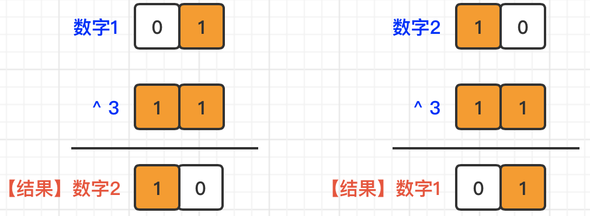

[#0000-28-bit-manipulation]
= Bit Manipulation 位运算

== 典型技巧

=== 通过减法求补数

最典型的例子： xref:0476-number-complement.adoc[476. Number Complement]。

=== 计算数组的汉明距离

在 xref:0461-hamming-distance.adoc[461. Hamming Distance] 中，计算两个数的汉明距离，可以将两个数先异或，然后再使用 Brian Kernighan 算法，stem:[f(x)=x & (x−1)]，求解包含的比特位数。

而在 xref:0477-total-hamming-distance.adoc[477. Total Hamming Distance] 中，则可以通过求所有数字在一个指定比特位上的 `1`（`c`） 和 `0`（`n - c`） 数量，再相乘 stem:[c*(n-c)]，就这个比特位上的汉明距离，最后把每一位的汉明距离相加，得到汉明距离的总和。

=== `1` 和 `2` 与 `3` 异或就可以交替出现 `1` 和 `2`

例题： xref:0481-magical-string.adoc[481. Magical String]

=== 乘法原理

. xref:2316-count-unreachable-pairs-of-nodes-in-an-undirected-graph.adoc[2316. Count Unreachable Pairs of Nodes in an Undirected Graph]

=== Boyer-Moore 投票算法

. xref:0169-majority-element.adoc[169. 多数元素]
. xref:0229-majority-element-ii.adoc[229. 多数元素 II]

== 经典例题

. xref:0029-divide-two-integers.adoc[29. Divide Two Integers]
. xref:0037-sudoku-solver.adoc[37. Sudoku Solver] -- 用比特位标记使用和撤销标记真是太妙了！
. xref:0067-add-binary.adoc[67. Add Binary]
. xref:0078-subsets.adoc[78. Subsets]
. xref:0089-gray-code.adoc[89. Gray Code]
. xref:0090-subsets-ii.adoc[90. Subsets II]
. xref:0136-single-number.adoc[136. Single Number]
. xref:0137-single-number-ii.adoc[137. Single Number II]
. xref:0187-repeated-dna-sequences.adoc[187. Repeated DNA Sequences]
. xref:0190-reverse-bits.adoc[190. Reverse Bits]
. xref:0191-number-of-1-bits.adoc[191. Number of 1 Bits]
. xref:0201-bitwise-and-of-numbers-range.adoc[201. Bitwise AND of Numbers Range]
. xref:0222-count-complete-tree-nodes.adoc[222. Count Complete Tree Nodes]
. xref:0231-power-of-two.adoc[231. Power of Two]
. xref:0260-single-number-iii.adoc[260. Single Number III]
. xref:0266-palindrome-permutation.adoc[266. Palindrome Permutation]
. xref:0268-missing-number.adoc[268. Missing Number]
. xref:0287-find-the-duplicate-number.adoc[287. Find the Duplicate Number]
. xref:0318-maximum-product-of-word-lengths.adoc[318. Maximum Product of Word Lengths]
. xref:0320-generalized-abbreviation.adoc[320. Generalized Abbreviation]
. xref:0338-counting-bits.adoc[338. Counting Bits]
. xref:0342-power-of-four.adoc[342. Power of Four]
. xref:0351-android-unlock-patterns.adoc[351. Android Unlock Patterns]
. xref:0371-sum-of-two-integers.adoc[371. Sum of Two Integers]
. xref:0389-find-the-difference.adoc[389. Find the Difference]
. xref:0393-utf-8-validation.adoc[393. UTF-8 Validation]
. xref:0397-integer-replacement.adoc[397. Integer Replacement]
. xref:0401-binary-watch.adoc[401. Binary Watch]
. xref:0405-convert-a-number-to-hexadecimal.adoc[405. Convert a Number to Hexadecimal]
. xref:0411-minimum-unique-word-abbreviation.adoc[411. Minimum Unique Word Abbreviation]
. xref:0421-maximum-xor-of-two-numbers-in-an-array.adoc[421. Maximum XOR of Two Numbers in an Array]
. xref:0461-hamming-distance.adoc[461. Hamming Distance]
. xref:0464-can-i-win.adoc[464. Can I Win]
. xref:0465-optimal-account-balancing.adoc[465. Optimal Account Balancing]
. xref:0473-matchsticks-to-square.adoc[473. Matchsticks to Square]
. xref:0476-number-complement.adoc[476. Number Complement]
. xref:0477-total-hamming-distance.adoc[477. Total Hamming Distance]
. xref:0491-non-decreasing-subsequences.adoc[491. Non-decreasing Subsequences]
. xref:0526-beautiful-arrangement.adoc[526. Beautiful Arrangement]
. xref:0638-shopping-offers.adoc[638. Shopping Offers]
. xref:0645-set-mismatch.adoc[645. Set Mismatch]
. xref:0672-bulb-switcher-ii.adoc[672. Bulb Switcher II]
. xref:0691-stickers-to-spell-word.adoc[691. Stickers to Spell Word]
. xref:0693-binary-number-with-alternating-bits.adoc[693. Binary Number with Alternating Bits]
. xref:0698-partition-to-k-equal-sum-subsets.adoc[698. Partition to K Equal Sum Subsets]
. xref:0751-ip-to-cidr.adoc[751. IP to CIDR]
. xref:0756-pyramid-transition-matrix.adoc[756. Pyramid Transition Matrix]
. xref:0762-prime-number-of-set-bits-in-binary-representation.adoc[762. Prime Number of Set Bits in Binary Representation]
. xref:0779-k-th-symbol-in-grammar.adoc[779. K-th Symbol in Grammar]
. xref:0782-transform-to-chessboard.adoc[782. Transform to Chessboard]
. xref:0784-letter-case-permutation.adoc[784. Letter Case Permutation]
. xref:0805-split-array-with-same-average.adoc[805. Split Array With Same Average]
. xref:0810-chalkboard-xor-game.adoc[810. Chalkboard XOR Game]
. xref:0832-flipping-an-image.adoc[832. Flipping an Image]
. xref:0847-shortest-path-visiting-all-nodes.adoc[847. Shortest Path Visiting All Nodes]
. xref:0861-score-after-flipping-matrix.adoc[861. Score After Flipping Matrix]
. xref:0864-shortest-path-to-get-all-keys.adoc[864. Shortest Path to Get All Keys]
. xref:0868-binary-gap.adoc[868. Binary Gap]
. xref:0898-bitwise-ors-of-subarrays.adoc[898. Bitwise ORs of Subarrays]
. xref:0943-find-the-shortest-superstring.adoc[943. Find the Shortest Superstring]
. xref:0957-prison-cells-after-n-days.adoc[957. Prison Cells After N Days]
. xref:0980-unique-paths-iii.adoc[980. Unique Paths III]
. xref:0982-triples-with-bitwise-and-equal-to-zero.adoc[982. Triples with Bitwise AND Equal To Zero]
. xref:0995-minimum-number-of-k-consecutive-bit-flips.adoc[995. Minimum Number of K Consecutive Bit Flips]
. xref:0996-number-of-squareful-arrays.adoc[996. Number of Squareful Arrays]
. xref:1009-complement-of-base-10-integer.adoc[1009. Complement of Base 10 Integer]
. xref:1018-binary-prefix-divisible-by-5.adoc[1018. Binary Prefix Divisible By 5]
. xref:1066-campus-bikes-ii.adoc[1066. Campus Bikes II]
. xref:1125-smallest-sufficient-team.adoc[1125. Smallest Sufficient Team]
. xref:1177-can-make-palindrome-from-substring.adoc[1177. Can Make Palindrome from Substring]
. xref:1178-number-of-valid-words-for-each-puzzle.adoc[1178. Number of Valid Words for Each Puzzle]
. xref:1238-circular-permutation-in-binary-representation.adoc[1238. Circular Permutation in Binary Representation]
. xref:1239-maximum-length-of-a-concatenated-string-with-unique-characters.adoc[1239. Maximum Length of a Concatenated String with Unique Characters]
. xref:1255-maximum-score-words-formed-by-letters.adoc[1255. Maximum Score Words Formed by Letters]
. xref:1256-encode-number.adoc[1256. Encode Number]
. xref:1284-minimum-number-of-flips-to-convert-binary-matrix-to-zero-matrix.adoc[1284. Minimum Number of Flips to Convert Binary Matrix to Zero Matrix]
. xref:1310-xor-queries-of-a-subarray.adoc[1310. XOR Queries of a Subarray]
. xref:1318-minimum-flips-to-make-a-or-b-equal-to-c.adoc[1318. Minimum Flips to Make a OR b Equal to c]
. xref:1342-number-of-steps-to-reduce-a-number-to-zero.adoc[1342. Number of Steps to Reduce a Number to Zero]
. xref:1349-maximum-students-taking-exam.adoc[1349. Maximum Students Taking Exam]
. xref:1356-sort-integers-by-the-number-of-1-bits.adoc[1356. Sort Integers by The Number of 1 Bits]
. xref:1371-find-the-longest-substring-containing-vowels-in-even-counts.adoc[1371. Find the Longest Substring Containing Vowels in Even Counts]
. xref:1386-cinema-seat-allocation.adoc[1386. Cinema Seat Allocation]
. xref:1404-number-of-steps-to-reduce-a-number-in-binary-representation-to-one.adoc[1404. Number of Steps to Reduce a Number in Binary Representation to One]
. xref:1434-number-of-ways-to-wear-different-hats-to-each-other.adoc[1434. Number of Ways to Wear Different Hats to Each Other]
. xref:1442-count-triplets-that-can-form-two-arrays-of-equal-xor.adoc[1442. Count Triplets That Can Form Two Arrays of Equal XOR]
. xref:1457-pseudo-palindromic-paths-in-a-binary-tree.adoc[1457. Pseudo-Palindromic Paths in a Binary Tree]
. xref:1461-check-if-a-string-contains-all-binary-codes-of-size-k.adoc[1461. Check If a String Contains All Binary Codes of Size K]
. xref:1486-xor-operation-in-an-array.adoc[1486. XOR Operation in an Array]
. xref:1494-parallel-courses-ii.adoc[1494. Parallel Courses II]
. xref:1506-find-root-of-n-ary-tree.adoc[1506. Find Root of N-Ary Tree]
. xref:1521-find-a-value-of-a-mysterious-function-closest-to-target.adoc[1521. Find a Value of a Mysterious Function Closest to Target]
. xref:1525-number-of-good-ways-to-split-a-string.adoc[1525. Number of Good Ways to Split a String]
. xref:1542-find-longest-awesome-substring.adoc[1542. Find Longest Awesome Substring]
. xref:1558-minimum-numbers-of-function-calls-to-make-target-array.adoc[1558. Minimum Numbers of Function Calls to Make Target Array]
. xref:1595-minimum-cost-to-connect-two-groups-of-points.adoc[1595. Minimum Cost to Connect Two Groups of Points]
. xref:1601-maximum-number-of-achievable-transfer-requests.adoc[1601. Maximum Number of Achievable Transfer Requests]
. xref:1611-minimum-one-bit-operations-to-make-integers-zero.adoc[1611. Minimum One Bit Operations to Make Integers Zero]
. xref:1617-count-subtrees-with-max-distance-between-cities.adoc[1617. Count Subtrees With Max Distance Between Cities]
. xref:1655-distribute-repeating-integers.adoc[1655. Distribute Repeating Integers]
. xref:1659-maximize-grid-happiness.adoc[1659. Maximize Grid Happiness]
. xref:1680-concatenation-of-consecutive-binary-numbers.adoc[1680. Concatenation of Consecutive Binary Numbers]
. xref:1681-minimum-incompatibility.adoc[1681. Minimum Incompatibility]
. xref:1684-count-the-number-of-consistent-strings.adoc[1684. Count the Number of Consistent Strings]
. xref:1707-maximum-xor-with-an-element-from-array.adoc[1707. Maximum XOR With an Element From Array]
. xref:1720-decode-xored-array.adoc[1720. Decode XORed Array]
. xref:1723-find-minimum-time-to-finish-all-jobs.adoc[1723. Find Minimum Time to Finish All Jobs]
. xref:1734-decode-xored-permutation.adoc[1734. Decode XORed Permutation]
. xref:1738-find-kth-largest-xor-coordinate-value.adoc[1738. Find Kth Largest XOR Coordinate Value]
. xref:1755-closest-subsequence-sum.adoc[1755. Closest Subsequence Sum]
. xref:1763-longest-nice-substring.adoc[1763. Longest Nice Substring]
. xref:1787-make-the-xor-of-all-segments-equal-to-zero.adoc[1787. Make the XOR of All Segments Equal to Zero]
. xref:1799-maximize-score-after-n-operations.adoc[1799. Maximize Score After N Operations]
. xref:1803-count-pairs-with-xor-in-a-range.adoc[1803. Count Pairs With XOR in a Range]
. xref:1815-maximum-number-of-groups-getting-fresh-donuts.adoc[1815. Maximum Number of Groups Getting Fresh Donuts]
. xref:1829-maximum-xor-for-each-query.adoc[1829. Maximum XOR for Each Query]
. xref:1835-find-xor-sum-of-all-pairs-bitwise-and.adoc[1835. Find XOR Sum of All Pairs Bitwise AND]
. xref:1863-sum-of-all-subset-xor-totals.adoc[1863. Sum of All Subset XOR Totals]
. xref:1879-minimum-xor-sum-of-two-arrays.adoc[1879. Minimum XOR Sum of Two Arrays]
. xref:1908-game-of-nim.adoc[1908. Game of Nim]
. xref:1915-number-of-wonderful-substrings.adoc[1915. Number of Wonderful Substrings]
. xref:1930-unique-length-3-palindromic-subsequences.adoc[1930. Unique Length-3 Palindromic Subsequences]
. xref:1938-maximum-genetic-difference-query.adoc[1938. Maximum Genetic Difference Query]
. xref:1947-maximum-compatibility-score-sum.adoc[1947. Maximum Compatibility Score Sum]
. xref:1986-minimum-number-of-work-sessions-to-finish-the-tasks.adoc[1986. Minimum Number of Work Sessions to Finish the Tasks]
. xref:1994-the-number-of-good-subsets.adoc[1994. The Number of Good Subsets]
. xref:2002-maximum-product-of-the-length-of-two-palindromic-subsequences.adoc[2002. Maximum Product of the Length of Two Palindromic Subsequences]
. xref:2032-two-out-of-three.adoc[2032. Two Out of Three]
. xref:2035-partition-array-into-two-arrays-to-minimize-sum-difference.adoc[2035. Partition Array Into Two Arrays to Minimize Sum Difference]
. xref:2044-count-number-of-maximum-bitwise-or-subsets.adoc[2044. Count Number of Maximum Bitwise-OR Subsets]
. xref:2128-remove-all-ones-with-row-and-column-flips.adoc[2128. Remove All Ones With Row and Column Flips]
. xref:2135-count-words-obtained-after-adding-a-letter.adoc[2135. Count Words Obtained After Adding a Letter]
. xref:2151-maximum-good-people-based-on-statements.adoc[2151. Maximum Good People Based on Statements]
. xref:2152-minimum-number-of-lines-to-cover-points.adoc[2152. Minimum Number of Lines to Cover Points]
. xref:2157-groups-of-strings.adoc[2157. Groups of Strings]
. xref:2172-maximum-and-sum-of-array.adoc[2172. Maximum AND Sum of Array]
. xref:2174-remove-all-ones-with-row-and-column-flips-ii.adoc[2174. Remove All Ones With Row and Column Flips II]
. xref:2184-number-of-ways-to-build-sturdy-brick-wall.adoc[2184. Number of Ways to Build Sturdy Brick Wall]
. xref:2206-divide-array-into-equal-pairs.adoc[2206. Divide Array Into Equal Pairs]
. xref:2212-maximum-points-in-an-archery-competition.adoc[2212. Maximum Points in an Archery Competition]
. xref:2220-minimum-bit-flips-to-convert-number.adoc[2220. Minimum Bit Flips to Convert Number]
. xref:2247-maximum-cost-of-trip-with-k-highways.adoc[2247. Maximum Cost of Trip With K Highways]
. xref:2275-largest-combination-with-bitwise-and-greater-than-zero.adoc[2275. Largest Combination With Bitwise AND Greater Than Zero]
. xref:2305-fair-distribution-of-cookies.adoc[2305. Fair Distribution of Cookies]
. xref:2306-naming-a-company.adoc[2306. Naming a Company]
. xref:2317-maximum-xor-after-operations.adoc[2317. Maximum XOR After Operations ]
. xref:2322-minimum-score-after-removals-on-a-tree.adoc[2322. Minimum Score After Removals on a Tree]
. xref:2351-first-letter-to-appear-twice.adoc[2351. First Letter to Appear Twice]
. xref:2354-number-of-excellent-pairs.adoc[2354. Number of Excellent Pairs]
. xref:2397-maximum-rows-covered-by-columns.adoc[2397. Maximum Rows Covered by Columns]
. xref:2401-longest-nice-subarray.adoc[2401. Longest Nice Subarray]
. xref:2403-minimum-time-to-kill-all-monsters.adoc[2403. Minimum Time to Kill All Monsters]
. xref:2411-smallest-subarrays-with-maximum-bitwise-or.adoc[2411. Smallest Subarrays With Maximum Bitwise OR]
. xref:2419-longest-subarray-with-maximum-bitwise-and.adoc[2419. Longest Subarray With Maximum Bitwise AND]
. xref:2425-bitwise-xor-of-all-pairings.adoc[2425. Bitwise XOR of All Pairings]
. xref:2429-minimize-xor.adoc[2429. Minimize XOR]
. xref:2433-find-the-original-array-of-prefix-xor.adoc[2433. Find The Original Array of Prefix Xor]
. xref:2438-range-product-queries-of-powers.adoc[2438. Range Product Queries of Powers]
. xref:2505-bitwise-or-of-all-subsequence-sums.adoc[2505. Bitwise OR of All Subsequence Sums]
. xref:2506-count-pairs-of-similar-strings.adoc[2506. Count Pairs Of Similar Strings]
. xref:2527-find-xor-beauty-of-array.adoc[2527. Find Xor-Beauty of Array]
. xref:2546-apply-bitwise-operations-to-make-strings-equal.adoc[2546. Apply Bitwise Operations to Make Strings Equal]
. xref:2564-substring-xor-queries.adoc[2564. Substring XOR Queries]
. xref:2568-minimum-impossible-or.adoc[2568. Minimum Impossible OR]
. xref:2571-minimum-operations-to-reduce-an-integer-to-0.adoc[2571. Minimum Operations to Reduce an Integer to 0]
. xref:2572-count-the-number-of-square-free-subsets.adoc[2572. Count the Number of Square-Free Subsets]
. xref:2588-count-the-number-of-beautiful-subarrays.adoc[2588. Count the Number of Beautiful Subarrays]
. xref:2595-number-of-even-and-odd-bits.adoc[2595. Number of Even and Odd Bits]
. xref:2657-find-the-prefix-common-array-of-two-arrays.adoc[2657. Find the Prefix Common Array of Two Arrays]
. xref:2680-maximum-or.adoc[2680. Maximum OR]
. xref:2683-neighboring-bitwise-xor.adoc[2683. Neighboring Bitwise XOR]
. xref:2708-maximum-strength-of-a-group.adoc[2708. Maximum Strength of a Group]
. xref:2732-find-a-good-subset-of-the-matrix.adoc[2732. Find a Good Subset of the Matrix]
. xref:2741-special-permutations.adoc[2741. Special Permutations]
. xref:2749-minimum-operations-to-make-the-integer-zero.adoc[2749. Minimum Operations to Make the Integer Zero]
. xref:2791-count-paths-that-can-form-a-palindrome-in-a-tree.adoc[2791. Count Paths That Can Form a Palindrome in a Tree]
. xref:2802-find-the-k-th-lucky-number.adoc[2802. Find The K-th Lucky Number]
. xref:2835-minimum-operations-to-form-subsequence-with-target-sum.adoc[2835. Minimum Operations to Form Subsequence With Target Sum]
. xref:2836-maximize-value-of-function-in-a-ball-passing-game.adoc[2836. Maximize Value of Function in a Ball Passing Game]
. xref:2857-count-pairs-of-points-with-distance-k.adoc[2857. Count Pairs of Points With Distance k]
. xref:2859-sum-of-values-at-indices-with-k-set-bits.adoc[2859. Sum of Values at Indices With K Set Bits]
. xref:2869-minimum-operations-to-collect-elements.adoc[2869. Minimum Operations to Collect Elements]
. xref:2871-split-array-into-maximum-number-of-subarrays.adoc[2871. Split Array Into Maximum Number of Subarrays]
. xref:2897-apply-operations-on-array-to-maximize-sum-of-squares.adoc[2897. Apply Operations on Array to Maximize Sum of Squares]
. xref:2917-find-the-k-or-of-an-array.adoc[2917. Find the K-or of an Array]
. xref:2920-maximum-points-after-collecting-coins-from-all-nodes.adoc[2920. Maximum Points After Collecting Coins From All Nodes]
. xref:2932-maximum-strong-pair-xor-i.adoc[2932. Maximum Strong Pair XOR I]
. xref:2935-maximum-strong-pair-xor-ii.adoc[2935. Maximum Strong Pair XOR II]
. xref:2939-maximum-xor-product.adoc[2939. Maximum Xor Product]
. xref:2959-number-of-possible-sets-of-closing-branches.adoc[2959. Number of Possible Sets of Closing Branches]
. xref:2980-check-if-bitwise-or-has-trailing-zeros.adoc[2980. Check if Bitwise OR Has Trailing Zeros]
. xref:2992-number-of-self-divisible-permutations.adoc[2992. Number of Self-Divisible Permutations]
. xref:2997-minimum-number-of-operations-to-make-array-xor-equal-to-k.adoc[2997. Minimum Number of Operations to Make Array XOR Equal to K]
. xref:3003-maximize-the-number-of-partitions-after-operations.adoc[3003. Maximize the Number of Partitions After Operations]
. xref:3007-maximum-number-that-sum-of-the-prices-is-less-than-or-equal-to-k.adoc[3007. Maximum Number That Sum of the Prices Is Less Than or Equal to K]
. xref:3011-find-if-array-can-be-sorted.adoc[3011. Find if Array Can Be Sorted]
. xref:3022-minimize-or-of-remaining-elements-using-operations.adoc[3022. Minimize OR of Remaining Elements Using Operations]
. xref:3064-guess-the-number-using-bitwise-questions-i.adoc[3064. Guess the Number Using Bitwise Questions I]
. xref:3068-find-the-maximum-sum-of-node-values.adoc[3068. Find the Maximum Sum of Node Values]
. xref:3094-guess-the-number-using-bitwise-questions-ii.adoc[3094. Guess the Number Using Bitwise Questions II]
. xref:3095-shortest-subarray-with-or-at-least-k-i.adoc[3095. Shortest Subarray With OR at Least K I]
. xref:3097-shortest-subarray-with-or-at-least-k-ii.adoc[3097. Shortest Subarray With OR at Least K II]
. xref:3108-minimum-cost-walk-in-weighted-graph.adoc[3108. Minimum Cost Walk in Weighted Graph]
. xref:3116-kth-smallest-amount-with-single-denomination-combination.adoc[3116. Kth Smallest Amount With Single Denomination Combination]
. xref:3117-minimum-sum-of-values-by-dividing-array.adoc[3117. Minimum Sum of Values by Dividing Array]
. xref:3133-minimum-array-end.adoc[3133. Minimum Array End]
. xref:3141-maximum-hamming-distances.adoc[3141. Maximum Hamming Distances]
. xref:3145-find-products-of-elements-of-big-array.adoc[3145. Find Products of Elements of Big Array]
. xref:3149-find-the-minimum-cost-array-permutation.adoc[3149. Find the Minimum Cost Array Permutation]
. xref:3154-find-number-of-ways-to-reach-the-k-th-stair.adoc[3154. Find Number of Ways to Reach the K-th Stair]
. xref:3158-find-the-xor-of-numbers-which-appear-twice.adoc[3158. Find the XOR of Numbers Which Appear Twice]
. xref:3171-find-subarray-with-bitwise-or-closest-to-k.adoc[3171. Find Subarray With Bitwise OR Closest to K]
. xref:3173-bitwise-or-of-adjacent-elements.adoc[3173. Bitwise OR of Adjacent Elements]
. xref:3181-maximum-total-reward-using-operations-ii.adoc[3181. Maximum Total Reward Using Operations II]
. xref:3191-minimum-operations-to-make-binary-array-elements-equal-to-one-i.adoc[3191. Minimum Operations to Make Binary Array Elements Equal to One I]
. xref:3199-count-triplets-with-even-xor-set-bits-i.adoc[3199. Count Triplets with Even XOR Set Bits I]
. xref:3209-number-of-subarrays-with-and-value-of-k.adoc[3209. Number of Subarrays With AND Value of K]
. xref:3211-generate-binary-strings-without-adjacent-zeros.adoc[3211. Generate Binary Strings Without Adjacent Zeros]
. xref:3215-count-triplets-with-even-xor-set-bits-ii.adoc[3215. Count Triplets with Even XOR Set Bits II]
. xref:3226-number-of-bit-changes-to-make-two-integers-equal.adoc[3226. Number of Bit Changes to Make Two Integers Equal]
. xref:3276-select-cells-in-grid-with-maximum-score.adoc[3276. Select Cells in Grid With Maximum Score]
. xref:3283-maximum-number-of-moves-to-kill-all-pawns.adoc[3283. Maximum Number of Moves to Kill All Pawns]
. xref:3287-find-the-maximum-sequence-value-of-array.adoc[3287. Find the Maximum Sequence Value of Array]
. xref:3304-find-the-k-th-character-in-string-game-i.adoc[3304. Find the K-th Character in String Game I]
. xref:3307-find-the-k-th-character-in-string-game-ii.adoc[3307. Find the K-th Character in String Game II]
. xref:3309-maximum-possible-number-by-binary-concatenation.adoc[3309. Maximum Possible Number by Binary Concatenation]
. xref:3314-construct-the-minimum-bitwise-array-i.adoc[3314. Construct the Minimum Bitwise Array I]
. xref:3315-construct-the-minimum-bitwise-array-ii.adoc[3315. Construct the Minimum Bitwise Array II]
. xref:3344-maximum-sized-array.adoc[3344. Maximum Sized Array]
. xref:3370-smallest-number-with-all-set-bits.adoc[3370. Smallest Number With All Set Bits]
. xref:3376-minimum-time-to-break-locks-i.adoc[3376. Minimum Time to Break Locks I]
. xref:3393-count-paths-with-the-given-xor-value.adoc[3393. Count Paths With the Given XOR Value]
. xref:3435-frequencies-of-shortest-supersequences.adoc[3435. Frequencies of Shortest Supersequences]
. xref:3444-minimum-increments-for-target-multiples-in-an-array.adoc[3444. Minimum Increments for Target Multiples in an Array]
. xref:3495-minimum-operations-to-make-array-elements-zero.adoc[3495. Minimum Operations to Make Array Elements Zero]
. xref:3513-number-of-unique-xor-triplets-i.adoc[3513. Number of Unique XOR Triplets I]
. xref:3514-number-of-unique-xor-triplets-ii.adoc[3514. Number of Unique XOR Triplets II]
. xref:3530-maximum-profit-from-valid-topological-order-in-dag.adoc[3530. Maximum Profit from Valid Topological Order in DAG]
. xref:3533-concatenated-divisibility.adoc[3533. Concatenated Divisibility]

== 参考资料

. https://leetcode.cn/discuss/post/3571304/cong-ji-he-lun-dao-wei-yun-suan-chang-ji-enve/[分享｜从集合论到位运算，常见位运算技巧分类总结！^]
