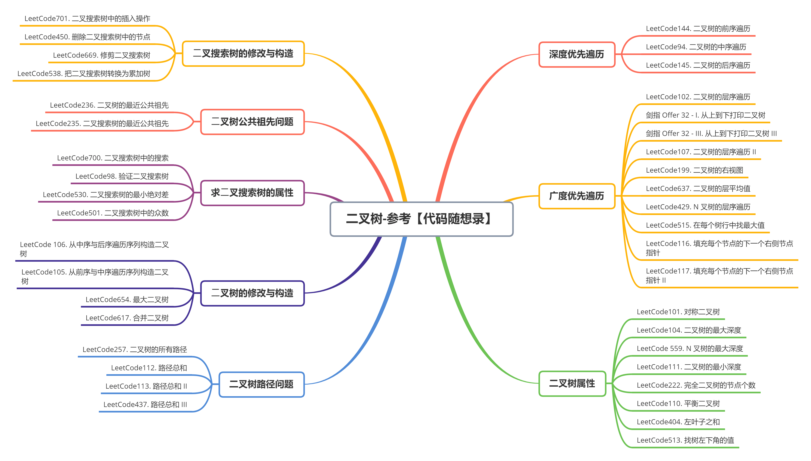
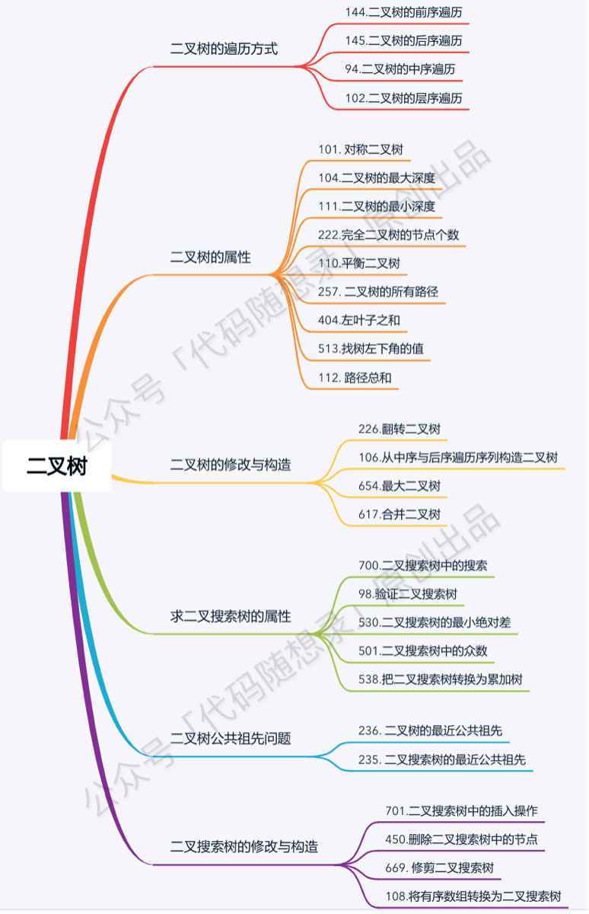

[#0000-data-structure-tree]
= Tree 树

树的遍历，如果用递归，代码写起来很简单。但是用遍历，又该如何做呢？

凡是用递归能解决的问题，都可以使用遍历来解决。用递归来求解问题，无非就是使用了方法栈来保存相关信息。同样，可以使用 `Stack` 来自己动手维护这些信息。例如：

xref:0144-binary-tree-preorder-traversal.adoc[144. Binary Tree Preorder Traversal^]

image::images/0000-ds-tree-02.gif[{image_attr}]

搜索二叉树，一个隐含的性质是如果中序遍历，其值是单调递增的。所以，如果两个节点交换位置了，则第一个错误节点是比较大的节点（后面的跑前面了），第二个错误节点为较小的节点（后面的跑前面了）。如果是相邻节点交换，也是类似。

将一棵搜索二叉树按后序遍历生成一个数组。那么，数组最后一个元素就是根节点，同时，从后向前遍历，第一个小于根节点值的地方就是左右树的分界线。然后再递归解析。就可以重建这棵搜索二叉树了。

社区里有人宣称： https://leetcode.cn/problems/minimum-absolute-difference-in-bst/solutions/39609/zhong-xu-bian-li-tuan-mie-xi-lie-er-cha-sou-suo-sh/[中序遍历团灭系列二叉搜索树问题^]。这点可以尝试一下：

. xref:0094-binary-tree-inorder-traversal.adoc[94. Binary Tree Inorder Traversal] 中序遍历二叉树
. xref:0530-minimum-absolute-difference-in-bst.adoc[530. Minimum Absolute Difference in BST] 二叉搜索树的最小绝对差
. xref:0230-kth-smallest-element-in-a-bst.adoc[230. Kth Smallest Element in a BST] 二叉搜索树中第k小的元素
. xref:0501-find-mode-in-binary-search-tree.adoc[501. Find Mode in Binary Search Tree] 二叉搜索树中的众数
. xref:0938-range-sum-of-bst.adoc[938. Range Sum of BST] 二叉搜索树的范围和
. xref:0653-two-sum-iv-input-is-a-bst.adoc[653. Two Sum IV - Input is a BST] 两数之和IV-输入BST
. xref:0098-validate-binary-search-tree.adoc[98. Validate Binary Search Tree] 验证二叉搜索树

== 需要加强的内容

. 基于 Morris 遍历的前序和后序遍历练习
. 前中后根遍历的非递归实现
. 利用 Morris 求树的最小深度： xref:0111-minimum-depth-of-binary-tree.adoc[111. Minimum Depth of Binary Tree]，尝试一下最大深度。

== 技巧或者隐藏知识点

. 非递归法后序遍历，可以用一个取巧的办法，套用一下前序遍历，前序遍历是根左右，后序遍历是左右根，我们只需要将前序遍历的结果反转一下，就是根左右。如果使用Java实现，可以在链表上做文章，将尾插改成头插也是一样的效果。
. 归并排序和二叉树后根遍历的递归顺序是一样的。

== Morris 遍历

二叉搜索树相关的的一些题目，很可能就会利用中序遍历是升序序列的特性来处理一下问题。那么，在时间复杂度相同，但空间复杂度都特别优秀的 Morris 遍历就是一个很好的选择。

image::images/0000-ds-tree-01.jpg[{image_attr}]

. xref:0098-validate-binary-search-tree.adoc[98. Validate Binary Search Tree]
. xref:0099-recover-binary-search-tree.adoc[99. Recover Binary Search Tree]

== 树形 DP 套路

树形 DP 套路使用前提：如果题目求解目标是 S 规则，则求解流程可以定成以每一个节点为头节点的子树在 S 规则下的每一个答案，并且最终答案一定在其中。

. 以某个节点 X 为头节点的子树中，分析答案有哪些可能性，并且这种分析是以 X 的左子树、X 的右子树和 X 整棵树的角度来考虑可能性的。
. 根据第一步的可能性分析，列出所有需要的信息。
. 合并第二步的信息，对左树和右树提出同样的要求，并写出信息结构。
. 设计递归函数，递归函数是处理以 X 为头节点的情况下的答案，包括设计递归的 base case，默认直接得到左树和右树的所有信息，以及把可能性整合，并且要返回第三步的信息结构这四个小步骤。

== 路径问题

=== 问题分类

二叉树路径的问题大致可以分为两类：

. 自顶向下：顾名思义，就是从某一个节点(不一定是根节点)，从上向下寻找路径，到某一个节点(不一定是叶节点)结束。而继续细分的话还可以分成一般路径与给定和的路径。
.. xref:0257-binary-tree-paths.adoc[257. Binary Tree Paths]
.. xref:0112-path-sum.adoc[112. Path Sum]
.. xref:0113-path-sum-ii.adoc[113. Path Sum II]
.. xref:0437-path-sum-iii.adoc[437. Path Sum III]
.. xref:0988-smallest-string-starting-from-leaf.adoc[988. Smallest String Starting From Leaf]
. 非自顶向下：就是从任意节点到任意节点的路径，不需要自顶向下。
.. xref:0124-binary-tree-maximum-path-sum.adoc[124. Binary Tree Maximum Path Sum]
.. xref:0687-longest-univalue-path.adoc[687. Longest Univalue Path]
.. xref:0543-diameter-of-binary-tree.adoc[543. Diameter of Binary Tree]

=== 解题模板

这类题通常用深度优先搜索(DFS)和广度优先搜索(BFS)解决，BFS较DFS繁琐，这里为了简洁只展现DFS代码
下面是我对两类题目的分析与模板

==== 一、自顶而下：

[source,cpp]
----
// **一般路径**
vector<vector<int>>res;
void dfs(TreeNode*root,vector<int>path)
{
    if(!root) return;  //根节点为空直接返回
    path.push_back(root->val);  //作出选择
    if(!root->left && !root->right) //如果到叶节点
    {
        res.push_back(path);
        return;
    }
    dfs(root->left,path);  //继续递归
    dfs(root->right,path);
}

// **给定和的路径**
void dfs(TreeNode*root, int sum, vector<int> path)
{
    if (!root)
        return;
    sum -= root->val;
    path.push_back(root->val);
    if (!root->left && !root->right && sum == 0)
    {
        res.push_back(path);
        return;
    }
    dfs(root->left, sum, path);
    dfs(root->right, sum, path);
}
----

这类题型DFS注意点：

. 如果是找路径和等于给定 `target` 的路径的，那么可以不用新增一个临时变量 `curSum` 来判断当前路径和，只需要用给定和 `target` 减去节点值，最终结束条件判断 `target==0` 即可
. 是否要回溯：二叉树的问题大部分是不需要回溯的，原因如下：
+
--
二叉树的递归部分：dfs(root->left),dfs(root->right)已经把可能的路径穷尽了，
因此到任意叶节点的路径只可能有一条，绝对不可能出现另外的路径也到这个满足条件的叶节点的；

而对比二维数组(例如迷宫问题)的DFS，for循环向四个方向查找每次只能朝向一个方向，并没有穷尽路径，
因此某一个满足条件的点可能是有多条路径到该点的

并且visited数组标记已经走过的路径是会受到另外路径是否访问的影响，这时候必须回溯
--
+
. 找到路径后是否要return：取决于题目是否要求找到叶节点满足条件的路径，如果必须到叶节点，那么就要return；但如果是到任意节点都可以，那么必不能return，因为这条路径下面还可能有更深的路径满足条件，还要在此基础上继续递归
. 是否要双重递归(即调用根节点的dfs函数后，继续调用根左右节点的pathsum函数)：看题目要不要求从根节点开始的，还是从任意节点开始

==== 二、非自顶而下：

这类题目一般解题思路如下：

设计一个辅助函数 `maxPath`，调用自身求出以一个节点为根节点的左侧最长路径 `left` 和右侧最长路径 `right`，那么经过该节点的最长路径就是 `left+right`

接着只需要从根节点开始dfs,不断比较更新全局变量即可

[source,cpp]
----
int res=0;
int maxPath(TreeNode *root) //以root为路径起始点的最长路径
{
    if (!root)
        return 0;
    int left=maxPath(root->left);
    int right=maxPath(root->right);
    res = max(res, left + right + root->val); //更新全局变量
    return max(left, right);   //返回左右路径较长者
}
----

这类题型DFS注意点：

. left,right代表的含义要根据题目所求设置，比如最长路径、最大路径和等等
. 全局变量res的初值设置是0还是INT_MIN要看题目节点是否存在负值,如果存在就用INT_MIN，否则就是0
. 注意两点之间路径为1，因此一个点是不能构成路径的

== 参考资料

. https://leetcode.cn/problems/recover-binary-search-tree/solutions/365873/yi-wen-zhang-wo-morrisbian-li-suan-fa-by-a-fei-8/[99. 恢复二叉搜索树 - 一文掌握Morris遍历算法^]
. https://leetcode.cn/problems/path-sum-iii/solutions/815688/yi-pian-wen-zhang-jie-jue-suo-you-er-cha-smch/[437. 路径总和 III - 一篇文章解决所有二叉树路径问题（问题分析+分类模板+题目剖析）^]
. https://leetcode.cn/problems/search-in-a-binary-search-tree/solutions/867987/dai-ma-sui-xiang-lu-dai-ni-xue-tou-er-ch-3ww7/[700. 二叉搜索树中的搜索:【递归法】【迭代法】详解^]
. https://leetcode.cn/problems/minimum-absolute-difference-in-bst/solutions/39609/zhong-xu-bian-li-tuan-mie-xi-lie-er-cha-sou-suo-sh/[530. 二叉搜索树的最小绝对差 - 中序遍历团灭系列二叉搜索树问题^]
. https://leetcode.cn/problems/insert-into-a-binary-search-tree/solutions/1766937/acm-xuan-shou-tu-jie-leetcode-by-rocky04-4yub/[701. 二叉搜索树中的插入操作 - ACM 选手图解 LeetCode 二叉搜索树中的插入操作（递归 + 非递归）^] -- 整理了一些资料，可以看看。
