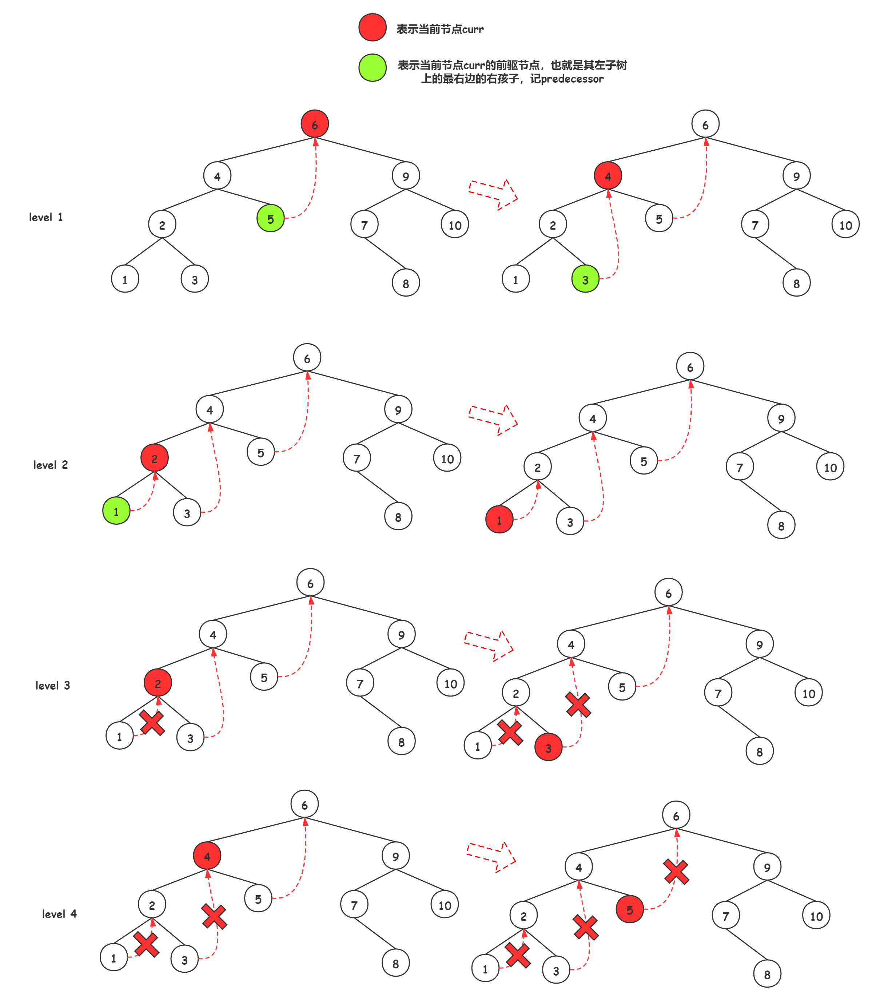

[#data-structure-tree]
= 数据结构：树

== 需要加强的内容

. 基于 Morris 遍历的前序和后序遍历练习
. 前中后根遍历的非递归实现
.

== 技巧或者隐藏知识点

. 非递归法后序遍历，可以用一个取巧的办法，套用一下前序遍历，前序遍历是根左右，后序遍历是左右根，我们只需要将前序遍历的结果反转一下，就是根左右。如果使用Java实现，可以在链表上做文章，将尾插改成头插也是一样的效果。
. 归并排序和二叉树后根遍历的递归顺序是一样的。

== Morris 遍历

二叉搜索树相关的的一些题目，很可能就会利用中序遍历是升序序列的特性来处理一下问题。那么，在时间复杂度相同，但空间复杂度都特别优秀的 Morris 遍历就是一个很好的选择。

. xref:0098-validate-binary-search-tree.adoc[98. Validate Binary Search Tree]
. xref:0099-recover-binary-search-tree.adoc[99. Recover Binary Search Tree]

== 参考资料

. https://leetcode.cn/problems/recover-binary-search-tree/solutions/365873/yi-wen-zhang-wo-morrisbian-li-suan-fa-by-a-fei-8/[99. 恢复二叉搜索树 - 一文掌握Morris遍历算法^]
