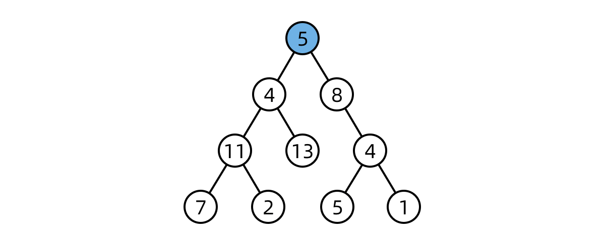

[#0000-data-structure-tree]
= Tree 树

image::images/0000-ds-tree-00.png[{image_attr}]

image::images/0000-ds-tree-03.png[{image_attr}]

树的遍历，如果用递归，代码写起来很简单。但是用遍历，又该如何做呢？

凡是用递归能解决的问题，都可以使用遍历来解决。用递归来求解问题，无非就是使用了方法栈来保存相关信息。同样，可以使用 `Stack` 来自己动手维护这些信息。例如：

xref:0144-binary-tree-preorder-traversal.adoc[144. Binary Tree Preorder Traversal^]

搜索二叉树，一个隐含的性质是如果中序遍历，其值是单调递增的。所以，如果两个节点交换位置了，则第一个错误节点是比较大的节点（后面的跑前面了），第二个错误节点为较小的节点（后面的跑前面了）。如果是相邻节点交换，也是类似。

将一棵搜索二叉树按后序遍历生成一个数组。那么，数组最后一个元素就是根节点，同时，从后向前遍历，第一个小于根节点值的地方就是左右树的分界线。然后再递归解析。就可以重建这棵搜索二叉树了。

社区里有人宣称： https://leetcode.cn/problems/minimum-absolute-difference-in-bst/solutions/39609/zhong-xu-bian-li-tuan-mie-xi-lie-er-cha-sou-suo-sh/[中序遍历团灭系列二叉搜索树问题^]。这点可以尝试一下：

. xref:0094-binary-tree-inorder-traversal.adoc[94. Binary Tree Inorder Traversal] 中序遍历二叉树
. xref:0530-minimum-absolute-difference-in-bst.adoc[530. Minimum Absolute Difference in BST] 二叉搜索树的最小绝对差
. xref:0230-kth-smallest-element-in-a-bst.adoc[230. Kth Smallest Element in a BST] 二叉搜索树中第k小的元素
. xref:0501-find-mode-in-binary-search-tree.adoc[501. Find Mode in Binary Search Tree] 二叉搜索树中的众数
. xref:0938-range-sum-of-bst.adoc[938. Range Sum of BST] 二叉搜索树的范围和
. xref:0653-two-sum-iv-input-is-a-bst.adoc[653. Two Sum IV - Input is a BST] 两数之和IV-输入BST
. xref:0098-validate-binary-search-tree.adoc[98. Validate Binary Search Tree] 验证二叉搜索树

== 需要加强的内容

. 基于 Morris 遍历的前序和后序遍历练习
. 前中后根遍历的非递归实现
. 利用 Morris 求树的最小深度： xref:0111-minimum-depth-of-binary-tree.adoc[111. Minimum Depth of Binary Tree]，尝试一下最大深度。

== 技巧或者隐藏知识点

. 非递归法后序遍历，可以用一个取巧的办法，套用一下前序遍历，前序遍历是根左右，后序遍历是左右根，我们只需要将前序遍历的结果反转一下，就是根左右。如果使用Java实现，可以在链表上做文章，将尾插改成头插也是一样的效果。
. 归并排序和二叉树后根遍历的递归顺序是一样的。

[#morris-traversal]
== Morris 遍历

二叉搜索树相关的的一些题目，很可能就会利用中序遍历是升序序列的特性来处理一下问题。那么，在时间复杂度相同，但空间复杂度都特别优秀的 Morris 遍历就是一个很好的选择。

image::images/0000-ds-tree-01.jpg[{image_attr}]

. xref:0098-validate-binary-search-tree.adoc[98. Validate Binary Search Tree]
. xref:0099-recover-binary-search-tree.adoc[99. Recover Binary Search Tree]

在 https://leetcode.cn/problems/binary-tree-inorder-traversal/solutions/96765/dong-hua-yan-shi-94-er-cha-shu-de-zhong-xu-bian-li/[94. 二叉树的中序遍历 - 动画演示+三种实现^] 中的“变形”莫尔斯算法则展示了莫尔斯算法的另一种 有趣用法。

== 树形 DP 套路

树形 DP 套路使用前提：如果题目求解目标是 S 规则，则求解流程可以定成以每一个节点为头节点的子树在 S 规则下的每一个答案，并且最终答案一定在其中。

. 以某个节点 X 为头节点的子树中，分析答案有哪些可能性，并且这种分析是以 X 的左子树、X 的右子树和 X 整棵树的角度来考虑可能性的。
. 根据第一步的可能性分析，列出所有需要的信息。
. 合并第二步的信息，对左树和右树提出同样的要求，并写出信息结构。
. 设计递归函数，递归函数是处理以 X 为头节点的情况下的答案，包括设计递归的 base case，默认直接得到左树和右树的所有信息，以及把可能性整合，并且要返回第三步的信息结构这四个小步骤。

== 路径问题

=== 问题分类

二叉树路径的问题大致可以分为两类：

. 自顶向下：顾名思义，就是从某一个节点(不一定是根节点)，从上向下寻找路径，到某一个节点(不一定是叶节点)结束。而继续细分的话还可以分成一般路径与给定和的路径。
.. xref:0257-binary-tree-paths.adoc[257. Binary Tree Paths]
.. xref:0112-path-sum.adoc[112. Path Sum]
.. xref:0113-path-sum-ii.adoc[113. Path Sum II]
.. xref:0437-path-sum-iii.adoc[437. Path Sum III]
.. xref:0988-smallest-string-starting-from-leaf.adoc[988. Smallest String Starting From Leaf]
. 非自顶向下：就是从任意节点到任意节点的路径，不需要自顶向下。
.. xref:0124-binary-tree-maximum-path-sum.adoc[124. Binary Tree Maximum Path Sum]
.. xref:0687-longest-univalue-path.adoc[687. Longest Univalue Path]
.. xref:0543-diameter-of-binary-tree.adoc[543. Diameter of Binary Tree]

=== 解题模板

这类题通常用深度优先搜索(DFS)和广度优先搜索(BFS)解决，BFS较DFS繁琐，这里为了简洁只展现DFS代码
下面是我对两类题目的分析与模板

==== 一、自顶而下：

[source,cpp]
----
// **一般路径**
vector<vector<int>>res;
void dfs(TreeNode*root,vector<int>path)
{
    if(!root) return;  //根节点为空直接返回
    path.push_back(root->val);  //作出选择
    if(!root->left && !root->right) //如果到叶节点
    {
        res.push_back(path);
        return;
    }
    dfs(root->left,path);  //继续递归
    dfs(root->right,path);
}

// **给定和的路径**
void dfs(TreeNode*root, int sum, vector<int> path)
{
    if (!root)
        return;
    sum -= root->val;
    path.push_back(root->val);
    if (!root->left && !root->right && sum == 0)
    {
        res.push_back(path);
        return;
    }
    dfs(root->left, sum, path);
    dfs(root->right, sum, path);
}
----

这类题型DFS注意点：

. 如果是找路径和等于给定 `target` 的路径的，那么可以不用新增一个临时变量 `curSum` 来判断当前路径和，只需要用给定和 `target` 减去节点值，最终结束条件判断 `target==0` 即可
. 是否要回溯：二叉树的问题大部分是不需要回溯的，原因如下：
+
--
二叉树的递归部分：dfs(root->left),dfs(root->right)已经把可能的路径穷尽了，
因此到任意叶节点的路径只可能有一条，绝对不可能出现另外的路径也到这个满足条件的叶节点的；

而对比二维数组(例如迷宫问题)的DFS，for循环向四个方向查找每次只能朝向一个方向，并没有穷尽路径，
因此某一个满足条件的点可能是有多条路径到该点的

并且visited数组标记已经走过的路径是会受到另外路径是否访问的影响，这时候必须回溯
--
+
. 找到路径后是否要return：取决于题目是否要求找到叶节点满足条件的路径，如果必须到叶节点，那么就要return；但如果是到任意节点都可以，那么必不能return，因为这条路径下面还可能有更深的路径满足条件，还要在此基础上继续递归
. 是否要双重递归(即调用根节点的dfs函数后，继续调用根左右节点的pathsum函数)：看题目要不要求从根节点开始的，还是从任意节点开始

==== 二、非自顶而下：

这类题目一般解题思路如下：

设计一个辅助函数 `maxPath`，调用自身求出以一个节点为根节点的左侧最长路径 `left` 和右侧最长路径 `right`，那么经过该节点的最长路径就是 `left+right`

接着只需要从根节点开始dfs,不断比较更新全局变量即可

[source,cpp]
----
int res=0;
int maxPath(TreeNode *root) //以root为路径起始点的最长路径
{
    if (!root)
        return 0;
    int left=maxPath(root->left);
    int right=maxPath(root->right);
    res = max(res, left + right + root->val); //更新全局变量
    return max(left, right);   //返回左右路径较长者
}
----

这类题型DFS注意点：

. left,right代表的含义要根据题目所求设置，比如最长路径、最大路径和等等
. 全局变量res的初值设置是0还是INT_MIN要看题目节点是否存在负值,如果存在就用INT_MIN，否则就是0
. 注意两点之间路径为1，因此一个点是不能构成路径的

== 经典题目

. xref:0094-binary-tree-inorder-traversal.adoc[94. 二叉树的中序遍历]
. xref:0095-unique-binary-search-trees-ii.adoc[95. 不同的二叉搜索树 II]
. xref:0096-unique-binary-search-trees.adoc[96. 不同的二叉搜索树]
. xref:0098-validate-binary-search-tree.adoc[98. 验证二叉搜索树]
. xref:0099-recover-binary-search-tree.adoc[99. 恢复二叉搜索树]
. xref:0100-same-tree.adoc[100. 相同的树]
. xref:0101-symmetric-tree.adoc[101. 对称二叉树]
. xref:0102-binary-tree-level-order-traversal.adoc[102. 二叉树的层序遍历]
. xref:0103-binary-tree-zigzag-level-order-traversal.adoc[103. 二叉树的锯齿形层序遍历]
. xref:0104-maximum-depth-of-binary-tree.adoc[104. 二叉树的最大深度]
. xref:0105-construct-binary-tree-from-preorder-and-inorder-traversal.adoc[105. 从前序与中序遍历序列构造二叉树]
. xref:0106-construct-binary-tree-from-inorder-and-postorder-traversal.adoc[106. 从中序与后序遍历序列构造二叉树]
. xref:0107-binary-tree-level-order-traversal-ii.adoc[107. 二叉树的层序遍历 II]
. xref:0108-convert-sorted-array-to-binary-search-tree.adoc[108. 将有序数组转换为二叉搜索树]
. xref:0109-convert-sorted-list-to-binary-search-tree.adoc[109. 有序链表转换二叉搜索树]
. xref:0110-balanced-binary-tree.adoc[110. 平衡二叉树]
. xref:0111-minimum-depth-of-binary-tree.adoc[111. 二叉树的最小深度]
. xref:0112-path-sum.adoc[112. 路径总和]
. xref:0113-path-sum-ii.adoc[113. 路径总和 II]
. xref:0114-flatten-binary-tree-to-linked-list.adoc[114. 二叉树展开为链表]
. xref:0116-populating-next-right-pointers-in-each-node.adoc[116. 填充每个节点的下一个右侧节点指针]
. xref:0117-populating-next-right-pointers-in-each-node-ii.adoc[117. 填充每个节点的下一个右侧节点指针 II]
. xref:0124-binary-tree-maximum-path-sum.adoc[124. 二叉树中的最大路径和]
. xref:0129-sum-root-to-leaf-numbers.adoc[129. 求根节点到叶节点数字之和]
. xref:0144-binary-tree-preorder-traversal.adoc[144. 二叉树的前序遍历]
. xref:0145-binary-tree-postorder-traversal.adoc[145. 二叉树的后序遍历]
. xref:0156-binary-tree-upside-down.adoc[156. 上下翻转二叉树]
. xref:0173-binary-search-tree-iterator.adoc[173. 二叉搜索树迭代器]
. xref:0199-binary-tree-right-side-view.adoc[199. 二叉树的右视图]
. xref:0222-count-complete-tree-nodes.adoc[222. 完全二叉树的节点个数]
. xref:0226-invert-binary-tree.adoc[226. 翻转二叉树]
. xref:0230-kth-smallest-element-in-a-bst.adoc[230. 二叉搜索树中第 K 小的元素]
. xref:0235-lowest-common-ancestor-of-a-binary-search-tree.adoc[235. 二叉搜索树的最近公共祖先]
. xref:0236-lowest-common-ancestor-of-a-binary-tree.adoc[236. 二叉树的最近公共祖先]
. xref:0250-count-univalue-subtrees.adoc[250. 统计同值子树]
. xref:0255-verify-preorder-sequence-in-binary-search-tree.adoc[255. 验证二叉搜索树的前序遍历序列]
. xref:0257-binary-tree-paths.adoc[257. 二叉树的所有路径]
. xref:0270-closest-binary-search-tree-value.adoc[270. 最接近的二叉搜索树值]
. xref:0272-closest-binary-search-tree-value-ii.adoc[272. 最接近的二叉搜索树值 II]
. xref:0285-inorder-successor-in-bst.adoc[285. 二叉搜索树中的中序后继]
. xref:0297-serialize-and-deserialize-binary-tree.adoc[297. 二叉树的序列化与反序列化]
. xref:0298-binary-tree-longest-consecutive-sequence.adoc[298. 二叉树最长连续序列]
. xref:0314-binary-tree-vertical-order-traversal.adoc[314. 二叉树的垂直遍历]
. xref:0331-verify-preorder-serialization-of-a-binary-tree.adoc[331. 验证二叉树的前序序列化]
. xref:0333-largest-bst-subtree.adoc[333. 最大二叉搜索子树]
. xref:0337-house-robber-iii.adoc[337. 打家劫舍 III]
. xref:0341-flatten-nested-list-iterator.adoc[341. 扁平化嵌套列表迭代器]
. xref:0366-find-leaves-of-binary-tree.adoc[366. 寻找二叉树的叶子节点]
. xref:0404-sum-of-left-leaves.adoc[404. 左叶子之和]
. xref:0426-convert-binary-search-tree-to-sorted-doubly-linked-list.adoc[426. 将二叉搜索树转化为排序的双向链表]
. xref:0427-construct-quad-tree.adoc[427. 建立四叉树]
. xref:0428-serialize-and-deserialize-n-ary-tree.adoc[428. 序列化和反序列化 N 叉树]
. xref:0429-n-ary-tree-level-order-traversal.adoc[429. N 叉树的层序遍历]
. xref:0431-encode-n-ary-tree-to-binary-tree.adoc[431. 将 N 叉树编码为二叉树]
. xref:0437-path-sum-iii.adoc[437. 路径总和 III]
. xref:0449-serialize-and-deserialize-bst.adoc[449. 序列化和反序列化二叉搜索树]
. xref:0450-delete-node-in-a-bst.adoc[450. 删除二叉搜索树中的节点]
. xref:0501-find-mode-in-binary-search-tree.adoc[501. 二叉搜索树中的众数]
. xref:0508-most-frequent-subtree-sum.adoc[508. 出现次数最多的子树元素和]
. xref:0510-inorder-successor-in-bst-ii.adoc[510. 二叉搜索树中的中序后继 II]
. xref:0513-find-bottom-left-tree-value.adoc[513. 找树左下角的值]
. xref:0515-find-largest-value-in-each-tree-row.adoc[515. 在每个树行中找最大值]
. xref:0530-minimum-absolute-difference-in-bst.adoc[530. 二叉搜索树的最小绝对差]
. xref:0536-construct-binary-tree-from-string.adoc[536. 从字符串生成二叉树]
. xref:0538-convert-bst-to-greater-tree.adoc[538. 把二叉搜索树转换为累加树]
. xref:0543-diameter-of-binary-tree.adoc[543. 二叉树的直径]
. xref:0545-boundary-of-binary-tree.adoc[545. 二叉树的边界]
. xref:0549-binary-tree-longest-consecutive-sequence-ii.adoc[549. 二叉树最长连续序列 II]
. xref:0558-logical-or-of-two-binary-grids-represented-as-quad-trees.adoc[558. 四叉树交集]
. xref:0559-maximum-depth-of-n-ary-tree.adoc[559. N 叉树的最大深度]
. xref:0563-binary-tree-tilt.adoc[563. 二叉树的坡度]
. xref:0572-subtree-of-another-tree.adoc[572. 另一棵树的子树]
. xref:0582-kill-process.adoc[582. 杀掉进程]
. xref:0589-n-ary-tree-preorder-traversal.adoc[589. N 叉树的前序遍历]
. xref:0590-n-ary-tree-postorder-traversal.adoc[590. N 叉树的后序遍历]
. xref:0606-construct-string-from-binary-tree.adoc[606. 根据二叉树创建字符串]
. xref:0617-merge-two-binary-trees.adoc[617. 合并二叉树]
. xref:0623-add-one-row-to-tree.adoc[623. 在二叉树中增加一行]
. xref:0637-average-of-levels-in-binary-tree.adoc[637. 二叉树的层平均值]
. xref:0652-find-duplicate-subtrees.adoc[652. 寻找重复的子树]
. xref:0653-two-sum-iv-input-is-a-bst.adoc[653. 两数之和 IV - 输入二叉搜索树]
. xref:0654-maximum-binary-tree.adoc[654. 最大二叉树]
. xref:0655-print-binary-tree.adoc[655. 输出二叉树]
. xref:0662-maximum-width-of-binary-tree.adoc[662. 二叉树最大宽度]
. xref:0663-equal-tree-partition.adoc[663. 均匀树划分]
. xref:0666-path-sum-iv.adoc[666. 路径总和 IV]
. xref:0669-trim-a-binary-search-tree.adoc[669. 修剪二叉搜索树]
. xref:0671-second-minimum-node-in-a-binary-tree.adoc[671. 二叉树中第二小的节点]
. xref:0687-longest-univalue-path.adoc[687. 最长同值路径]
. xref:0690-employee-importance.adoc[690. 员工的重要性]
. xref:0700-search-in-a-binary-search-tree.adoc[700. 二叉搜索树中的搜索]
. xref:0701-insert-into-a-binary-search-tree.adoc[701. 二叉搜索树中的插入操作]
. xref:0703-kth-largest-element-in-a-stream.adoc[703. 数据流中的第 K 大元素]
. xref:0742-closest-leaf-in-a-binary-tree.adoc[742. 二叉树最近的叶节点]
. xref:0776-split-bst.adoc[776. 拆分二叉搜索树]
. xref:0783-minimum-distance-between-bst-nodes.adoc[783. 二叉搜索树节点最小距离]
. xref:0814-binary-tree-pruning.adoc[814. 二叉树剪枝]
. xref:0834-sum-of-distances-in-tree.adoc[834. 树中距离之和]
. xref:0863-all-nodes-distance-k-in-binary-tree.adoc[863. 二叉树中所有距离为 K 的结点]
. xref:0865-smallest-subtree-with-all-the-deepest-nodes.adoc[865. 具有所有最深节点的最小子树]
. xref:0872-leaf-similar-trees.adoc[872. 叶子相似的树]
. xref:0889-construct-binary-tree-from-preorder-and-postorder-traversal.adoc[889. 根据前序和后序遍历构造二叉树]
. xref:0894-all-possible-full-binary-trees.adoc[894. 所有可能的真二叉树]
. xref:0897-increasing-order-search-tree.adoc[897. 递增顺序搜索树]
. xref:0919-complete-binary-tree-inserter.adoc[919. 完全二叉树插入器]
. xref:0938-range-sum-of-bst.adoc[938. 二叉搜索树的范围和]
. xref:0951-flip-equivalent-binary-trees.adoc[951. 翻转等价二叉树]
. xref:0958-check-completeness-of-a-binary-tree.adoc[958. 二叉树的完全性检验]
. xref:0965-univalued-binary-tree.adoc[965. 单值二叉树]
. xref:0968-binary-tree-cameras.adoc[968. 监控二叉树]
. xref:0971-flip-binary-tree-to-match-preorder-traversal.adoc[971. 翻转二叉树以匹配先序遍历]
. xref:0979-distribute-coins-in-binary-tree.adoc[979. 在二叉树中分配硬币]
. xref:0987-vertical-order-traversal-of-a-binary-tree.adoc[987. 二叉树的垂序遍历]
. xref:0988-smallest-string-starting-from-leaf.adoc[988. 从叶结点开始的最小字符串]
. xref:0993-cousins-in-binary-tree.adoc[993. 二叉树的堂兄弟节点]
. xref:0998-maximum-binary-tree-ii.adoc[998. 最大二叉树 II]
. xref:1008-construct-binary-search-tree-from-preorder-traversal.adoc[1008. 前序遍历构造二叉搜索树]
. xref:1022-sum-of-root-to-leaf-binary-numbers.adoc[1022. 从根到叶的二进制数之和]
. xref:1026-maximum-difference-between-node-and-ancestor.adoc[1026. 节点与其祖先之间的最大差值]
. xref:1028-recover-a-tree-from-preorder-traversal.adoc[1028. 从先序遍历还原二叉树]
. xref:1038-binary-search-tree-to-greater-sum-tree.adoc[1038. 从二叉搜索树到更大和树]
. xref:1080-insufficient-nodes-in-root-to-leaf-paths.adoc[1080. 根到叶路径上的不足节点]
. xref:1104-path-in-zigzag-labelled-binary-tree.adoc[1104. 二叉树寻路]
. xref:1110-delete-nodes-and-return-forest.adoc[1110. 删点成林]
. xref:1120-maximum-average-subtree.adoc[1120. 子树的最大平均值]
. xref:1123-lowest-common-ancestor-of-deepest-leaves.adoc[1123. 最深叶节点的最近公共祖先]
. xref:1145-binary-tree-coloring-game.adoc[1145. 二叉树着色游戏]
. xref:1161-maximum-level-sum-of-a-binary-tree.adoc[1161. 最大层内元素和]
. xref:1214-two-sum-bsts.adoc[1214. 查找两棵二叉搜索树之和]
. xref:1245-tree-diameter.adoc[1245. 树的直径]
. xref:1257-smallest-common-region.adoc[1257. 最小公共区域]
. xref:1261-find-elements-in-a-contaminated-binary-tree.adoc[1261. 在受污染的二叉树中查找元素]
. xref:1273-delete-tree-nodes.adoc[1273. 删除树节点]
. xref:1302-deepest-leaves-sum.adoc[1302. 层数最深叶子节点的和]
. xref:1305-all-elements-in-two-binary-search-trees.adoc[1305. 两棵二叉搜索树中的所有元素]
. xref:1315-sum-of-nodes-with-even-valued-grandparent.adoc[1315. 祖父节点值为偶数的节点和]
. xref:1325-delete-leaves-with-a-given-value.adoc[1325. 删除给定值的叶子节点]
. xref:1339-maximum-product-of-splitted-binary-tree.adoc[1339. 分裂二叉树的最大乘积]
. xref:1361-validate-binary-tree-nodes.adoc[1361. 验证二叉树]
. xref:1367-linked-list-in-binary-tree.adoc[1367. 二叉树中的链表]
. xref:1372-longest-zigzag-path-in-a-binary-tree.adoc[1372. 二叉树中的最长交错路径]
. xref:1373-maximum-sum-bst-in-binary-tree.adoc[1373. 二叉搜索子树的最大键值和]
. xref:1376-time-needed-to-inform-all-employees.adoc[1376. 通知所有员工所需的时间]
. xref:1377-frog-position-after-t-seconds.adoc[1377. T 秒后青蛙的位置]
. xref:1379-find-a-corresponding-node-of-a-binary-tree-in-a-clone-of-that-tree.adoc[1379. 找出克隆二叉树中的相同节点]
. xref:1382-balance-a-binary-search-tree.adoc[1382. 将二叉搜索树变平衡]
. xref:1430-check-if-a-string-is-a-valid-sequence-from-root-to-leaves-path-in-a-binary-tree.adoc[1430. 判断给定的序列是否是二叉树从根到叶的路径]
. xref:1443-minimum-time-to-collect-all-apples-in-a-tree.adoc[1443. 收集树上所有苹果的最少时间]
. xref:1448-count-good-nodes-in-binary-tree.adoc[1448. 统计二叉树中好节点的数目]
. xref:1457-pseudo-palindromic-paths-in-a-binary-tree.adoc[1457. 二叉树中的伪回文路径]
. xref:1469-find-all-the-lonely-nodes.adoc[1469. 寻找所有的独生节点]
. xref:1483-kth-ancestor-of-a-tree-node.adoc[1483. 树节点的第 K 个祖先]
. xref:1485-clone-binary-tree-with-random-pointer.adoc[1485. 克隆含随机指针的二叉树]
. xref:1490-clone-n-ary-tree.adoc[1490. 克隆 N 叉树]
. xref:1506-find-root-of-n-ary-tree.adoc[1506. 找到 N 叉树的根节点]
. xref:1516-move-sub-tree-of-n-ary-tree.adoc[1516. 移动 N 叉树的子树]
. xref:1519-number-of-nodes-in-the-sub-tree-with-the-same-label.adoc[1519. 子树中标签相同的节点数]
. xref:1522-diameter-of-n-ary-tree.adoc[1522. N 叉树的直径]
. xref:1530-number-of-good-leaf-nodes-pairs.adoc[1530. 好叶子节点对的数量]
. xref:1569-number-of-ways-to-reorder-array-to-get-same-bst.adoc[1569. 将子数组重新排序得到同一个二叉搜索树的方案数]
. xref:1586-binary-search-tree-iterator-ii.adoc[1586. 二叉搜索树迭代器 II]
. xref:1597-build-binary-expression-tree-from-infix-expression.adoc[1597. 根据中缀表达式构造二叉表达式树]
. xref:1600-throne-inheritance.adoc[1600. 王位继承顺序]
. xref:1602-find-nearest-right-node-in-binary-tree.adoc[1602. 找到二叉树中最近的右侧节点]
. xref:1609-even-odd-tree.adoc[1609. 奇偶树]
. xref:1612-check-if-two-expression-trees-are-equivalent.adoc[1612. 检查两棵二叉表达式树是否等价]
. xref:1617-count-subtrees-with-max-distance-between-cities.adoc[1617. 统计子树中城市之间最大距离]
. xref:1628-design-an-expression-tree-with-evaluate-function.adoc[1628. 设计带解析函数的表达式树]
. xref:1644-lowest-common-ancestor-of-a-binary-tree-ii.adoc[1644. 二叉树的最近公共祖先 II]
. xref:1650-lowest-common-ancestor-of-a-binary-tree-iii.adoc[1650. 二叉树的最近公共祖先 III]
. xref:1660-correct-a-binary-tree.adoc[1660. 纠正二叉树]
. xref:1666-change-the-root-of-a-binary-tree.adoc[1666. 改变二叉树的根节点]
. xref:1676-lowest-common-ancestor-of-a-binary-tree-iv.adoc[1676. 二叉树的最近公共祖先 IV]
. xref:1719-number-of-ways-to-reconstruct-a-tree.adoc[1719. 重构一棵树的方案数]
. xref:1740-find-distance-in-a-binary-tree.adoc[1740. 找到二叉树中的距离]
. xref:1766-tree-of-coprimes.adoc[1766. 互质树]
. xref:1902-depth-of-bst-given-insertion-order.adoc[1902. 给定二叉搜索树的插入顺序求深度]
. xref:1916-count-ways-to-build-rooms-in-an-ant-colony.adoc[1916. 统计为蚁群构筑房间的不同顺序]
. xref:1932-merge-bsts-to-create-single-bst.adoc[1932. 合并多棵二叉搜索树]
. xref:1973-count-nodes-equal-to-sum-of-descendants.adoc[1973. 值等于子节点值之和的节点数量]
. xref:1993-operations-on-tree.adoc[1993. 树上的操作]
. xref:2003-smallest-missing-genetic-value-in-each-subtree.adoc[2003. 每棵子树内缺失的最小基因值]
. xref:2005-subtree-removal-game-with-fibonacci-tree.adoc[2005. 斐波那契树的移除子树游戏]
. xref:2049-count-nodes-with-the-highest-score.adoc[2049. 统计最高分的节点数目]
. xref:2096-step-by-step-directions-from-a-binary-tree-node-to-another.adoc[2096. 从二叉树一个节点到另一个节点每一步的方向]
. xref:2196-create-binary-tree-from-descriptions.adoc[2196. 根据描述创建二叉树]
. xref:2236-root-equals-sum-of-children.adoc[2236. 判断根结点是否等于子结点之和]
. xref:2246-longest-path-with-different-adjacent-characters.adoc[2246. 相邻字符不同的最长路径]
. xref:2265-count-nodes-equal-to-average-of-subtree.adoc[2265. 统计值等于子树平均值的节点数]
. xref:2277-closest-node-to-path-in-tree.adoc[2277. 树中最接近路径的节点]
. xref:2313-minimum-flips-in-binary-tree-to-get-result.adoc[2313. 二叉树中得到结果所需的最少翻转次数]
. xref:2322-minimum-score-after-removals-on-a-tree.adoc[2322. 从树中删除边的最小分数]
. xref:2331-evaluate-boolean-binary-tree.adoc[2331. 计算布尔二叉树的值]
. xref:2368-reachable-nodes-with-restrictions.adoc[2368. 受限条件下可到达节点的数目]
. xref:2378-choose-edges-to-maximize-score-in-a-tree.adoc[2378. 选择边来最大化树的得分]
. xref:2385-amount-of-time-for-binary-tree-to-be-infected.adoc[2385. 感染二叉树需要的总时间]
. xref:2415-reverse-odd-levels-of-binary-tree.adoc[2415. 反转二叉树的奇数层]
. xref:2421-number-of-good-paths.adoc[2421. 好路径的数目]
. xref:2440-create-components-with-same-value.adoc[2440. 创建价值相同的连通块]
. xref:2445-number-of-nodes-with-value-one.adoc[2445. 值为 1 的节点数]
. xref:2458-height-of-binary-tree-after-subtree-removal-queries.adoc[2458. 移除子树后的二叉树高度]
. xref:2467-most-profitable-path-in-a-tree.adoc[2467. 树上最大得分和路径]
. xref:2471-minimum-number-of-operations-to-sort-a-binary-tree-by-level.adoc[2471. 逐层排序二叉树所需的最少操作数目]
. xref:2476-closest-nodes-queries-in-a-binary-search-tree.adoc[2476. 二叉搜索树最近节点查询]
. xref:2477-minimum-fuel-cost-to-report-to-the-capital.adoc[2477. 到达首都的最少油耗]
. xref:2479-maximum-xor-of-two-non-overlapping-subtrees.adoc[2479. 两个不重叠子树的最大异或值]
. xref:2509-cycle-length-queries-in-a-tree.adoc[2509. 查询树中环的长度]
. xref:2538-difference-between-maximum-and-minimum-price-sum.adoc[2538. 最大价值和与最小价值和的差值]
. xref:2581-count-number-of-possible-root-nodes.adoc[2581. 统计可能的树根数目]
. xref:2583-kth-largest-sum-in-a-binary-tree.adoc[2583. 二叉树中的第 K 大层和]
. xref:2603-collect-coins-in-a-tree.adoc[2603. 收集树中金币]
. xref:2641-cousins-in-binary-tree-ii.adoc[2641. 二叉树的堂兄弟节点 II]
. xref:2646-minimize-the-total-price-of-the-trips.adoc[2646. 最小化旅行的价格总和]
. xref:2673-make-costs-of-paths-equal-in-a-binary-tree.adoc[2673. 使二叉树所有路径值相等的最小代价]
. xref:2689-extract-kth-character-from-the-rope-tree.adoc[2689. 从 Rope 树中提取第 K 个字符]
. xref:2764-is-array-a-preorder-of-some-binary-tree.adoc[2764. 数组是否表示某二叉树的前序遍历]
. xref:2773-height-of-special-binary-tree.adoc[2773. 特殊二叉树的高度]
. xref:2791-count-paths-that-can-form-a-palindrome-in-a-tree.adoc[2791. 树中可以形成回文的路径数]
. xref:2792-count-nodes-that-are-great-enough.adoc[2792. 计算足够大的节点数]
. xref:2846-minimum-edge-weight-equilibrium-queries-in-a-tree.adoc[2846. 边权重均等查询]
. xref:2867-count-valid-paths-in-a-tree.adoc[2867. 统计树中的合法路径数目]
. xref:2872-maximum-number-of-k-divisible-components.adoc[2872. 可以被 K 整除连通块的最大数目]
. xref:2920-maximum-points-after-collecting-coins-from-all-nodes.adoc[2920. 收集所有金币可获得的最大积分]
. xref:2925-maximum-score-after-applying-operations-on-a-tree.adoc[2925. 在树上执行操作以后得到的最大分数]
. xref:2973-find-number-of-coins-to-place-in-tree-nodes.adoc[2973. 树中每个节点放置的金币数目]
. xref:3004-maximum-subtree-of-the-same-color.adoc[3004. 相同颜色的最大子树]
. xref:3067-count-pairs-of-connectable-servers-in-a-weighted-tree-network.adoc[3067. 在带权树网络中统计可连接服务器对数目]
. xref:3068-find-the-maximum-sum-of-node-values.adoc[3068. 最大节点价值之和]
. xref:3157-find-the-level-of-tree-with-minimum-sum.adoc[3157. 找到具有最小和的树的层数]
. xref:3203-find-minimum-diameter-after-merging-two-trees.adoc[3203. 合并两棵树后的最小直径]
. xref:3241-time-taken-to-mark-all-nodes.adoc[3241. 标记所有节点需要的时间]
. xref:3249-count-the-number-of-good-nodes.adoc[3249. 统计好节点的数目]
. xref:3313-find-the-last-marked-nodes-in-tree.adoc[3313. 查找树中最后标记的节点]
. xref:3319-k-th-largest-perfect-subtree-size-in-binary-tree.adoc[3319. 第 K 大的完美二叉子树的大小]
. xref:3327-check-if-dfs-strings-are-palindromes.adoc[3327. 判断 DFS 字符串是否是回文串]
. xref:3331-find-subtree-sizes-after-changes.adoc[3331. 修改后子树的大小]
. xref:3367-maximize-sum-of-weights-after-edge-removals.adoc[3367. 移除边之后的权重最大和]
. xref:3372-maximize-the-number-of-target-nodes-after-connecting-trees-i.adoc[3372. 连接两棵树后最大目标节点数目 I]
. xref:3373-maximize-the-number-of-target-nodes-after-connecting-trees-ii.adoc[3373. 连接两棵树后最大目标节点数目 II]
. xref:3425-longest-special-path.adoc[3425. 最长特殊路径]
. xref:3486-longest-special-path-ii.adoc[3486. 最长特殊路径 II]

== 参考资料

. https://leetcode.cn/problems/recover-binary-search-tree/solutions/365873/yi-wen-zhang-wo-morrisbian-li-suan-fa-by-a-fei-8/[99. 恢复二叉搜索树 - 一文掌握Morris遍历算法^]
. https://leetcode.cn/problems/path-sum-iii/solutions/815688/yi-pian-wen-zhang-jie-jue-suo-you-er-cha-smch/[437. 路径总和 III - 一篇文章解决所有二叉树路径问题（问题分析+分类模板+题目剖析）^]
. https://leetcode.cn/problems/search-in-a-binary-search-tree/solutions/867987/dai-ma-sui-xiang-lu-dai-ni-xue-tou-er-ch-3ww7/[700. 二叉搜索树中的搜索:【递归法】【迭代法】详解^]
. https://leetcode.cn/problems/minimum-absolute-difference-in-bst/solutions/39609/zhong-xu-bian-li-tuan-mie-xi-lie-er-cha-sou-suo-sh/[530. 二叉搜索树的最小绝对差 - 中序遍历团灭系列二叉搜索树问题^]
. https://leetcode.cn/problems/insert-into-a-binary-search-tree/solutions/1766937/acm-xuan-shou-tu-jie-leetcode-by-rocky04-4yub/[701. 二叉搜索树中的插入操作 - ACM 选手图解 LeetCode 二叉搜索树中的插入操作（递归 + 非递归）^] -- 整理了一些资料，可以看看。
