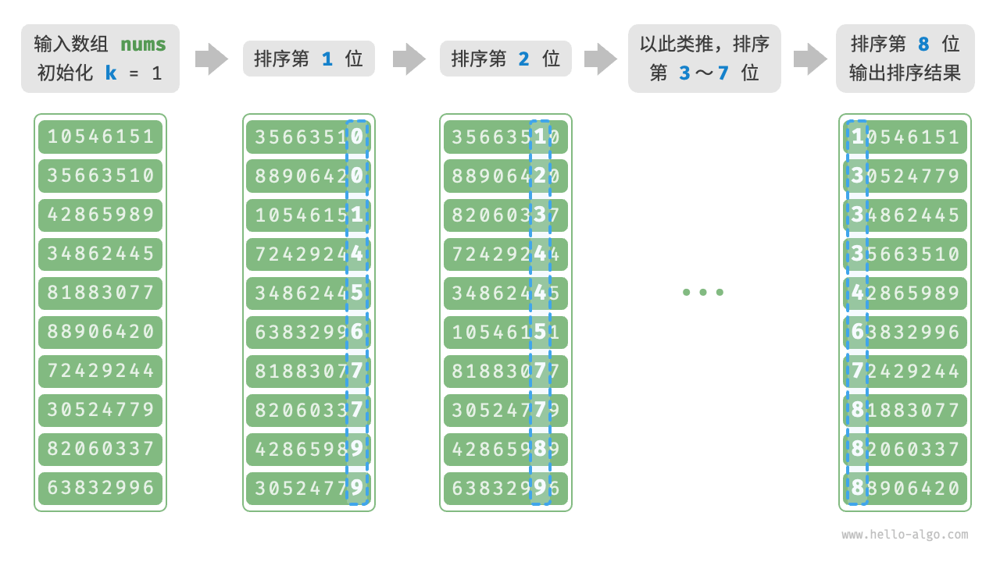

[#0000-radix-sort]
= 基数排序

基数排序通过从低位到高位，对数字的每一位进行排序来获得排序结果。比较适合数量不多，但是每个数字之间相差很大的情况。而且时间复杂度是 stem:[O(nk)]，`n` 表示数量， `k` 表示最大位数。

[{java_src_attr}]
----
include::{sortdir}/RadixSort.java[tag=answer]
----

== 经典题目

xref:0164-maximum-gap.adoc[164. 最大间距]
