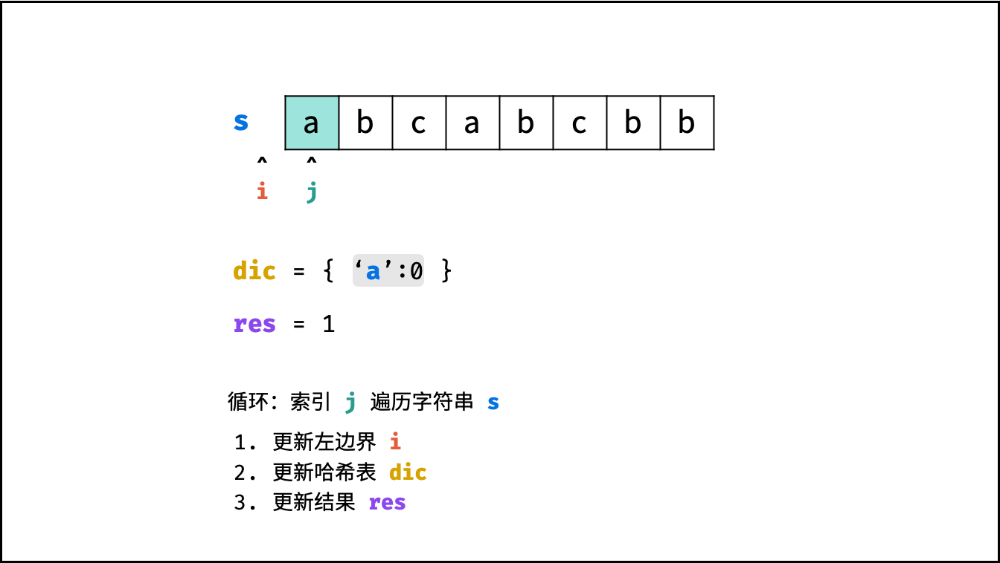
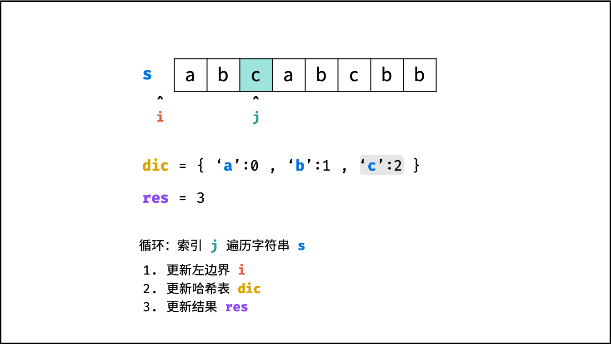
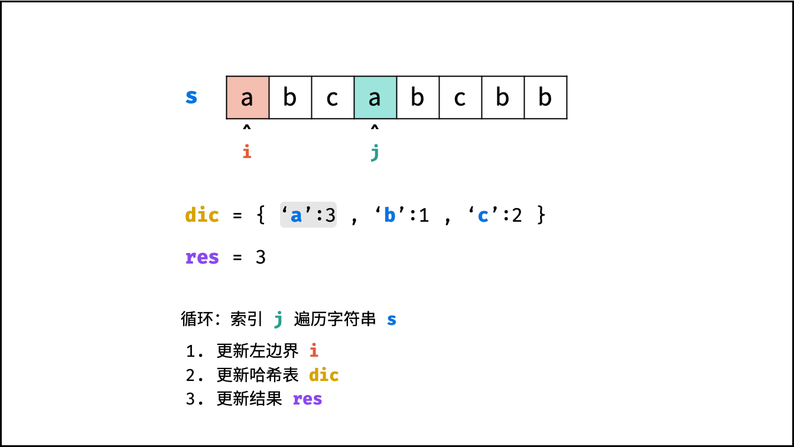
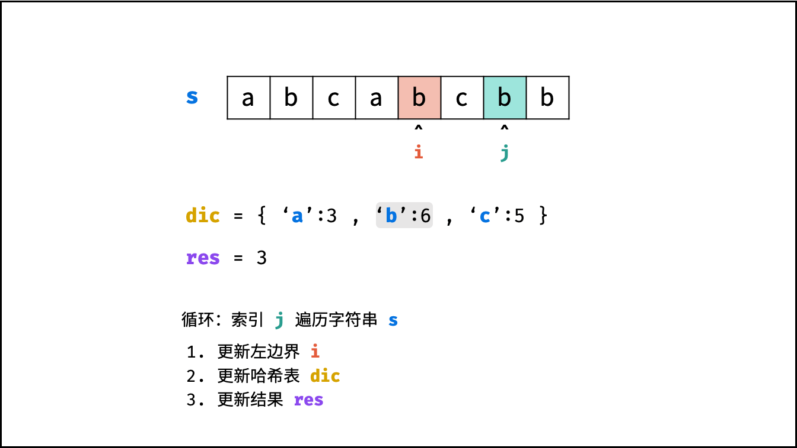

[#0003-longest-substring-without-repeating-characters]
= 3. 无重复字符的最长子串

https://leetcode.cn/problems/longest-substring-without-repeating-characters/[LeetCode - 3. 无重复字符的最长子串^]

给定一个字符串 `s` ，请你找出其中不含有重复字符的 **最长子串** 的长度。

*示例 1:*

....
输入: s = "abcabcbb"
输出: 3
解释: 因为无重复字符的最长子串是 "abc"，所以其长度为 3。
....

*示例 2:*

....
输入: s = "bbbbb"
输出: 1
解释: 因为无重复字符的最长子串是 "b"，所以其长度为 1。
....

*示例 3:*

....
输入: s = "pwwkew"
输出: 3
解释: 因为无重复字符的最长子串是 "wke"，所以其长度为 3。
     请注意，你的答案必须是 子串 的长度，"pwke" 是一个子序列，不是子串。
....

*提示：*

* `0 \<= s.length \<= 5 * 10^4^`
* `s` 由英文字母、数字、符号和空格组成

== 思路分析

滑动窗口。

可以采用计数法，也可以采用地址法。

image::images/0003-01.png[{image_attr}]

image::images/0003-03.png[{image_attr}]

image::images/0003-07.png[{image_attr}]

image::images/0003-10.png[{image_attr}]

[[src-0003]]
[tabs]
====
一刷::
+
--
[{java_src_attr}]
----
include::{sourcedir}/_0003_LongestSubstringWithoutRepeatingCharacters.java[tag=answer]
----
--

二刷::
+
--
[{java_src_attr}]
----
include::{sourcedir}/_0003_LongestSubstringWithoutRepeatingCharacters_2.java[tag=answer]
----
--

三刷::
+
--
[{java_src_attr}]
----
include::{sourcedir}/_0003_LongestSubstringWithoutRepeatingCharacters_3.java[tag=answer]
----
--

四刷::
+
--
[{java_src_attr}]
----
include::{sourcedir}/_0003_LongestSubstringWithoutRepeatingCharacters_4.java[tag=answer]
----
--

五刷::
+
--
[{java_src_attr}]
----
include::{sourcedir}/_0003_LongestSubstringWithoutRepeatingCharacters_5.java[tag=answer]
----
--
====

== 参考资料

. https://leetcode.cn/problems/longest-substring-without-repeating-characters/solutions/227999/wu-zhong-fu-zi-fu-de-zui-chang-zi-chuan-by-leetc-2/[3. 无重复字符的最长子串 - 官方题解^]
. https://leetcode.cn/problems/longest-substring-without-repeating-characters/solutions/3982/hua-dong-chuang-kou-by-powcai/[3. 无重复字符的最长子串 - 滑动窗口^]
. https://leetcode.cn/problems/longest-substring-without-repeating-characters/solutions/2361797/3-wu-zhong-fu-zi-fu-de-zui-chang-zi-chua-26i5/[3. 无重复字符的最长子串 - 滑动窗口，清晰图解^]
. https://leetcode.cn/problems/longest-substring-without-repeating-characters/solutions/228576/longest-substring-without-repeating-characters-b-2/[3. 无重复字符的最长子串 - 滑动窗口，精简代码，图解模拟^]
. https://leetcode.cn/problems/longest-substring-without-repeating-characters/solutions/7399/hua-jie-suan-fa-3-wu-zhong-fu-zi-fu-de-zui-chang-z/[3. 无重复字符的最长子串 - 画解算法^]
. https://leetcode.cn/problems/longest-substring-without-repeating-characters/solutions/41673/wu-zhong-fu-zi-fu-de-zui-chang-zi-chuan-cshi-xian-/[3. 无重复字符的最长子串 - C++ 实现三种解法 多重循环，hashmap 优化，桶优化^]
. https://leetcode.cn/problems/longest-substring-without-repeating-characters/solutions/4354/javati-jie-3wu-zhong-fu-zi-fu-de-zui-chang-zi-chua/[3. 无重复字符的最长子串 - Java 题解^]
