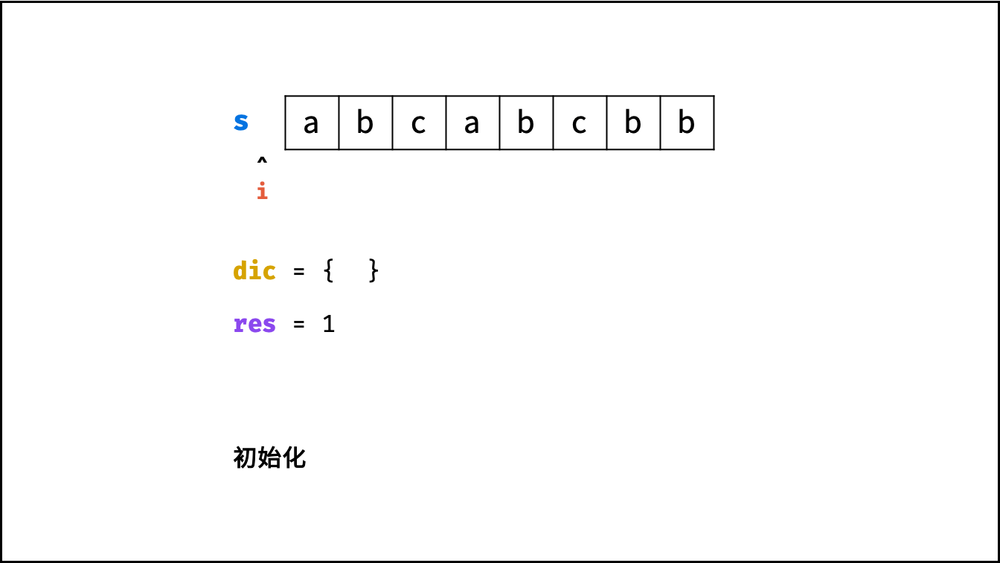

[#0003-longest-substring-without-repeating-characters]
= 3. Longest Substring Without Repeating Characters

{leetcode}/problems/longest-substring-without-repeating-characters/[LeetCode - Longest Substring Without Repeating Characters^]

Given a string, find the length of the *longest substring* without repeating characters.

.Example 1:
[subs="verbatim,quotes,macros"]
----
*Input:* "abcabcbb"
*Output:* 3 
*Explanation:* The answer is `"abc"`, with the length of 3. 
----

.Example 2:
[subs="verbatim,quotes,macros"]
----
*Input:* "bbbbb"
*Output:* 1
*Explanation:* The answer is `"b"`, with the length of 1.
----

.Example 3:
[subs="verbatim,quotes,macros"]
----
*Input:* "pwwkew"
*Output:* 3
*Explanation:* The answer is `"wke"`, with the length of 3. 
             Note that the answer must be a *substring*, `"pwke"` is a _subsequence_ and not a substring.
----

== 思路分析

滑动窗口

image::images/0003-11.png[{image_attr}]

image::images/0003-02.png[{image_attr}]

image::images/0003-04.png[{image_attr}]

image::images/0003-05.png[{image_attr}]

image::images/0003-06.png[{image_attr}]

image::images/0003-08.png[{image_attr}]

image::images/0003-09.png[{image_attr}]

[[src-0003]]
[{java_src_attr}]
----
include::{sourcedir}/_0003_LongestSubstringWithoutRepeatingCharacters.java[tag=answer]
----

[{java_src_attr}]
----
include::{sourcedir}/_0003_LongestSubstringWithoutRepeatingCharacters_2.java[tag=answer]
----

== 参考资料

. https://leetcode.cn/problems/longest-substring-without-repeating-characters/solutions/227999/wu-zhong-fu-zi-fu-de-zui-chang-zi-chuan-by-leetc-2/[3. 无重复字符的最长子串 - 官方题解^]
. https://leetcode.cn/problems/longest-substring-without-repeating-characters/solutions/3982/hua-dong-chuang-kou-by-powcai/[3. 无重复字符的最长子串 - 滑动窗口^]
. https://leetcode.cn/problems/longest-substring-without-repeating-characters/solutions/2361797/3-wu-zhong-fu-zi-fu-de-zui-chang-zi-chua-26i5/[3. 无重复字符的最长子串 - 滑动窗口，清晰图解^]
. https://leetcode.cn/problems/longest-substring-without-repeating-characters/solutions/228576/longest-substring-without-repeating-characters-b-2/[3. 无重复字符的最长子串 - 滑动窗口，精简代码，图解模拟^]
. https://leetcode.cn/problems/longest-substring-without-repeating-characters/solutions/7399/hua-jie-suan-fa-3-wu-zhong-fu-zi-fu-de-zui-chang-z/[3. 无重复字符的最长子串 - 画解算法^]
. https://leetcode.cn/problems/longest-substring-without-repeating-characters/solutions/41673/wu-zhong-fu-zi-fu-de-zui-chang-zi-chuan-cshi-xian-/[3. 无重复字符的最长子串 - C++ 实现三种解法 多重循环，hashmap 优化，桶优化^]
. https://leetcode.cn/problems/longest-substring-without-repeating-characters/solutions/4354/javati-jie-3wu-zhong-fu-zi-fu-de-zui-chang-zi-chua/[3. 无重复字符的最长子串 - Java 题解^]
