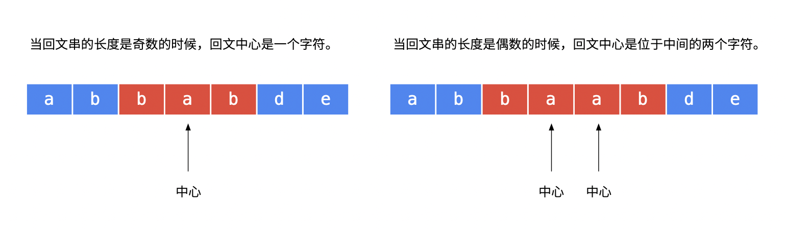

[#0005-longest-palindromic-substring]
= 5. Longest Palindromic Substring

{leetcode}/problems/longest-palindromic-substring/[LeetCode - Longest Palindromic Substring^]

Given a string *s*, find the longest palindromic substring in *s*. You may assume that the maximum length of *s* is 1000.

.Example 1:
[subs="verbatim,quotes,macros"]
----
*Input:* "babad"
*Output:* "bab"
*Note:* "aba" is also a valid answer.
----

.Example 2:
[subs="verbatim,quotes,macros"]
----
*Input:* "cbbd"
*Output:* "bb"
----

== 解题分析

最简单的方式：使用两个指针，把字符串逐个"拆成"子串，然后留下最大子串即可。可惜，这种算法的时间复杂度是 O(n^3^)。

中心扩散法

没想到，竟然存在时间复杂度为 O(n) 的算法：Manacher's Algorithm。在维基百科上有解释： https://en.wikipedia.org/wiki/Longest_palindromic_substring[Longest palindromic substring - Wikipedia^]。回头研究研究再补充！

另外，这道题还可以练手动态规划。

[[src-0005]]
[tabs]
====
一刷::
+
--
[{java_src_attr}]
----
include::{sourcedir}/_0005_LongestPalindromicSubstring.java[tag=answer]
----
--

二刷::
+
--
[{java_src_attr}]
----
include::{sourcedir}/_0005_LongestPalindromicSubstring_2.java[tag=answer]
----
--
====

== 参考资料

* https://www.geeksforgeeks.org/manachers-algorithm-linear-time-longest-palindromic-substring-part-1/[Manacher's Algorithm - Linear Time Longest Palindromic Substring - Part 1^]
* https://www.geeksforgeeks.org/manachers-algorithm-linear-time-longest-palindromic-substring-part-2/[Manacher's Algorithm - Linear Time Longest Palindromic Substring - Part 2^]
* https://www.geeksforgeeks.org/manachers-algorithm-linear-time-longest-palindromic-substring-part-3-2/[Manacher's Algorithm - Linear Time Longest Palindromic Substring - Part 3^]
* https://www.geeksforgeeks.org/manachers-algorithm-linear-time-longest-palindromic-substring-part-4/[Manacher's Algorithm - Linear Time Longest Palindromic Substring - Part 4^]
* https://medium.com/hackernoon/manachers-algorithm-explained-longest-palindromic-substring-22cb27a5e96f[Manacher’s Algorithm Explained— Longest Palindromic Substring^]
* https://blog.csdn.net/dyx404514/article/details/42061017[Manacher算法总结^]
* https://www.jianshu.com/p/6db44081a155[Manacher算法详解^]
* https://leetcode.cn/problems/longest-palindromic-substring/solutions/255195/zui-chang-hui-wen-zi-chuan-by-leetcode-solution/[5. 最长回文子串 - 官方题解^]
* https://leetcode.cn/problems/longest-palindromic-substring/solutions/63641/zhong-xin-kuo-san-fa-he-dong-tai-gui-hua-by-reedfa/[5. 最长回文子串 - 中心扩散法和动态规划^]
* https://leetcode.cn/problems/longest-palindromic-substring/solutions/9001/xiang-xi-tong-su-de-si-lu-fen-xi-duo-jie-fa-bao-gu/[5. 最长回文子串 - 详细通俗的思路分析，多解法^]
* https://leetcode.cn/problems/longest-palindromic-substring/solutions/4299/zui-chang-hui-wen-zi-chuan-c-by-gpe3dbjds1/[5. 最长回文子串^]
* https://leetcode.cn/problems/longest-palindromic-substring/solutions/7792/zhong-xin-kuo-san-dong-tai-gui-hua-by-liweiwei1419/[5. 最长回文子串 - 动态规划、中心扩散、Manacher 算法^]

