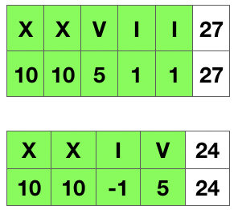

[#0013-roman-to-integer]
= 13. Roman to Integer

https://leetcode.com/problems/roman-to-integer/[LeetCode - Roman to Integer]

Roman numerals are represented by seven different symbols: `I`, `V`, `X`, `L`, `C`, `D` and `M`.

[subs="verbatim,quotes,macros"]
----
*Symbol*       *Value*
I             1
V             5
X             10
L             50
C             100
D             500
M             1000
----

For example, two is written as `II` in Roman numeral, just two one's added together. Twelve is written as, `XII`, which is simply `X` + `II`. The number twenty seven is written as `XXVII`, which is `XX` + `V` + `II`.

Roman numerals are usually written largest to smallest from left to right. However, the numeral for four is not `IIII`. Instead, the number four is written as `IV`. Because the one is before the five we subtract it making four. The same principle applies to the number nine, which is written as `IX`. There are six instances where subtraction is used:

* `I` can be placed before `V` (5) and `X` (10) to make 4 and 9. 
* `X` can be placed before `L` (50) and `C` (100) to make 40 and 90. 
* `C` can be placed before `D` (500) and `M` (1000) to make 400 and 900.

Given a roman numeral, convert it to an integer. Input is guaranteed to be within the range from 1 to 3999.

*Example 1:*

[subs="verbatim,quotes,macros"]
----
*Input:* "III"
*Output:* 3
----

*Example 2:*

[subs="verbatim,quotes,macros"]
----
*Input:* "IV"
*Output:* 4
----

*Example 3:*

[subs="verbatim,quotes,macros"]
----
*Input:* "IX"
*Output:* 9
----

*Example 4:*

[subs="verbatim,quotes,macros"]
----
*Input:* "LVIII"
*Output:* 58
*Explanation:* L = 50, V= 5, III = 3.

----

*Example 5:*

[subs="verbatim,quotes,macros"]
----
*Input:* "MCMXCIV"
*Output:* 1994
*Explanation:* M = 1000, CM = 900, XC = 90 and IV = 4.
----

== 解题分析

查看罗马数字，如果左边的数字比右边大，则就是需要做减法，否则做加法。

[[src-0013]]
[{java_src_attr}]
----
include::{sourcedir}/_0013_RomanToInteger.java[tag=answer]
----

== 参考资料

. https://leetcode-cn.com/problems/roman-to-integer/solution/yong-shi-9993nei-cun-9873jian-dan-jie-fa-by-donesp/[用时 99.93%，内存98.73%，简单解法 - 罗马数字转整数 - 力扣（LeetCode）]

