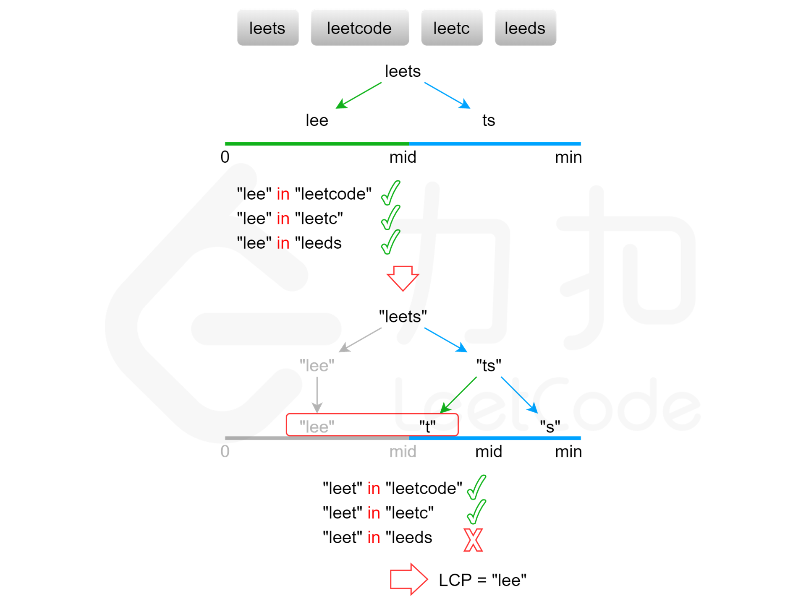

[#0014-longest-common-prefix]
= 14. 最长公共前缀

https://leetcode.cn/problems/longest-common-prefix/[LeetCode - 14. 最长公共前缀 ^]

编写一个函数来查找字符串数组中的最长公共前缀。

如果不存在公共前缀，返回空字符串 `""`。

*示例 1：*

....
输入：strs = ["flower","flow","flight"]
输出："fl"
....

*示例 2：*

....
输入：strs = ["dog","racecar","car"]
输出：""
解释：输入不存在公共前缀。
....

*提示：*

* `+1 <= strs.length <= 200+`
* `+0 <= strs[i].length <= 200+`
* `strs[i]` 仅由小写英文字母组成

== 思路分析

最简单的解题办法是逐列扫描。看题解，也不需要保存前缀，发现不同时，直接从字符串中截取即可。

image::images/0014-10.png[{image_attr}]

image::images/0014-12.png[{image_attr}]

[[src-0014]]
[tabs]
====
一刷::
+
--
[{java_src_attr}]
----
include::{sourcedir}/_0014_LongestCommonPrefix.java[tag=answer]
----
--

二刷::
+
--
[{java_src_attr}]
----
include::{sourcedir}/_0014_LongestCommonPrefix_2.java[tag=answer]
----
--
====

== 参考资料

. https://leetcode.cn/problems/longest-common-prefix/solutions/288575/zui-chang-gong-gong-qian-zhui-by-leetcode-solution/[14. 最长公共前缀 - 官方题解^] -- 解法很多！
