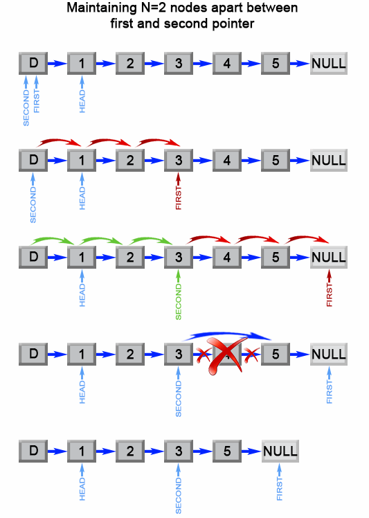

[#0019-remove-nth-node-from-end-of-list]
= 19. 删除链表的倒数第 N 个结点

https://leetcode.cn/problems/remove-nth-node-from-end-of-list/[LeetCode - 19. 删除链表的倒数第 N 个结点 ^]

给你一个链表，删除链表的倒数第 `n` 个结点，并且返回链表的头结点。

*示例 1：*

image::images/0019-01.jpg[{image_attr}]

....
输入：head = [1,2,3,4,5], n = 2
输出：[1,2,3,5]
....

*示例 2：*

....
输入：head = [1], n = 1
输出：[]
....

*示例 3：*

....
输入：head = [1,2], n = 1
输出：[1]
....

*提示：*

* 链表中结点的数目为 `sz`
* `+1 <= sz <= 30+`
* `+0 <= Node.val <= 100+`
* `+1 <= n <= sz+`

**进阶：**你能尝试使用一趟扫描实现吗？

== 思路分析

快慢指针

[[src-0019]]
[tabs]
====
一刷::
+
--
[{java_src_attr}]
----
include::{sourcedir}/_0019_RemoveNthNodeFromEndOfList.java[tag=answer]
----
--

二刷::
+
--
[{java_src_attr}]
----
include::{sourcedir}/_0019_RemoveNthNodeFromEndOfList_2.java[tag=answer]
----
--
====

== 参考资料

. https://leetcode-cn.com/problems/remove-nth-node-from-end-of-list/solution/shan-chu-lian-biao-de-dao-shu-di-nge-jie-dian-by-l/[删除链表的倒数第N个节点 - 删除链表的倒数第N个节点 - 力扣（LeetCode）^]
