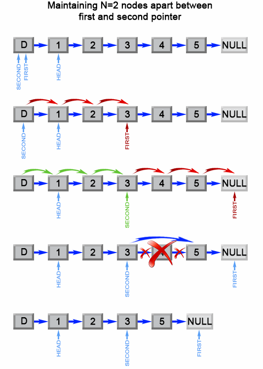

[#0019-remove-nth-node-from-end-of-list]
= 19. Remove Nth Node From End of List

https://leetcode.com/problems/remove-nth-node-from-end-of-list/[LeetCode - Remove Nth Node From End of List]

Given a linked list, remove the _n_-th node from the end of list and return its head.

*Example:*

[subs="verbatim,quotes,macros"]
----
Given linked list: *1->2->3->4->5*, and *_n_ = 2*.

After removing the second node from the end, the linked list becomes *1->2->3->5*.
----

*Note:*

Given _n_ will always be valid.

*Follow up:*

Could you do this in one pass?

== 解题分析

快慢指针

[[src-0019]]
[{java_src_attr}]
----
include::{sourcedir}/_0019_RemoveNthNodeFromEndOfList.java[tag=answer]
----

== 参考资料

. https://leetcode-cn.com/problems/remove-nth-node-from-end-of-list/solution/shan-chu-lian-biao-de-dao-shu-di-nge-jie-dian-by-l/[删除链表的倒数第N个节点 - 删除链表的倒数第N个节点 - 力扣（LeetCode）]
