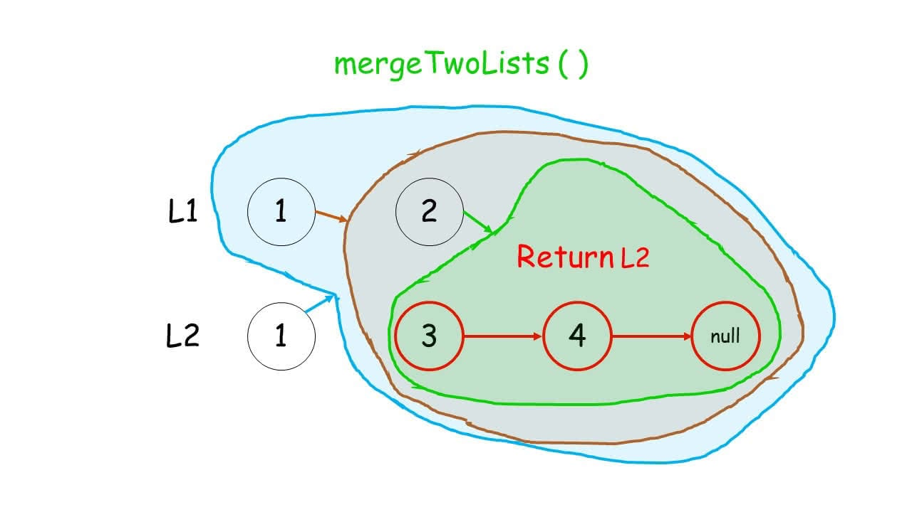
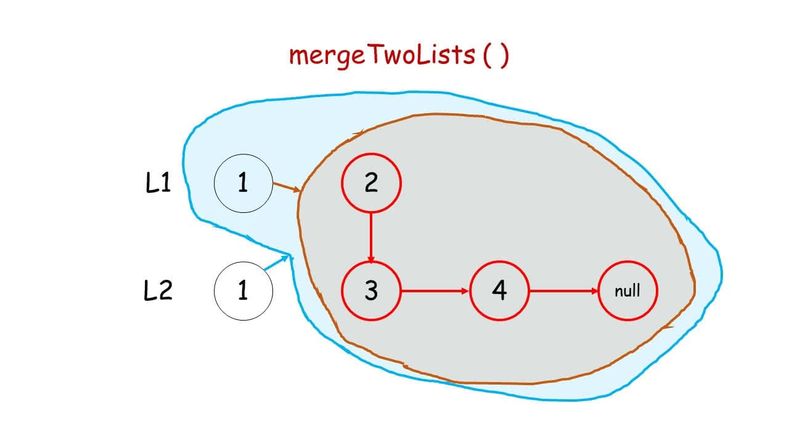

[#0021-merge-two-sorted-lists]
= 21. Merge Two Sorted Lists

https://leetcode.com/problems/merge-two-sorted-lists/[LeetCode - Merge Two Sorted Lists]

Merge two sorted linked lists and return it as a new list. The new list should be made by splicing together the nodes of the first two lists.

image::images/0021-00.jpg[{image_attr}]

*Example:*
[subs="verbatim,quotes,macros"]
----
*Input:* 1->2->4, 1->3->4
*Output:* 1->1->2->3->4->4
----

== 思路分析

=== 迭代

[[src-0021]]
[{java_src_attr}]
----
include::{sourcedir}/_0021_MergeTwoSortedLists.java[]
----

[{java_src_attr}]
----
include::{sourcedir}/_0021_MergeTwoSortedLists_2.java[]
----

=== 递归

没想到这个题也可以用递归解决！

image::images/0021-03.jpeg[{image_attr}]

image::images/0021-03.jpeg[{image_attr}]

image::images/0021-07.jpeg[{image_attr}]

image::images/0021-08.jpeg[{image_attr}]

== 参考资料

. https://leetcode.cn/problems/merge-two-sorted-lists/solutions/226408/he-bing-liang-ge-you-xu-lian-biao-by-leetcode-solu/[21. 合并两个有序链表 - 官方题解^]
. https://leetcode.cn/problems/merge-two-sorted-lists/solutions/2361535/21-he-bing-liang-ge-you-xu-lian-biao-shu-aisw/[21. 合并两个有序链表 - 双指针，清晰图解^]
. https://leetcode.cn/problems/merge-two-sorted-lists/solutions/8814/hua-jie-suan-fa-21-he-bing-liang-ge-you-xu-lian-bi/[21. 合并两个有序链表 - 画解算法^]
. https://leetcode.cn/problems/merge-two-sorted-lists/solutions/103891/yi-kan-jiu-hui-yi-xie-jiu-fei-xiang-jie-di-gui-by-/[21. 合并两个有序链表 - 一看就会，一写就废？详解递归^]
. https://leetcode.cn/problems/merge-two-sorted-lists/solutions/227293/merge-two-sorted-lists-by-ikaruga/[21. 合并两个有序链表 - 简单迭代，详细图解^]

