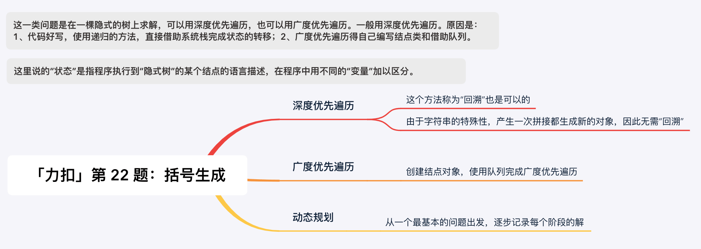
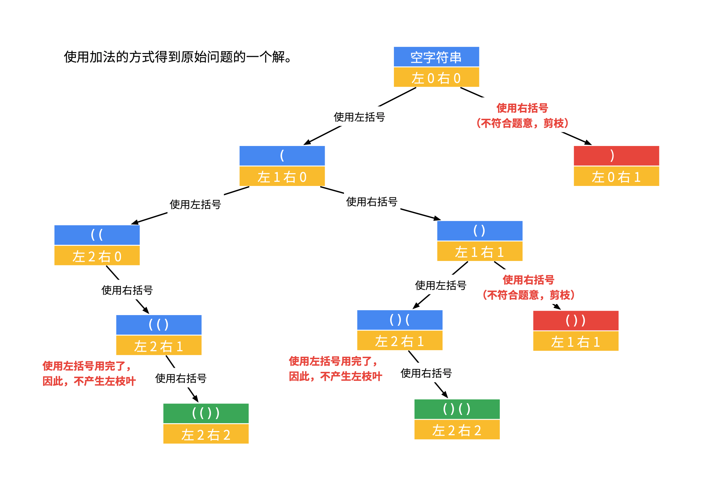
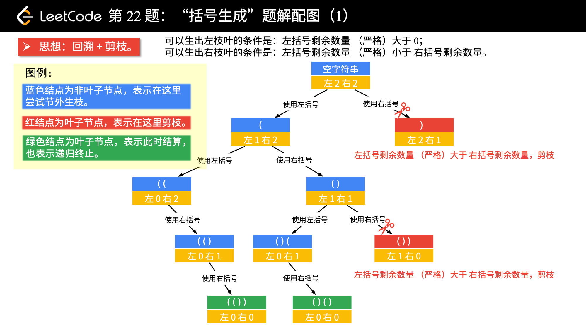

[#0022-generate-parentheses]
= 22. Generate Parentheses

https://leetcode.com/problems/generate-parentheses/[LeetCode - Generate Parentheses^]

Given _n_ pairs of parentheses, write a function to generate all combinations of well-formed parentheses.

For example, given _n_ = 3, a solution set is:

[subs="verbatim,quotes,macros"]
----
[
  "((()))",
  "(()())",
  "(())()",
  "()(())",
  "()()()"
]
----

== 解题分析

使用回溯法解题时，需要关注的一个点是，**在递归调用时，为了保证结果是有效的括号对，则添加的闭区间符号不能多于开区间符号。也就是，保证添加在添加一个闭区间符号之前，要先添加了对应的开区间符号。所以，就要注意闭区间的判断，是跟开区间大小判断，而不是括号数量。**并不是所有的排列组合都符合我们的需求。

[[src-0022]]
[{java_src_attr}]
----
include::{sourcedir}/_0022_GenerateParentheses.java[tag=answer]
----

== 思考题

有机会思考尝试一下广度优先遍历。

== 参考资料

. https://leetcode-cn.com/problems/generate-parentheses/solution/hui-su-suan-fa-by-liweiwei1419/[回溯算法（深度优先遍历）+ 广度优先遍历 + 动态规划 - 括号生成 - 力扣（LeetCode）^]