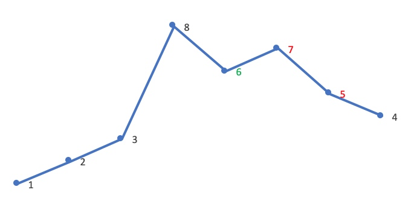
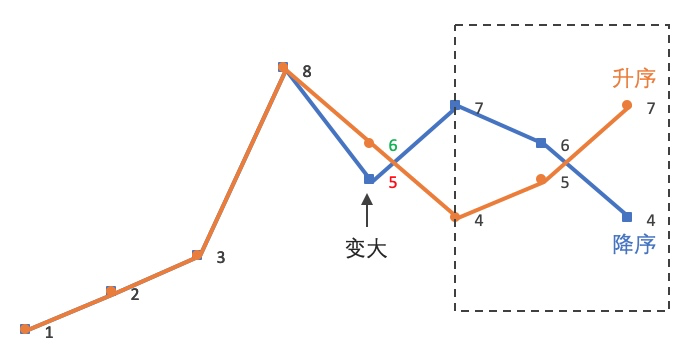

[#0031-next-permutation]
= 31. 下一个排列

https://leetcode.cn/problems/next-permutation/[LeetCode - 31. 下一个排列^]

整数数组的一个 *排列* 就是将其所有成员以序列或线性顺序排列。

* 例如，`arr = [1,2,3]` ，以下这些都可以视作 `arr` 的排列：`[1,2,3]`、`[1,3,2]`、`[3,1,2]`、`[2,3,1]`。

整数数组的 *下一个排列* 是指其整数的下一个字典序更大的排列。更正式地，如果数组的所有排列根据其字典顺序从小到大排列在一个容器中，那么数组的 *下一个排列* 就是在这个有序容器中排在它后面的那个排列。如果不存在下一个更大的排列，那么这个数组必须重排为字典序最小的排列（即，其元素按升序排列）。

* 例如，`arr = [1,2,3]` 的下一个排列是 `[1,3,2]`。
* 类似地，`arr = [2,3,1]` 的下一个排列是 `[3,1,2]`。
* 而 `arr = [3,2,1]` 的下一个排列是 `[1,2,3]` ，因为 `[3,2,1]` 不存在一个字典序更大的排列。

给你一个整数数组 `nums` ，找出 `nums` 的下一个排列。

必须 *https://baike.baidu.com/item/%E5%8E%9F%E5%9C%B0%E7%AE%97%E6%B3%95[原地]* 修改，只允许使用额外常数空间。

*示例 1：*

....
输入：nums = [1,2,3]
输出：[1,3,2]
....

*示例 2：*

....
输入：nums = [3,2,1]
输出：[1,2,3]
....

*示例 3：*

....
输入：nums = [1,1,5]
输出：[1,5,1]
....

*提示：*

* `1 \<= nums.length \<= 100`
* `0 \<= nums[i] \<= 100`

== 思路分析

可以看成寻找下一个更大的数。这样更容易理解。

标准的 “下一个排列” 算法可以描述为：

. 从后向前 查找第一个 相邻升序 的元素对 `(i,j)`，满足 `A[i] < A[j]`。此时 `[j,end)` 必然是降序
. 在 `[j,end)` 从后向前 查找第一个满足 `A[i] < A[k]` 的 `k`。`A[i]`、`A[k]` 分别就是上文所说的「小数」、「大数」
. 将 `A[i]` 与 `A[k]` 交换
. 可以断定这时 `[j,end)` 必然是降序，逆置 `[j,end)`，使其升序
. 如果在步骤 1 找不到符合的相邻元素对，说明当前 `[begin,end)` 为一个降序顺序，则直接跳到步骤 4

image::images/0031-01.png[{image_attr}]

image::images/0031-02.png[{image_attr}]

image::images/0031-03.png[{image_attr}]

image::images/0031-05.png[{image_attr}]

[[src-0031]]
[tabs]
====
一刷::
+
--
[{java_src_attr}]
----
include::{sourcedir}/_0031_NextPermutation.java[tag=answer]
----
--

二刷::
+
--
[{java_src_attr}]
----
include::{sourcedir}/_0031_NextPermutation_2.java[tag=answer]
----
--

三刷::
+
--
[{java_src_attr}]
----
include::{sourcedir}/_0031_NextPermutation_3.java[tag=answer]
----
--

四刷::
+
--
[{java_src_attr}]
----
include::{sourcedir}/_0031_NextPermutation_4.java[tag=answer]
----
--
====

== 参考资料

. https://leetcode.cn/problems/next-permutation/solutions/3621022/jiao-ni-cong-ling-kai-shi-si-kao-zhe-ti-9qfrq/[31. 下一个排列 - 带你发明下一个排列算法^]
. https://leetcode.cn/problems/next-permutation/solutions/80560/xia-yi-ge-pai-lie-suan-fa-xiang-jie-si-lu-tui-dao-/[31. 下一个排列 - 思路+推导+步骤，看不懂算我输！^]
. https://leetcode.cn/problems/next-permutation/solutions/479151/xia-yi-ge-pai-lie-by-leetcode-solution/[31. 下一个排列 - 官方题解^]

