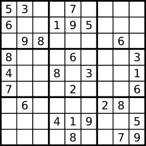
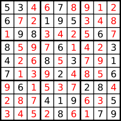
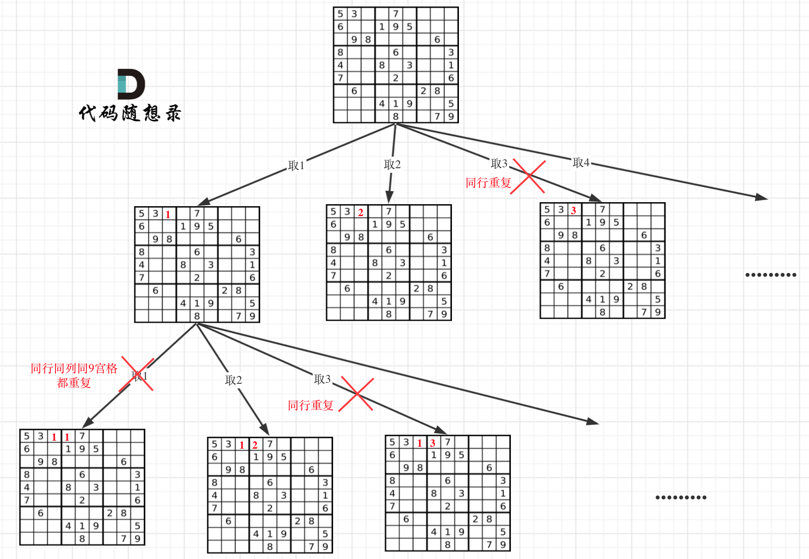

[#0037-sudoku-solver]
= 37. 解数独

https://leetcode.cn/problems/sudoku-solver/[LeetCode - 37. 解数独^]

编写一个程序，通过填充空格来解决数独问题。

数独的解法需 *遵循如下规则*：

. 数字 `1-9` 在每一行只能出现一次。
. 数字 `1-9` 在每一列只能出现一次。
. 数字 `1-9` 在每一个以粗实线分隔的 `3x3` 宫内只能出现一次。（请参考示例图）

数独部分空格内已填入了数字，空白格用 `.` 表示。

*示例 1：*

....
输入：board = [
 ["5","3",".",".","7",".",".",".","."],
 ["6",".",".","1","9","5",".",".","."],
 [".","9","8",".",".",".",".","6","."],
 ["8",".",".",".","6",".",".",".","3"],
 ["4",".",".","8",".","3",".",".","1"],
 ["7",".",".",".","2",".",".",".","6"],
 [".","6",".",".",".",".","2","8","."],
 [".",".",".","4","1","9",".",".","5"],
 [".",".",".",".","8",".",".","7","9"]]
输出：[
 ["5","3","4","6","7","8","9","1","2"],
 ["6","7","2","1","9","5","3","4","8"],
 ["1","9","8","3","4","2","5","6","7"],
 ["8","5","9","7","6","1","4","2","3"],
 ["4","2","6","8","5","3","7","9","1"],
 ["7","1","3","9","2","4","8","5","6"],
 ["9","6","1","5","3","7","2","8","4"],
 ["2","8","7","4","1","9","6","3","5"],
 ["3","4","5","2","8","6","1","7","9"]]
解释：输入的数独如上图所示，唯一有效的解决方案如下所示：
....

*提示：*

* `board.length == 9`
* `board[i].length == 9`
* `board[i][j]` 是一位数字或者 `.`
* 题目数据 *保证* 输入数独仅有一个解

== 思路分析

这道题特别需要关注的点是：只要找到一个解就可以了，不需要求全部解。所以，需要重点思考的是，如何在找到第一个解时，就立即停止搜索。

尝试画一下递归树！

位运算牛逼：使用 `1~9` 的比特位来表示是否已经存在某个数字。

使用异或而不是使用或，或只能用于初次标记（从 `0` 开始标记，所以，无论是异或还是或，跟一个 `1` 相计算，都可以把 `1`保留下来）。而异或的优点是，在选择和撤销时，可以使用相同的操作（原始比特是 `0`，异或后是 `1`，再异或又是 `0`）。

行列块相或 `rows | columns | boxes` 后，还是 `0` 的比特位，就是需要待填充的值。拿题目实例来举例：

----

   84                             1010100  rows[0]
  128                            10000000  column[2]
  436                           110110100  box[0][0] 左上角的9个方格
  500                           111110100  rows[0] | columns[2] | boxes[0][0] = or
 -501    11111111111111111111111000001011  ~or
   11                                1011  ~or & 0x1FF = mask
    1                                   1  mask & (-mask) 取出最后一位 1 的下标

                                           mask &= (mask - 1) 演进到下一步
----

[[src-0037]]
[tabs]
====
一刷::
+
--
[{java_src_attr}]
----
include::{sourcedir}/_0037_SudokuSolver.java[tag=answer]
----
--

二刷::
+
--
[{java_src_attr}]
----
include::{sourcedir}/_0037_SudokuSolver_2.java[tag=answer]
----
--

二刷（引入步进）::
+
--
[{java_src_attr}]
----
include::{sourcedir}/_0037_SudokuSolver_21.java[tag=answer]
----
--

三刷::
+
--
[{java_src_attr}]
----
include::{sourcedir}/_0037_SudokuSolver_3.java[tag=answer]
----
--

四刷::
+
--
[{java_src_attr}]
----
include::{sourcedir}/_0037_SudokuSolver_4.java[tag=answer]
----
--

五刷::
+
--
[{java_src_attr}]
----
include::{sourcedir}/_0037_SudokuSolver_5.java[tag=answer]
----
--
====

== 参考资料

. https://mp.weixin.qq.com/s/VCirGskFGPln-S2LGFTgKg[搞懂回溯算法，我终于能做数独了^]
. https://leetcode.cn/problems/sudoku-solver/solutions/414261/37-jie-shu-du-hui-su-sou-suo-suan-fa-xiang-jie-by-/[37. 解数独 - 「代码随想录」带你学透回溯算法！^]

