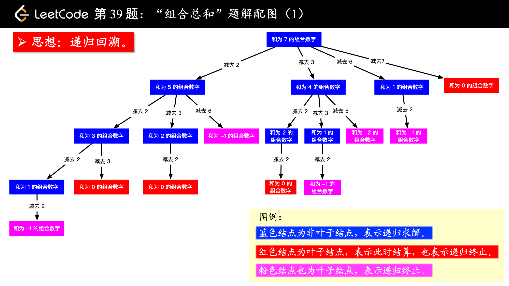
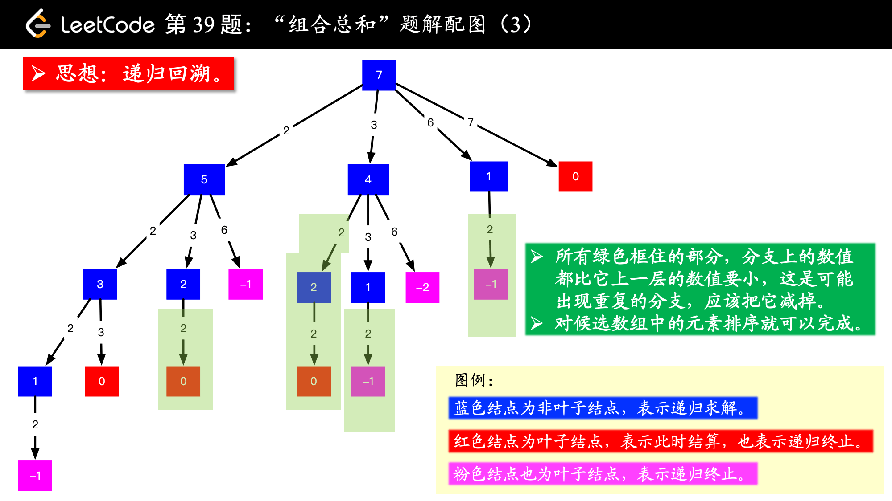

[#0039-combination-sum]
= 39. Combination Sum

https://leetcode.com/problems/combination-sum/[LeetCode - Combination Sum]

Given a *set* of candidate numbers (`candidates`) (**without duplicates**) and a target number (`target`), find all unique combinations in `candidates` where the candidate numbers sums to `target`.

The *same* repeated number may be chosen from `candidates` unlimited number of times.

*Note:*

* All numbers (including target) will be positive integers.
* The solution set must not contain duplicate combinations.

.Example 1:
[source]
----
Input: candidates = [2,3,6,7], target = 7,
A solution set is:
[
  [7],
  [2,2,3]
]
----

.Example 2:
[source]
----
Input: candidates = [2,3,5], target = 8,
A solution set is:
[
  [2,2,2,2],
  [2,3,3],
  [3,5]
]
----

参考 xref:0046-permutations.adoc[46. Permutations] 认真学习一下回溯思想。

image::images/0039-2.png[{image_attr}]

思考题：如何做剪枝？这道题通过做剪枝从 164ms 优化到了 9ms。

== 参考资料

. https://leetcode-cn.com/problems/combination-sum/solution/hui-su-suan-fa-jian-zhi-python-dai-ma-java-dai-m-2/[回溯算法 + 剪枝（Python、Java、C++） - 组合总和 - 力扣（LeetCode）]

Given a *set* of candidate numbers (`candidates`) *(without duplicates)* and a target number (`target`), find all unique combinations in `candidates` where the candidate numbers sums to `target`.

The *same* repeated number may be chosen from `candidates` unlimited number of times.

*Note:*

* All numbers (including `target`) will be positive integers.
* The solution set must not contain duplicate combinations.

*Example 1:*

[subs="verbatim,quotes,macros"]
----
*Input:* candidates = `[2,3,6,7], `target = `7`,
*A solution set is:*
[
  [7],
  [2,2,3]
]
----

*Example 2:*

[subs="verbatim,quotes,macros"]
----
*Input:* candidates = [2,3,5]`, `target = 8,
*A solution set is:*
[
  [2,2,2,2],
  [2,3,3],
  [3,5]
]
----

[[src-0039]]
[{java_src_attr}]
----
include::{sourcedir}/_0039_CombinationSum.java[]
----

