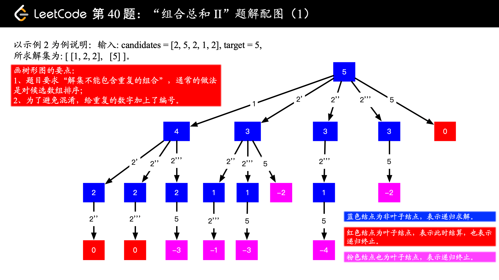
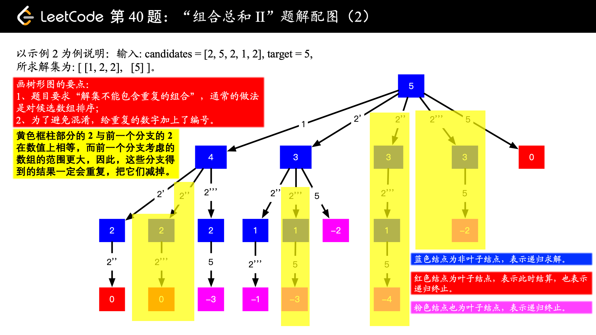
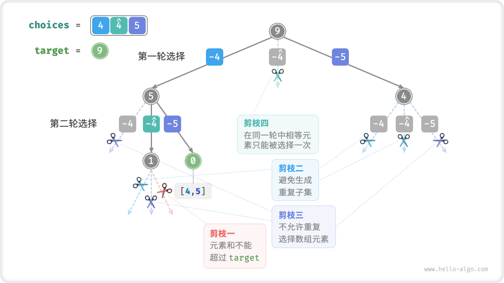
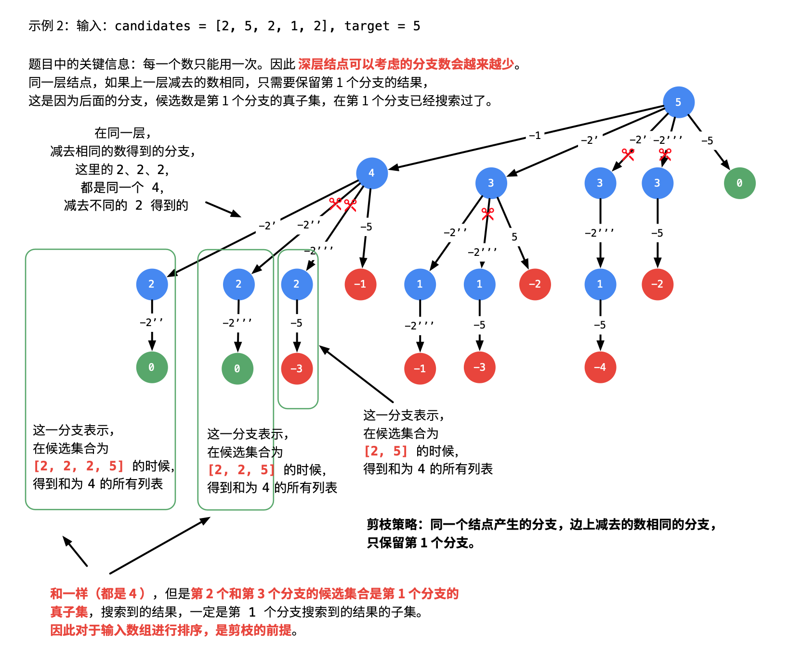
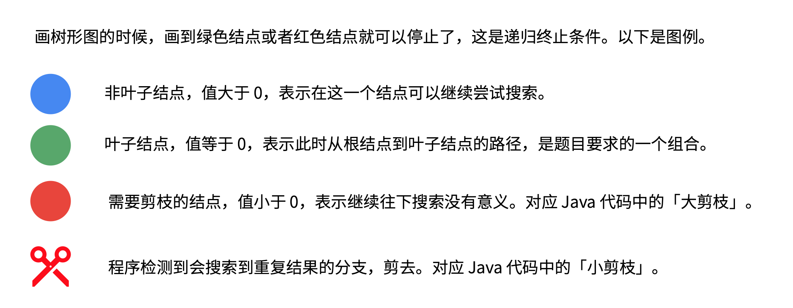

[#0040-combination-sum-ii]
= 40. 组合总和 II

https://leetcode.cn/problems/combination-sum-ii/[LeetCode - 40. 组合总和 II ^]

给定一个候选人编号的集合 `candidates` 和一个目标数 `target` ，找出 `candidates` 中所有可以使数字和为 `target` 的组合。

`candidates` 中的每个数字在每个组合中只能使用 *一次* 。

**注意：**解集不能包含重复的组合。

*示例 1:*

....
输入: candidates = [10,1,2,7,6,1,5], target = 8,
输出:
[
  [1,1,6],
  [1,2,5],
  [1,7],
  [2,6]
]
....

*示例 2:*

....
输入: candidates = [2,5,2,1,2], target = 5,
输出:
[
  [1,2,2],
  [5]
]
....

*提示:*

* `+1 <= candidates.length <= 100+`
* `+1 <= candidates[i] <= 50+`
* `+1 <= target <= 30+`

== 思路分析

image::images/0040-03.png[{image_attr}]

这道题的关键是由于候选值不能重复使用，所以需要向下传递起始位置。可以对比一下 xref:0039-combination-sum.adoc[39. Combination Sum] 的处理上的不同之处。

思考一下解决重复值时是怎么剪枝的？

[[src-0040]]
[tabs]
====
一刷::
+
--
[{java_src_attr}]
----
include::{sourcedir}/_0040_CombinationSumII.java[tag=answer]
----
--

二刷::
+
--
[{java_src_attr}]
----
include::{sourcedir}/_0040_CombinationSumII_2.java[tag=answer]
----
--

三刷::
+
--
[{java_src_attr}]
----
include::{sourcedir}/_0040_CombinationSumII_3.java[tag=answer]
----
--

四刷::
+
--
[{java_src_attr}]
----
include::{sourcedir}/_0040_CombinationSumIi_4.java[tag=answer]
----
--
====

== 思考题

如果一个既存在重复元素，同一个元素又可以重复使用，该怎么做组合总和？

其实，不能这样搞。没办法区分是同一个元素，还是重复的元素。

== 参考资料

. https://leetcode.cn/problems/combination-sum-ii/solutions/407850/zu-he-zong-he-ii-by-leetcode-solution/[40. 组合总和 II - 官方题解^]
. https://leetcode.cn/problems/combination-sum-ii/solutions/14753/hui-su-suan-fa-jian-zhi-python-dai-ma-java-dai-m-3/[40. 组合总和 II - 回溯算法 + 剪枝（Java、Python）^]
. https://leetcode.cn/problems/combination-sum-ii/solutions/2363941/40-zu-he-zong-he-iihui-su-qing-xi-tu-jie-7y8s/[40. 组合总和 II - 回溯，清晰图解^]

