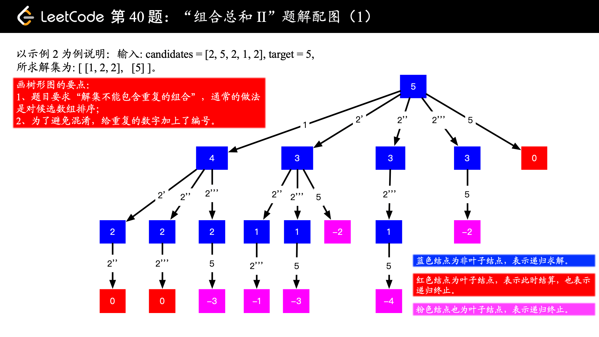
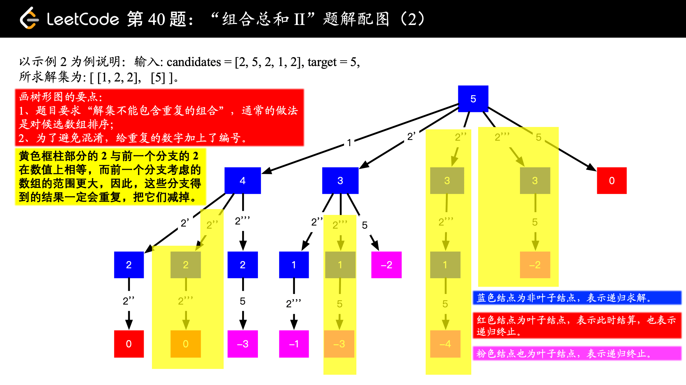
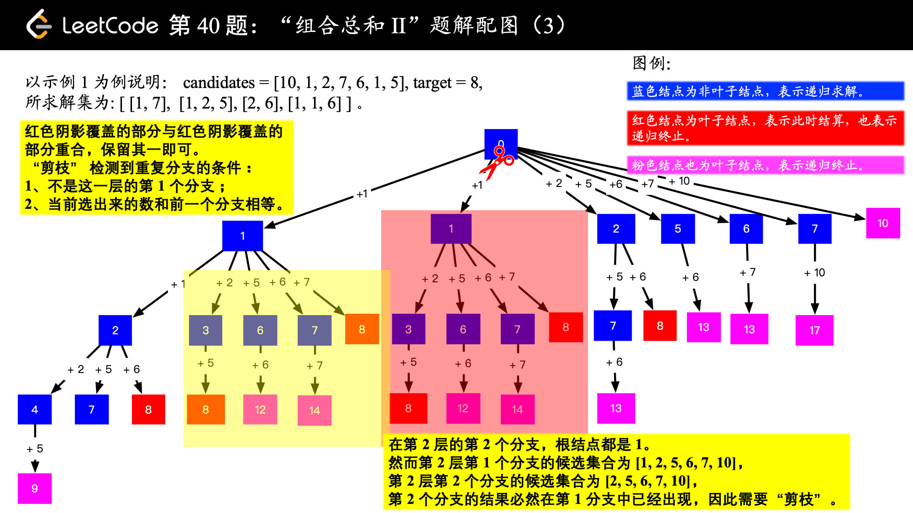

== 40. Combination Sum II

https://leetcode.com/problems/combination-sum-ii/[LeetCode - Combination Sum II]

Given a collection of candidate numbers (`candidates`) and a target number (`target`), find all unique combinations in `candidates` where the candidate numbers sums to `target`.

Each number in `candidates` may only be used once in the combination.

*Note:*

* All numbers (including target) will be positive integers.
* The solution set must not contain duplicate combinations.

.Example 1:
[source]
----
Input: candidates = [10,1,2,7,6,1,5], target = 8,
A solution set is:
[
  [1, 7],
  [1, 2, 5],
  [2, 6],
  [1, 1, 6]
]
----

.Example 2:
[source]
----
Input: candidates = [2,5,2,1,2], target = 5,
A solution set is:
[
  [1,2,2],
  [5]
]
----

这道题的关键是由于候选值不能重复使用，所以需要向下传递起始位置。可以对比一下 xref:0039-combination-sum.adoc[] 的处理上的不同之处。

思考一下解决重复值时是怎么剪枝的？

Given a collection of candidate numbers (`candidates`) and a target number (`target`), find all unique combinations in `candidates` where the candidate numbers sums to `target`.

Each number in `candidates` may only be used *once* in the combination.

*Note:*

* All numbers (including `target`) will be positive integers.
* The solution set must not contain duplicate combinations.

*Example 1:*

[subs="verbatim,quotes,macros"]
----
*Input:* candidates = `[10,1,2,7,6,1,5]`, target = `8`,
*A solution set is:*
[
  [1, 7],
  [1, 2, 5],
  [2, 6],
  [1, 1, 6]
]
----

*Example 2:*

[subs="verbatim,quotes,macros"]
----
*Input:* candidates = [2,5,2,1,2], target = 5,
*A solution set is:*
[
  [1,2,2],
  [5]
]
----

[[src-0040]]
[source,{java_source_attr}]
----
include::{sourcedir}/_0040_CombinationSumII.java[]
----

