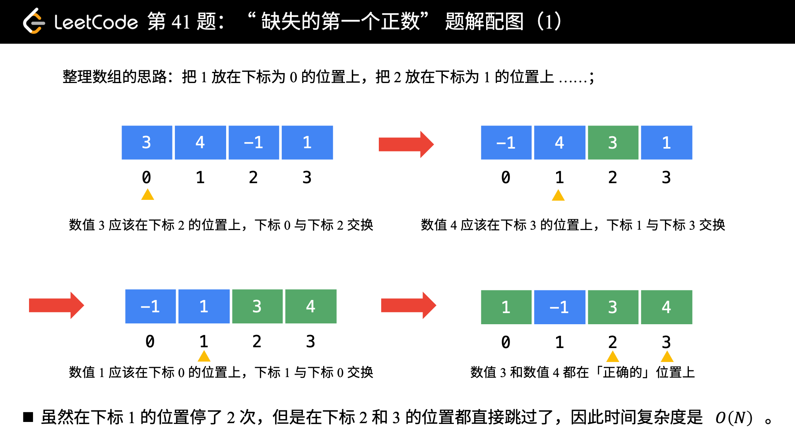

[#0041-first-missing-positive]
= 41. 缺失的第一个正数

https://leetcode.cn/problems/first-missing-positive/[LeetCode - 41. 缺失的第一个正数^]

给你一个未排序的整数数组 `nums` ，请你找出其中没有出现的最小的正整数。

请你实现时间复杂度为 stem:[O(n)] 并且只使用常数级别额外空间的解决方案。

*示例 1：*

....
输入：nums = [1,2,0]
输出：3
解释：范围 [1,2] 中的数字都在数组中。
....

*示例 2：*

....
输入：nums = [3,4,-1,1]

输出：2

解释：1 在数组中，但 2 没有。
....

*示例 3：*

....
输入：nums = [7,8,9,11,12]
输出：1
解释：最小的正数 1 没有出现。
....

*提示：*

* `1 \<= nums.length \<= 10^5^`
* `-2^31^ \<= nums[i] \<= 2^31^ - 1`

== 思路分析

循环排序，原地哈希。

这道题跟 xref:0268-missing-number.adoc[268. Missing Number] 很像！

image::images/0041-01.png[{image_attr}]

[[src-0041]]
[tabs]
====
一刷::
+
--
[{java_src_attr}]
----
include::{sourcedir}/_0041_FirstMissingPositive.java[tag=answer]
----
--

二刷::
+
--
[{java_src_attr}]
----
include::{sourcedir}/_0041_FirstMissingPositive_2.java[tag=answer]
----
--

三刷::
+
--
[{java_src_attr}]
----
include::{sourcedir}/_0041_FirstMissingPositive_3.java[tag=answer]
----
--

四刷::
+
--
[{java_src_attr}]
----
include::{sourcedir}/_0041_FirstMissingPositive_4.java[tag=answer]
----
--

五刷::
+
--
[{java_src_attr}]
----
include::{sourcedir}/_0041_FirstMissingPositive_5.java[tag=answer]
----
--
====

== 参考资料

. https://leetcode.cn/problems/first-missing-positive/solutions/3655377/huan-zuo-wei-tong-guo-li-zi-li-jie-suan-qa94e/[41. 缺失的第一个正数 - O(n) 换座位，通过例子理解算法思想^]
. https://leetcode.cn/problems/first-missing-positive/solutions/304743/que-shi-de-di-yi-ge-zheng-shu-by-leetcode-solution/[41. 缺失的第一个正数 - 官方题解^]
. https://leetcode.cn/problems/first-missing-positive/solutions/7703/tong-pai-xu-python-dai-ma-by-liweiwei1419/[41. 缺失的第一个正数 - 原地哈希（哈希函数为：f(nums[i\]) = nums[i\] - 1）^]
