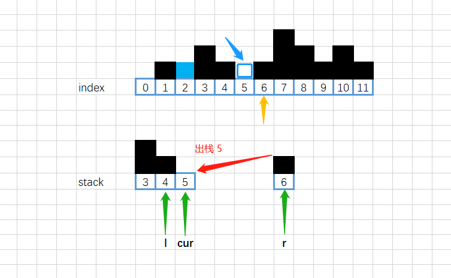

[#0042-trapping-rain-water]
= 42. Trapping Rain Water

https://leetcode.com/problems/trapping-rain-water/[LeetCode - Trapping Rain Water^]

Given _n_ non-negative integers representing an elevation map where the width of each bar is 1, compute how much water it is able to trap after raining.

*Example:*

image::images/0042-00.png[{image_attr}]

[.small]#The above elevation map is represented by array [0,1,0,2,1,0,1,3,2,1,2,1]. In this case, 6 units of rain water (blue section) are being trapped. *Thanks Marcos* for contributing this image!#

[subs="verbatim,quotes,macros"]
----
*Input:* [0,1,0,2,1,0,1,3,2,1,2,1]
*Output:* 6
----

== 解题分析

image::images/0042-01.png[{image_attr}]

image::images/0042-03.png[{image_attr}]

image::images/0042-05.png[{image_attr}]

[[src-0042]]
[tabs]
====
一刷::
+
--
[{java_src_attr}]
----
include::{sourcedir}/_0042_TrappingRainWater.java[tag=answer]
----
--

二刷::
+
--
[{java_src_attr}]
----
include::{sourcedir}/_0042_TrappingRainWater_2.java[tag=answer]
----
--

三刷::
+
--
[{java_src_attr}]
----
include::{sourcedir}/_0042_TrappingRainWater_3.java[tag=answer]
----
--
====

== 思考题

尝试一下动态规划解法！

== 参考资料

. https://leetcode.cn/problems/trapping-rain-water/solutions/9112/xiang-xi-tong-su-de-si-lu-fen-xi-duo-jie-fa-by-w-8/[42. 接雨水 - 详细通俗的思路分析，多解法^]
. https://blog.csdn.net/weixin_50348837/article/details/136304458[深入理解单调栈算法，这一篇就够了^]
. https://leetcode.cn/problems/trapping-rain-water/solutions/185678/trapping-rain-water-by-ikaruga/[42. 接雨水 - 单调递减栈，简洁代码，动图模拟^]
