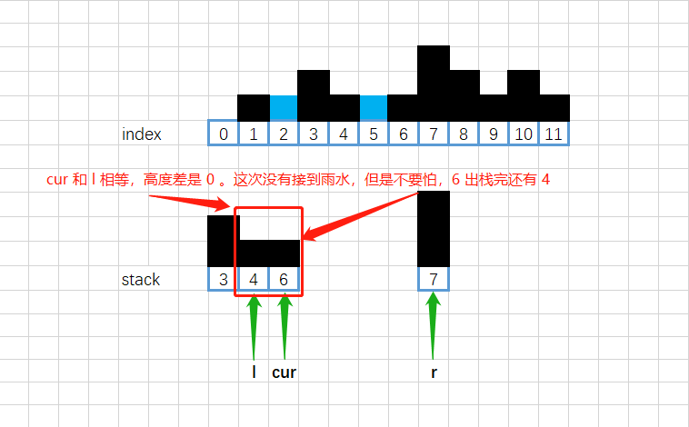

[#0042-trapping-rain-water]
= 42. 接雨水

https://leetcode.cn/problems/trapping-rain-water/[LeetCode - 42. 接雨水^]

给定 `n` 个非负整数表示每个宽度为 `1` 的柱子的高度图，计算按此排列的柱子，下雨之后能接多少雨水。

*示例 1：*

....
输入：height = [0,1,0,2,1,0,1,3,2,1,2,1]
输出：6
解释：上面是由数组 [0,1,0,2,1,0,1,3,2,1,2,1] 表示的高度图，在这种情况下，可以接 6 个单位的雨水（蓝色部分表示雨水）。
....

*示例 2：*

....
输入：height = [4,2,0,3,2,5]
输出：9
....

*提示：*

* `n == height.length`
* `1 \<= n \<= 2 * 10^4^`
* `0 \<= height[i] \<= 10^5^`

[#解题分析]
== 解题分析

这道题最简单的思路是双指针，类似 xref:0011-container-with-most-water.adoc[11. Container With Most Water] 的思路：两端指针，保存两端最高柱子高度，谁低计算谁的盛水数量，向前推进。

单调栈解法图示：

image::images/0042-01.png[{image_attr}]

image::images/0042-02.png[{image_attr}]

image::images/0042-04.png[{image_attr}]

image::images/0042-05.png[{image_attr}]

image::images/0042-06.png[{image_attr}]

[[src-0042]]
[tabs]
====
一刷::
+
--
[{java_src_attr}]
----
include::{sourcedir}/_0042_TrappingRainWater.java[tag=answer]
----
--

二刷::
+
--
[{java_src_attr}]
----
include::{sourcedir}/_0042_TrappingRainWater_2.java[tag=answer]
----
--

三刷::
+
--
[{java_src_attr}]
----
include::{sourcedir}/_0042_TrappingRainWater_3.java[tag=answer]
----
--

四刷::
+
--
[{java_src_attr}]
----
include::{sourcedir}/_0042_TrappingRainWater_4.java[tag=answer]
----
--

五刷::
+
--
[{java_src_attr}]
----
include::{sourcedir}/_0042_TrappingRainWater_5.java[tag=answer]
----
--

六刷::
+
--
[{java_src_attr}]
----
include::{sourcedir}/_0042_TrappingRainWater_6.java[tag=answer]
----
--
====

== 思考题

尝试一下动态规划解法！

== 参考资料

. https://leetcode.cn/problems/trapping-rain-water/solutions/1974340/zuo-liao-nbian-huan-bu-hui-yi-ge-shi-pin-ukwm/[42. 接雨水 - 三种方法：前后缀分解/双指针/单调栈^]
. https://leetcode.cn/problems/trapping-rain-water/solutions/692342/jie-yu-shui-by-leetcode-solution-tuvc/[42. 接雨水 - 官方题解^] -- 左右双指针的解法，代码最简单。
. https://leetcode.cn/problems/trapping-rain-water/solutions/9112/xiang-xi-tong-su-de-si-lu-fen-xi-duo-jie-fa-by-w-8/[42. 接雨水 - 详细通俗的思路分析，多解法^]
. https://blog.csdn.net/weixin_50348837/article/details/136304458[深入理解单调栈算法，这一篇就够了^]
. https://leetcode.cn/problems/trapping-rain-water/solutions/185678/trapping-rain-water-by-ikaruga/[42. 接雨水 - 单调递减栈，简洁代码，动图模拟^]
