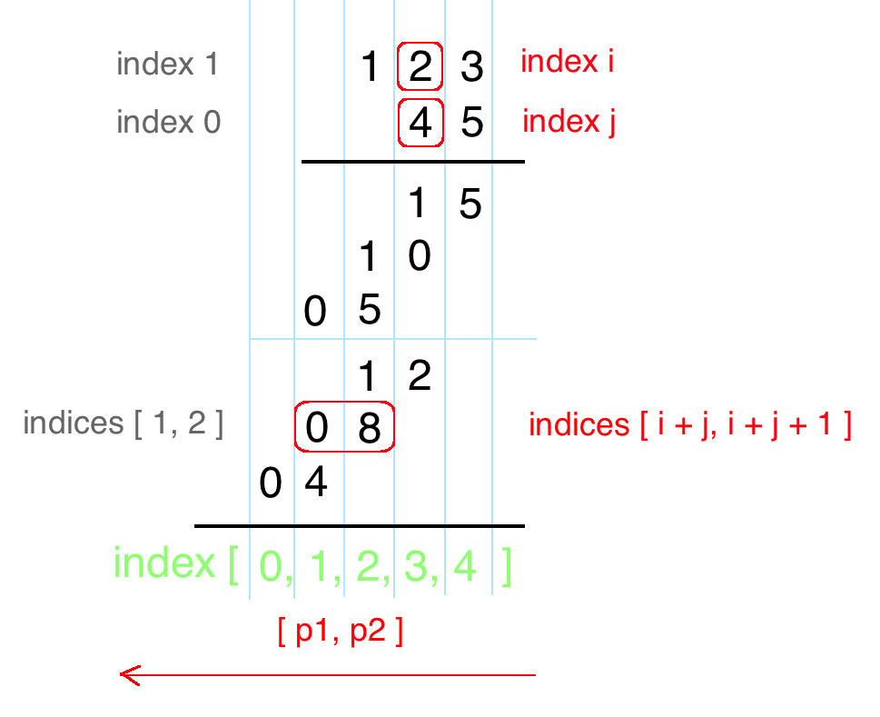

== 43. Multiply Strings

https://leetcode.com/problems/multiply-strings/[LeetCode - Multiply Strings]

Given two non-negative integers `num1` and `num2` represented as strings, return the product of `num1` and num2, also represented as a string.

.Example 1:
----
Input: num1 = "2", num2 = "3"
Output: "6"
----

.Example 2:
----
Input: num1 = "123", num2 = "456"
Output: "56088"
----

*Note:*

. The length of both `num1` and `num2` is < 110.
. Both `num1` and `num2` contain only digits 0-9.
. Both `num1` and `num2` do not contain any leading zero, except the number 0 itself.
. You *must not use any built-in `BigInteger` library* or *convert the inputs to integer* directly.

=== 解题思路

将每次相乘的计算结果存入到一个数组中，每个元素保存一个位上的数字。

=== 参考资料

. https://leetcode-cn.com/problems/multiply-strings/solution/you-hua-ban-shu-shi-da-bai-994-by-breezean/[优化版竖式(打败99.4%) - 字符串相乘 - 力扣（LeetCode）] -- 第二种解法，最初没看明白，但是受他们的启发，我自己想到了。

Given two non-negative integers `num1` and `num2` represented as strings, return the product of `num1` and `num2`, also represented as a string.

*Example 1:*

[subs="verbatim,quotes,macros"]
----
*Input:* num1 = "2", num2 = "3"
*Output:* "6"
----

*Example 2:*

[subs="verbatim,quotes,macros"]
----
*Input:* num1 = "123", num2 = "456"
*Output:* "56088"
----

*Note:*

. The length of both `num1` and `num2` is < 110.
. Both `num1` and `num2` contain only digits `0-9`.
. Both `num1` and `num2` do not contain any leading zero, except the number 0 itself.
. You *must not use any built-in BigInteger library* or *convert the inputs to integer* directly.

