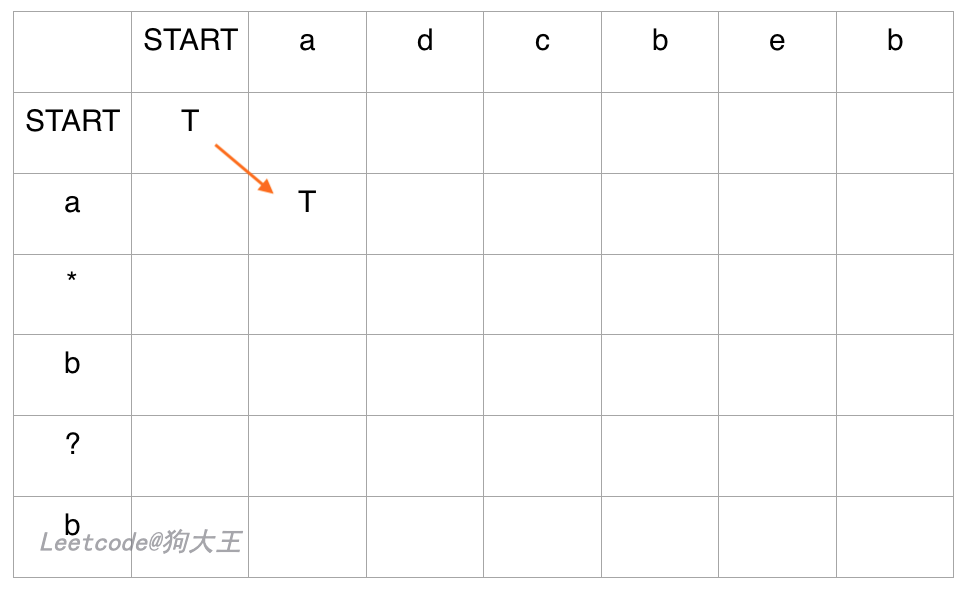

[#0044-wildcard-matching]
= 44. 通配符匹配

https://leetcode.cn/problems/wildcard-matching/[LeetCode - 44. 通配符匹配 ^]

给你一个输入字符串 (`s`) 和一个字符模式 (`p`) ，请你实现一个支持 `?` 和 `*` 匹配规则的通配符匹配：

* `?` 可以匹配任何单个字符。
* `*` 可以匹配任意字符序列（包括空字符序列）。

判定匹配成功的充要条件是：字符模式必须能够 *完全匹配* 输入字符串（而不是部分匹配）。

*示例 1：*

....
输入：s = "aa", p = "a"
输出：false
解释："a" 无法匹配 "aa" 整个字符串。
....

*示例 2：*

....
输入：s = "aa", p = "*"
输出：true
解释：'*' 可以匹配任意字符串。
....

*示例 3：*

....
输入：s = "cb", p = "?a"
输出：false
解释：'?' 可以匹配 'c', 但第二个 'a' 无法匹配 'b'。
....

*提示：*

* `+0 <= s.length, p.length <= 2000+`
* `s` 仅由小写英文字母组成
* `p` 仅由小写英文字母、`?` 或 `*` 组成

== 思路分析

想使用双指针，发现行不通！

完全没有想到是动态规划！

image::images/0044-10.png[{image_attr}]

image::images/0044-11.png[{image_attr}]

image::images/0044-14.png[{image_attr}]

image::images/0044-16.png[{image_attr}]

[[src-0044]]
[tabs]
====
一刷::
+
--
[{java_src_attr}]
----
include::{sourcedir}/_0044_WildcardMatching.java[tag=answer]
----
--

// 二刷::
// +
// --
// [{java_src_attr}]
// ----
// include::{sourcedir}/_0044_WildcardMatching_2.java[tag=answer]
// ----
// --
====

== 参考资料

. https://leetcode.cn/problems/wildcard-matching/solutions/316462/yi-ge-qi-pan-kan-dong-dong-tai-gui-hua-dpsi-lu-by-/[44. 通配符匹配 - 一个棋盘看懂动态规划(DP)思路^]
. https://leetcode.cn/problems/wildcard-matching/solutions/315802/tong-pei-fu-pi-pei-by-leetcode-solution/[44. 通配符匹配 - 官方题解^] -- 动态规划的思路与上一个题解一样，代码更简洁！
. https://leetcode.cn/problems/wildcard-matching/solutions/63465/44-tong-pei-fu-pi-pei-shuang-zhi-zhen-by-guohaodin/[44. 通配符匹配 - 双指针贪心^] -- 这个贪心解法很简洁！

