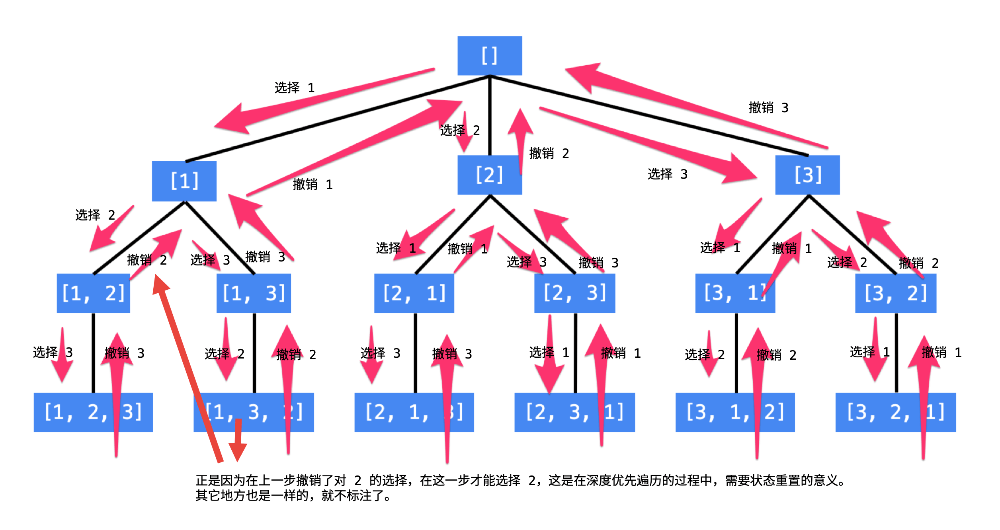

== 46. Permutations

https://leetcode.com/problems/permutations/[LeetCode - Permutations]

首先介绍“回溯”算法的应用。“回溯”算法也叫“回溯搜索”算法，主要用于在一个庞大的空间里搜索我们所需要的问题的解。我们每天使用的“搜索引擎”就是帮助我们在庞大的互联网上搜索我们需要的信息。“搜索”引擎的“搜索”和“回溯搜索”算法的“搜索”意思是一样的。

“回溯”指的是“状态重置”，可以理解为“回到过去”、“恢复现场”，是在编码的过程中，是为了节约空间而使用的一种技巧。而回溯其实是“深度优先遍历”特有的一种现象。之所以是“深度优先遍历”，是因为我们要解决的问题通常是在一棵树上完成的，在这棵树上搜索需要的答案，一般使用深度优先遍历。

“全排列”就是一个非常经典的“回溯”算法的应用。我们知道，N 个数字的全排列一共有 N! 这么多个。

使用编程的方法得到全排列，就是在这样的一个树形结构中进行编程，具体来说，就是**执行一次深度优先遍历，从树的根结点到叶子结点形成的路径就是一个全排列。**

说明：

. 每一个结点表示了“全排列”问题求解的不同阶段，这些阶段通过变量的“不同的值”体现；
. 这些变量的不同的值，也称之为“状态”；
. 使用深度优先遍历有“回头”的过程，在“回头”以后，状态变量需要设置成为和先前一样；
. 因此在回到上一层结点的过程中，需要撤销上一次选择，这个操作也称之为“状态重置”；
. 深度优先遍历，可以直接借助系统栈空间，为我们保存所需要的状态变量，在编码中只需要注意遍历到相应的结点的时候，状态变量的值是正确的，具体的做法是：往下走一层的时候，path 变量在尾部追加，而往回走的时候，需要撤销上一次的选择，也是在尾部操作，因此 path 变量是一个栈。
. 深度优先遍历通过“回溯”操作，实现了全局使用一份状态变量的效果。

**解决一个回溯问题，实际上就是一个决策树的遍历过程。**只需要思考 3 个问题：

. 路径：也就是已经做出的选择。
. 选择列表：也就是你当前可以做的选择。
. 结束条件：也就是到达决策树底层，无法再做选择的条件。

代码方面，回溯算法的框架：

[source]
----
result = []
def backtrack(路径, 选择列表):
    if 满足结束条件:
        result.add(路径)
        return

    for 选择 in 选择列表:
        做选择
        backtrack(路径, 选择列表)
        撤销选择
----

**其核心就是 for 循环里面的递归，在递归调用之前「做选择」，在递归调用之后「撤销选择」**，特别简单。

必须说明的是，不管怎么优化，都符合回溯框架，而且时间复杂度都不可能低于 O(N!)，因为穷举整棵决策树是无法避免的。**这也是回溯算法的一个特点，不像动态规划存在重叠子问题可以优化，回溯算法就是纯暴力穷举，复杂度一般都很高。**

== 参考资料

. https://leetcode-cn.com/problems/permutations/solution/hui-su-suan-fa-python-dai-ma-java-dai-ma-by-liweiw/[从全排列问题开始理解“回溯搜索”算法（深度优先遍历 + 状态重置 + 剪枝） - 全排列 - 力扣（LeetCode）]
. https://leetcode-cn.com/problems/permutations/solution/hui-su-suan-fa-xiang-jie-by-labuladong-2/[回溯算法详解 - 全排列 - 力扣（LeetCode）]
. https://labuladong.gitbook.io/algo/suan-fa-si-wei-xi-lie/hui-su-suan-fa-xiang-jie-xiu-ding-ban[回溯算法详解 - labuladong]

