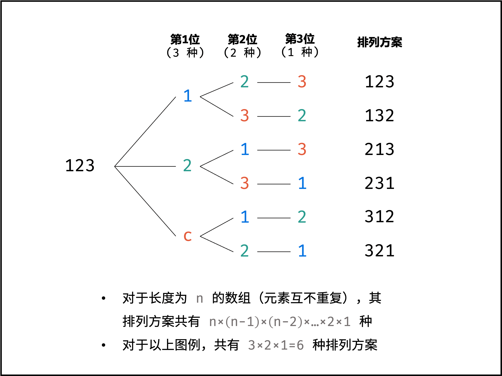

[#0046-permutations]
= 46. 全排列

https://leetcode.cn/problems/permutations/[LeetCode - 46. 全排列 ^]

给定一个不含重复数字的数组 `nums` ，返回其 _所有可能的全排列_ 。你可以 *按任意顺序* 返回答案。

*示例 1：*

....
输入：nums = [1,2,3]
输出：[[1,2,3],[1,3,2],[2,1,3],[2,3,1],[3,1,2],[3,2,1]]
....

*示例 2：*

....
输入：nums = [0,1]
输出：[[0,1],[1,0]]
....

*示例 3：*

....
输入：nums = [1]
输出：[[1]]
....

*提示：*

* `+1 <= nums.length <= 6+`
* `+-10 <= nums[i] <= 10+`
* `nums` 中的所有整数 *互不相同*

== 思路分析

[[src-0046]]
[tabs]
====
一刷::
+
--
[{java_src_attr}]
----
include::{sourcedir}/_0046_Permutations.java[tag=answer]
----
--

二刷::
+
--
[{java_src_attr}]
----
include::{sourcedir}/_0046_Permutations_2.java[tag=answer]
----
--

三刷::
+
--
[{java_src_attr}]
----
include::{sourcedir}/_0046_Permutations_3.java[tag=answer]
----
--

四刷（回溯）::
+
--
[{java_src_attr}]
----
include::{sourcedir}/_0046_Permutations_4.java[tag=answer]
----
--

五刷（子集）::
+
--
[{java_src_attr}]
----
include::{sourcedir}/_0046_Permutations_5.java[tag=answer]
----
--
====

== 参考资料

. https://leetcode.cn/problems/permutations/solutions/9914/hui-su-suan-fa-python-dai-ma-java-dai-ma-by-liweiw/[从全排列问题开始理解“回溯搜索”算法（深度优先遍历 + 状态重置 + 剪枝）^]
. https://leetcode.cn/problems/permutations/solutions/49013/hui-su-suan-fa-xiang-jie-by-labuladong-2/[回溯算法框架详解^]
. https://leetcode.cn/problems/permutations/solutions/2363882/46-quan-pai-lie-hui-su-qing-xi-tu-jie-by-6o7h/[46. 全排列 - （回溯，清晰图解）^]

