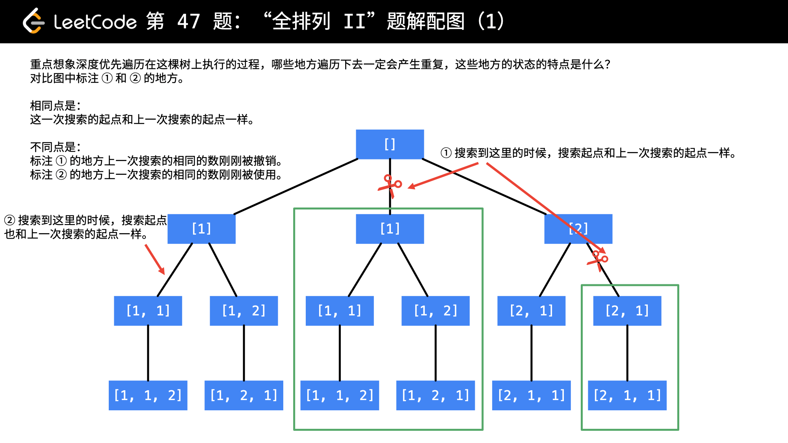

[#0047-permutations-ii]
= 47. Permutations II

https://leetcode.com/problems/permutations-ii/[LeetCode - Permutations II^]

Given a collection of numbers that might contain duplicates, return all possible unique permutations.

.Example:
[source]
----
Input: [1,1,2]
Output:
[
  [1,1,2],
  [1,2,1],
  [2,1,1]
]
----

== 思路分析

image::images/0047-02.png[{image_attr}]

image::images/0047-03.png[{image_attr}]

[[src-0047]]
[tabs]
====
一刷::
+
--
[{java_src_attr}]
----
include::{sourcedir}/_0047_PermutationsII.java[tag=answer]
----
--

二刷::
+
--
[{java_src_attr}]
----
include::{sourcedir}/_0047_PermutationsII_2.java[tag=answer]
----
--
====

思考：去重剪枝的判断是怎么实现的？

== 参考资料

. https://leetcode.cn/problems/permutations-ii/solutions/417937/quan-pai-lie-ii-by-leetcode-solution/[47. 全排列 II - 官方题解^]
. https://leetcode.cn/problems/permutations-ii/solutions/9917/hui-su-suan-fa-python-dai-ma-java-dai-ma-by-liwe-2/[47. 全排列 II - 回溯搜索 + 剪枝（Java、Python）^]
. https://leetcode.cn/problems/permutations-ii/solutions/2363888/47-quan-pai-lie-iihui-su-qing-xi-tu-jie-7ry7t/[47. 全排列 II - （回溯，清晰图解）^]
. https://leetcode.cn/problems/permutations-ii/solutions/71776/hot-100-47quan-pai-lie-ii-python3-hui-su-kao-lu-zh/[47. 全排列 II - 回溯 考虑重复^]

