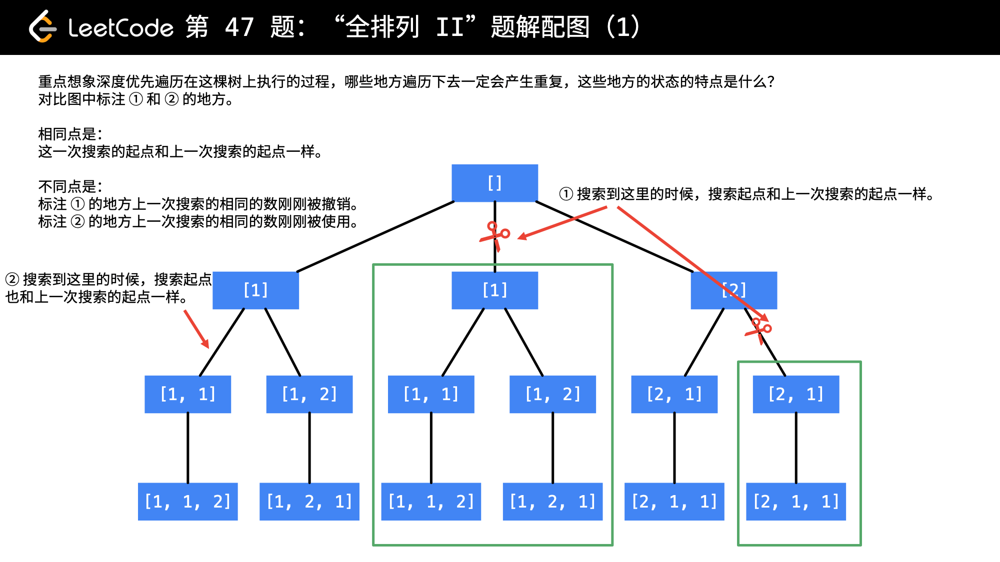

[#0047-permutations-ii]
= 47. Permutations II

https://leetcode.com/problems/permutations-ii/[LeetCode - Permutations II]

Given a collection of numbers that might contain duplicates, return all possible unique permutations.

.Example:
[source]
----
Input: [1,1,2]
Output:
[
  [1,1,2],
  [1,2,1],
  [2,1,1]
]
----

思考：去重剪枝的判断是怎么实现的？

== 参考资料

. https://leetcode-cn.com/problems/permutations-ii/solution/hui-su-suan-fa-python-dai-ma-java-dai-ma-by-liwe-2/[回溯搜索 + 剪枝 - 全排列 II - 力扣（LeetCode）]

Given a collection of numbers that might contain duplicates, return all possible unique permutations.

*Example:*

[subs="verbatim,quotes,macros"]
----
*Input:* [1,1,2]
*Output:*
[
  [1,1,2],
  [1,2,1],
  [2,1,1]
]
----

[[src-0047]]
[{java_src_attr}]
----
include::{sourcedir}/_0047_PermutationsII.java[]
----

