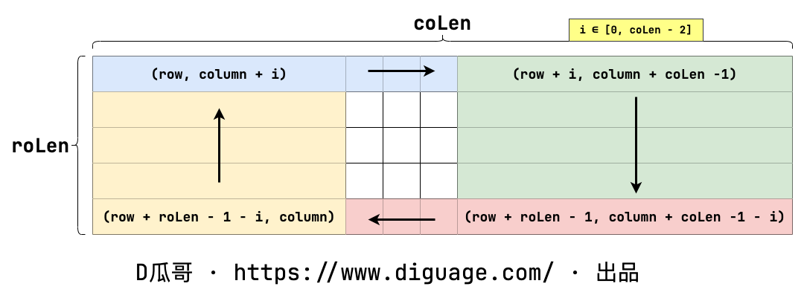

[#0048-rotate-image]
= 48. 旋转图像

https://leetcode.cn/problems/rotate-image/[LeetCode - 48. 旋转图像 ^]

给定一个 `n×n` 的二维矩阵 `matrix` 表示一个图像。请你将图像顺时针旋转 90 度。

你必须在 *https://baike.baidu.com/item/%E5%8E%9F%E5%9C%B0%E7%AE%97%E6%B3%95[原地]* 旋转图像，这意味着你需要直接修改输入的二维矩阵。*请不要* 使用另一个矩阵来旋转图像。

*示例 1：*

image::images/0048-00.jpg[{image_attr}]

....
输入：matrix = [[1,2,3],[4,5,6],[7,8,9]]
输出：[[7,4,1],[8,5,2],[9,6,3]]
....

*示例 2：*

image::images/0048-01.jpg[{image_attr}]

....
输入：matrix = [[5,1,9,11],[2,4,8,10],[13,3,6,7],[15,14,12,16]]
输出：[[15,13,2,5],[14,3,4,1],[12,6,8,9],[16,7,10,11]]
....

*提示：*

* `n == matrix.length == matrix[i].length`
* `+1 <= n <= 20+`
* `+-1000 <= matrix[i][j] <= 1000+`

[#思路分析]
== 思路分析

将矩阵周围一圈，划分成四个区域。如下图所示：

这样每个区域长度相等，使用循环做数字交换即可。另外，借助回溯思想，利用递归推进层次。

image:images/0048-03.png[{image_attr}]

image:images/0048-04.png[{image_attr}]

下面辅助矩阵的方案也不错：

image:images/0048-05.png[{image_attr}]

官方题解中的翻转矩阵的方案也不错！

[[src-0048]]
[tabs]
====
一刷::
+
--
[{java_src_attr}]
----
include::{sourcedir}/_0048_RotateImage.java[tag=answer]
----
--

二刷::
+
--
[{java_src_attr}]
----
include::{sourcedir}/_0048_RotateImage_2.java[tag=answer]
----
--

三刷::
+
--
[{java_src_attr}]
----
include::{sourcedir}/_0048_RotateImage_3.java[tag=answer]
----
--
====

== 参考资料

. https://leetcode.cn/problems/rotate-image/solutions/1228078/48-xuan-zhuan-tu-xiang-fu-zhu-ju-zhen-yu-jobi/?envType=study-plan-v2&envId=selected-coding-interview[48. 旋转图像 - 辅助矩阵 / 原地修改，清晰图解^]
. https://leetcode.cn/problems/rotate-image/solutions/526980/xuan-zhuan-tu-xiang-by-leetcode-solution-vu3m/?envType=study-plan-v2&envId=selected-coding-interview[48. 旋转图像 - 官方题解^]
