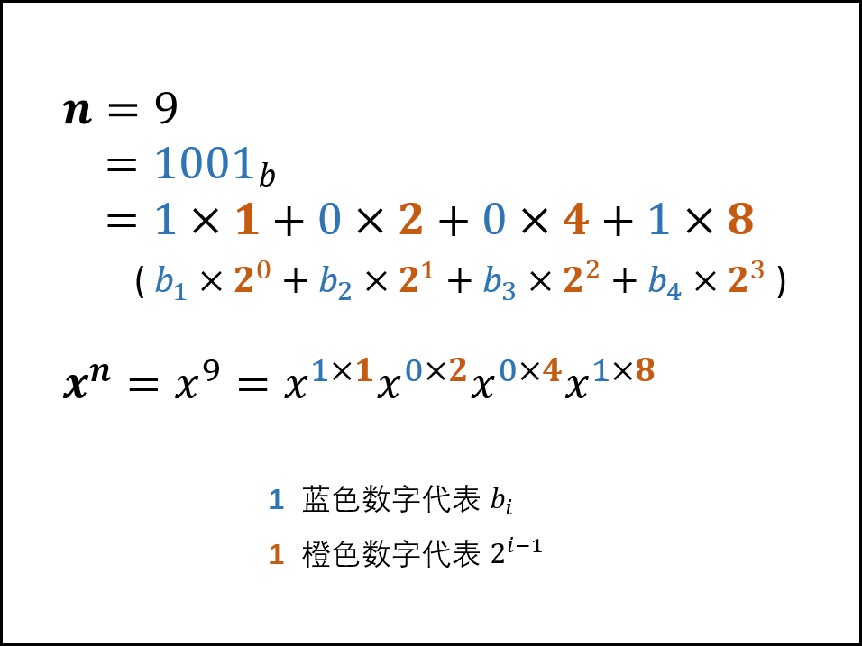
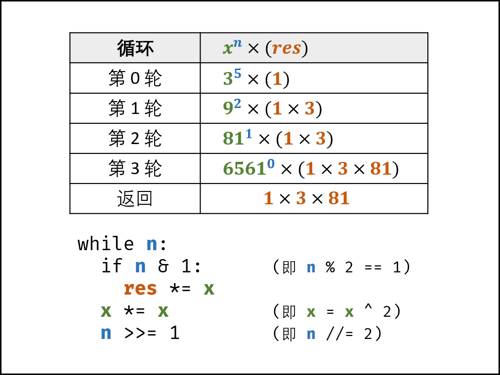

[#0050-powx-n]
= 50. Pow(x, n)

https://leetcode.cn/problems/powx-n/[LeetCode - 50. Pow(x, n) ^]

实现 https://www.cplusplus.com/reference/valarray/pow/[pow(x, n)] ，即计算 `x` 的整数 `n` 次幂函数（即，`x^n^`）。

*示例 1：*

....
输入：x = 2.00000, n = 10
输出：1024.00000
....

*示例 2：*

....
输入：x = 2.10000, n = 3
输出：9.26100
....

*示例 3：*

....
输入：x = 2.00000, n = -2
输出：0.25000
解释：2-2 = 1/22 = 1/4 = 0.25
....

*提示：*

* `-100.0 < x < 100.0`
* `-2^31^ \<= n \<= 2^31^-1`
* `n` 是一个整数
* 要么 `x` 不为零，要么 `n > 0` 。
* `-10^4^ \<= x^n^ \<= 10^4^`

== 思路分析

首先，可以把"一半的计算结果"存储起来，节省一半的递归调用；

其次，没想到还需要处理"无穷"的情况！

另外，思考一下，如果使用迭代来实现？

快速幂的算法能看懂，但代码不知道怎么写。

[[src-0050]]
[tabs]
====
一刷::
+
--
[{java_src_attr}]
----
include::{sourcedir}/_0050_PowXN.java[tag=answer]
----
--

二刷::
+
--
[{java_src_attr}]
----
include::{sourcedir}/_0050_PowXN_2.java[tag=answer]
----
--

三刷::
+
--
[{java_src_attr}]
----
include::{sourcedir}/_0050_PowXN_3.java[tag=answer]
----
--
====

== 参考资料

. https://leetcode.cn/problems/powx-n/solutions/238559/powx-n-by-leetcode-solution/[50. Pow(x, n) - 官方题解^]
. https://leetcode.cn/problems/powx-n/solutions/241471/50-powx-n-kuai-su-mi-qing-xi-tu-jie-by-jyd/[50. Pow(x, n) - 快速幂，清晰图解^]

