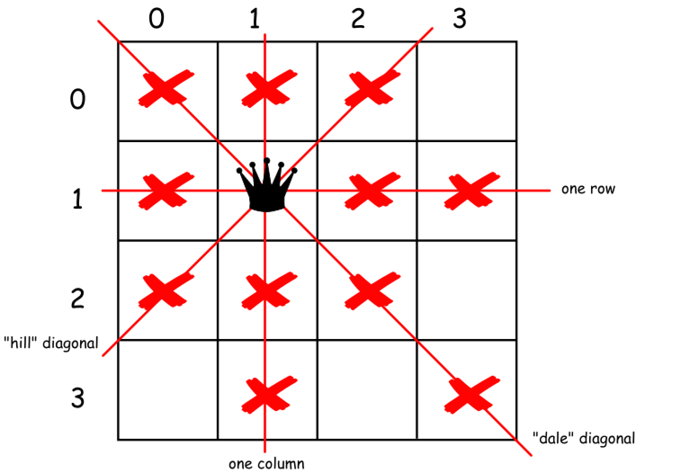
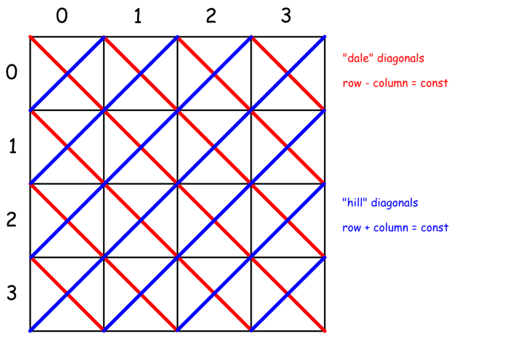

== 51. N-Queens

https://leetcode.com/problems/n-queens/[LeetCode - N-Queens]

The *__n__-queens* puzzle is the problem of placing *n* queens on an *n×n* chessboard such that no two queens attack each other.

image::images/0051-0-8-queens.png[]

Given an integer **n**, return all distinct solutions to the *__n__-queens* puzzle.

Each solution contains a distinct board configuration of the **__n__-queens**' placement, where `Q` and `.` both indicate a queen and an empty space respectively.

.Example:
----
Input: 4
Output: [
 [".Q..",  // Solution 1
  "...Q",
  "Q...",
  "..Q."],

 ["..Q.",  // Solution 2
  "Q...",
  "...Q",
  ".Q.."]
 ]

Explanation: There exist two distinct solutions to the 4-queens puzzle as shown above.
----

=== 解题分析

八皇后问题是回溯思想的经典题目。

当在棋盘上放置了一个皇后后，立即排除当前行，列和对应的两个对角线。这里有一点可以优化：**我们从上向下进行尝试，所以，只需要判断当前行以上的相关节点是否冲突即可。**另外，先检查再渐进点，合适之后，再向前走，可以做到有效地剪枝。

这里有个知识点需要注意：

对于所有的主对角线有 `行号 + 列号 = 常数`； +
对于所有的次对角线有 `行号 - 列号 = 常数`。 +
如下图所示：

利用回溯解题时，只回溯一半，然后将每个解反转即可求得另外一般解。这里有个细节需要注意：**如果长度是奇数，而且第一行中间是合法位置，则在回溯过程中已经产生了对称解法。就不需要再反转了。**。

=== 参考资料

. https://leetcode-cn.com/problems/n-queens/solution/nhuang-hou-by-leetcode/[51. N皇后 题解 - 力扣（LeetCode）]

The _n_-queens puzzle is the problem of placing _n_ queens on an _n_&times;_n_ chessboard such that no two queens attack each other.

Given an integer _n_, return all distinct solutions to the _n_-queens puzzle.

Each solution contains a distinct board configuration of the _n_-queens' placement, where `'Q'` and `'.'` both indicate a queen and an empty space respectively.

*Example:*

[subs="verbatim,quotes"]
----
*Input:* 4
*Output:* [
 [".Q..",  // Solution 1
  "...Q",
  "Q...",
  "..Q."],

 ["..Q.",  // Solution 2
  "Q...",
  "...Q",
  ".Q.."]
]
*Explanation:* There exist two distinct solutions to the 4-queens puzzle as shown above.
----

