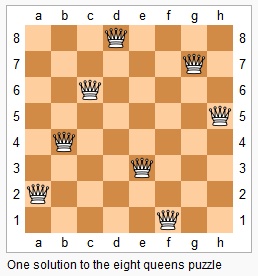
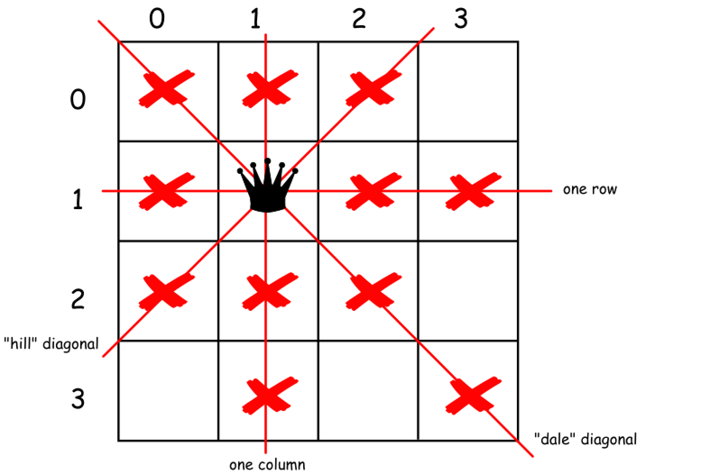
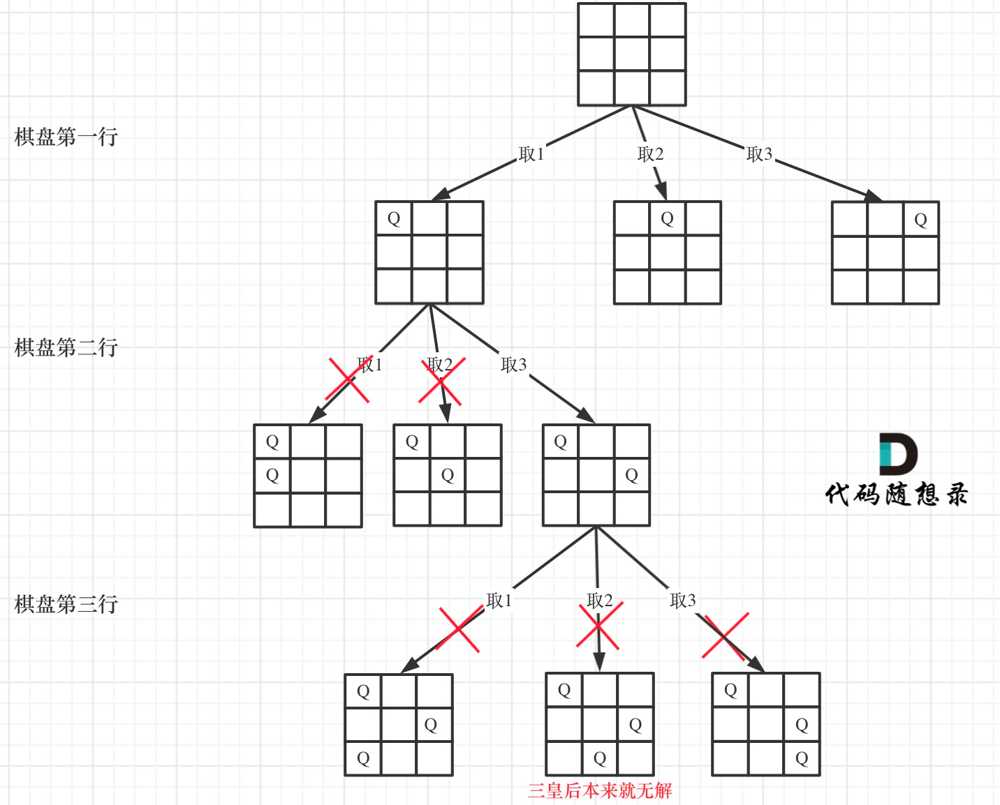

[#0051-n-queens]
= 51. N-Queens

https://leetcode.com/problems/n-queens/[LeetCode - N-Queens]

The *__n__-queens* puzzle is the problem of placing *n* queens on an *n×n* chessboard such that no two queens attack each other.

Given an integer **n**, return all distinct solutions to the *__n__-queens* puzzle.

Each solution contains a distinct board configuration of the **__n__-queens**' placement, where `Q` and `.` both indicate a queen and an empty space respectively.

.Example:
----
Input: 4
Output: [
 [".Q..",  // Solution 1
  "...Q",
  "Q...",
  "..Q."],

 ["..Q.",  // Solution 2
  "Q...",
  "...Q",
  ".Q.."]
 ]

Explanation: There exist two distinct solutions to the 4-queens puzzle as shown above.
----

== 解题分析

八皇后问题是回溯思想的经典题目。

当在棋盘上放置了一个皇后后，立即排除当前行，列和对应的两个对角线。这里有一点可以优化：**我们从上向下进行尝试，所以，只需要判断当前行以上的相关节点是否冲突即可。**另外，先检查再渐进点，合适之后，再向前走，可以做到有效地剪枝。

这里有个知识点需要注意：

对于所有的主对角线有 `行号 + 列号 = 常数`； +
对于所有的次对角线有 `行号 - 列号 = 常数`。 +
如下图所示：

image::images/0051-02.png[]

利用回溯解题时，只回溯一半，然后将每个解反转即可求得另外一般解。这里有个细节需要注意：**如果长度是奇数，而且第一行中间是合法位置，则在回溯过程中已经产生了对称解法。就不需要再反转了。**。

[[src-0051]]
[{java_src_attr}]
----
include::{sourcedir}/_0051_NQueens.java[]
----

第二次自己实现，没有使用反转，感觉更容易理解。

[{java_src_attr}]
----
include::{sourcedir}/_0051_NQueens_2.java[]
----

== 参考资料

. https://leetcode.cn/problems/n-queens/solutions/398929/nhuang-hou-by-leetcode-solution/[51. N 皇后 - 官方题解^]
. https://leetcode.cn/problems/n-queens/solutions/2566744/dai-ma-sui-xiang-lu-leetcode51nhuang-hou-hcat/[51. N 皇后 - 代码随想录^]

