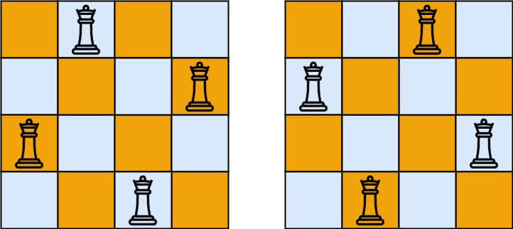

[#0052-n-queens-ii]
= 52. N-Queens II

https://leetcode.com/problems/n-queens-ii/[LeetCode - N-Queens II]

The *__n__-queens* puzzle is the problem of placing *n* queens on an *n×n* chessboard such that no two queens attack each other.

Given an integer **n**, return the number of distinct solutions to the *__n__-queens* puzzle.

.Example:
----
Input: 4
Output: 2
Explanation: There are two distinct solutions to the 4-queens puzzle as shown below.
[
 [".Q..",  // Solution 1
  "...Q",
  "Q...",
  "..Q."],

 ["..Q.",  // Solution 2
  "Q...",
  "...Q",
  ".Q.."]
]
----

== 解题分析

解题分析参考 xref:0051-n-queens.adoc[N-Queens]。

[[src-0052]]
[{java_src_attr}]
----
include::{sourcedir}/_0052_NQueensII.java[]
----

[{java_src_attr}]
----
include::{sourcedir}/_0052_NQueensII_2.java[]
----

== 参考资料

. https://leetcode.cn/problems/n-queens-ii/solutions/449388/nhuang-hou-ii-by-leetcode-solution/[52. N 皇后 II - 官方题解^]
. https://leetcode.cn/problems/n-queens-ii/solutions/5577/dfs-wei-yun-suan-jian-zhi-by-makeex/[52. N 皇后 II - DFS + 位运算剪枝^]  -- 简洁，但是一脸懵逼。
. https://leetcode.cn/problems/n-queens-ii/solutions/449558/52-nhuang-hou-iihui-su-fa-jing-dian-wen-ti-xiang-j/[代码随想录」52. N皇后 II:【回溯法经典问题】详解^]
