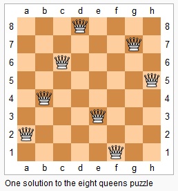

== 52. N-Queens II

https://leetcode.com/problems/n-queens-ii/[LeetCode - N-Queens II]

The *__n__-queens* puzzle is the problem of placing *n* queens on an *n×n* chessboard such that no two queens attack each other.

Given an integer **n**, return the number of distinct solutions to the *__n__-queens* puzzle.

.Example:
----
Input: 4
Output: 2
Explanation: There are two distinct solutions to the 4-queens puzzle as shown below.
[
 [".Q..",  // Solution 1
  "...Q",
  "Q...",
  "..Q."],

 ["..Q.",  // Solution 2
  "Q...",
  "...Q",
  ".Q.."]
]
----

=== 解题分析

解题分析参考 xref:0051-n-queens.adoc[N-Queens]。

The _n_-queens puzzle is the problem of placing _n_ queens on an _n_&times;_n_ chessboard such that no two queens attack each other.

image::https://assets.leetcode.com/uploads/2018/10/12/8-queens.png[]

Given an integer _n_, return the number of distinct solutions to the _n_-queens puzzle.

*Example:*

[subs="verbatim,quotes,macros"]
----
*Input:* 4
*Output:* 2
*Explanation:* There are two distinct solutions to the 4-queens puzzle as shown below.
[
 [".Q..",  // Solution 1
  "...Q",
  "Q...",
  "..Q."],

 ["..Q.",  // Solution 2
  "Q...",
  "...Q",
  ".Q.."]
]
----

