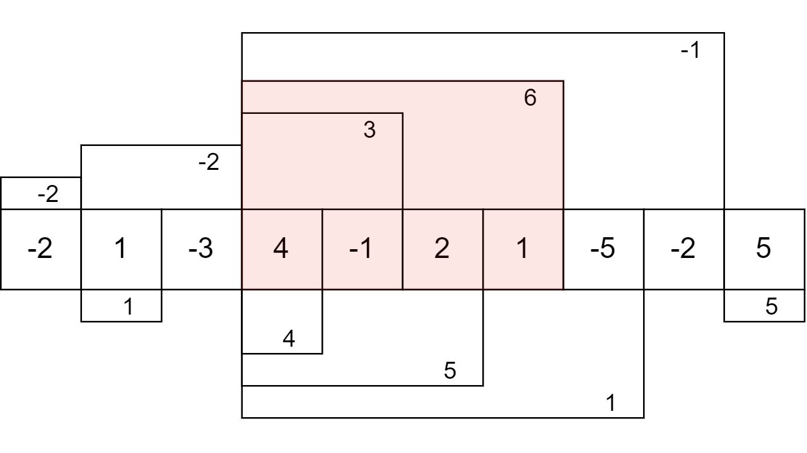

[#0053-maximum-subarray]
= 53. 最大子数组和

https://leetcode.cn/problems/maximum-subarray/[LeetCode - 53. 最大子数组和^]

给你一个整数数组 `nums`，请你找出一个具有最大和的连续子数组（子数组最少包含一个元素），返回其最大和。

**子数组**是数组中的一个连续部分。

*示例 1：*

....
输入：nums = [-2,1,-3,4,-1,2,1,-5,4]
输出：6
解释：连续子数组 [4,-1,2,1] 的和最大，为 6 。
....

*示例 2：*

....
输入：nums = [1]
输出：1
....

*示例 3：*

....
输入：nums = [5,4,-1,7,8]
输出：23
....

*提示：*

* `1 \<= nums.length \<= 10^5^`
* `-10^4^ \<= nums[i] \<= 10^4^`

**进阶：**如果你已经实现复杂度为 stem:[O(n)] 的解法，尝试使用更为精妙的 *分治法* 求解。

== 思路分析

使用动态规划，在“当前元素”与“当前元素加之前数组的和”之间，取最大值作为动态规划的结果，向前推进。在所有动态结果中，取最大值即可。

stem:[f(x)] 表示从 `0` 到第 `x` 个元素的最大子数组和，如果第 `x-1` 个元素的最大子数组之和大于 `0`，则可以继续向上“盖楼”；当小于等于 `0` 时，可以抛弃前面的元素从新开始。则递推公式是： stem:[f(x)=max(f(x-1),0)+a[x\]]。这个做法也叫做 Kadane 算法。

NOTE: 另有更精妙的分治解法和前缀和解法，抽空再尝试。

[[src-0053]]
[tabs]
====
一刷::
+
--
[{java_src_attr}]
----
include::{sourcedir}/_0053_MaximumSubarray.java[tag=answer]
----
--

二刷::
+
--
[{java_src_attr}]
----
include::{sourcedir}/_0053_MaximumSubarray_2.java[tag=answer]
----
--

三刷::
+
--
[{java_src_attr}]
----
include::{sourcedir}/_0053_MaximumSubarray_3.java[tag=answer]
----
--

四刷::
+
--
[{java_src_attr}]
----
include::{sourcedir}/_0053_MaximumSubarray_4.java[tag=answer]
----
--

五刷::
+
--
[{java_src_attr}]
----
include::{sourcedir}/_0053_MaximumSubarray_5.java[tag=answer]
----
--
====

== 参考资料

. https://leetcode.cn/problems/maximum-subarray/solutions/2533977/qian-zhui-he-zuo-fa-ben-zhi-shi-mai-mai-abu71/[53. 最大子数组和 - 两种方法：前缀和+贪心 / 动态规划，附变形题^]
. https://leetcode.cn/problems/maximum-subarray/solutions/228009/zui-da-zi-xu-he-by-leetcode-solution/[53. 最大子数组和 - 官方题解^]
. https://leetcode.cn/problems/maximum-subarray/solutions/9058/dong-tai-gui-hua-fen-zhi-fa-python-dai-ma-java-dai/[53. 最大子数组和 - 经典动态规划问题（理解「无后效性」）^]
. https://zh.wikipedia.org/wiki/%E6%9C%80%E5%A4%A7%E5%AD%90%E6%95%B0%E5%88%97%E9%97%AE%E9%A2%98[最大子数列问题^]
. https://en.wikipedia.org/wiki/Maximum_subarray_problem[Maximum subarray problem - Wikipedia^]

