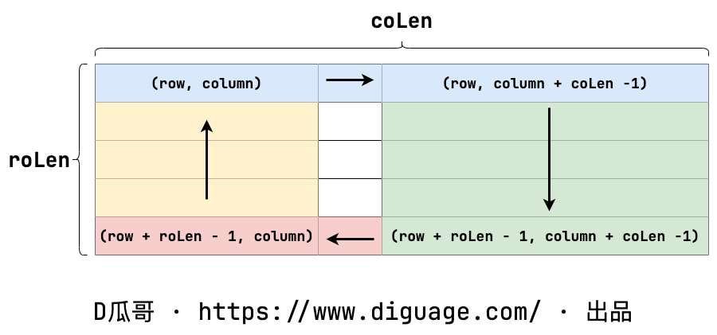

[#0054-spiral-matrix]
= 54. 螺旋矩阵

https://leetcode.cn/problems/spiral-matrix/[LeetCode - 54. 螺旋矩阵 ^]

给你一个 `m` 行 `n` 列的矩阵 `matrix` ，请按照 *顺时针螺旋顺序*，返回矩阵中的所有元素。

*示例 1：*

image::images/0054-01.jpg[{image_attr}]

....
输入：matrix = [[1,2,3],[4,5,6],[7,8,9]]
输出：[1,2,3,6,9,8,7,4,5]
....

*示例 2：*

image::images/0054-02.jpg[{image_attr}]

....
输入：matrix = [[1,2,3,4],[5,6,7,8],[9,10,11,12]]
输出：[1,2,3,4,8,12,11,10,9,5,6,7]
....

*提示：*

* `m == matrix.length`
* `n == matrix[i].length`
* `+1 <= m, n <= 10+`
* `+-100 <= matrix[i][j] <= 100+`

== 思路分析

从回溯思想得到启发，使用递归来逐层推进。每次方法调用只负责指定层的遍历，向里推进层次的工作，交给递归来完成。这样避免了复杂的判断。

[[src-0054]]
[tabs]
====
一刷::
+
--
[{java_src_attr}]
----
include::{sourcedir}/_0054_SpiralMatrix.java[tag=answer]
----
--

二刷::
+
--
[{java_src_attr}]
----
include::{sourcedir}/_0054_SpiralMatrix_2.java[tag=answer]
----
--

三刷::
+
--
[{java_src_attr}]
----
include::{sourcedir}/_0054_SpiralMatrix_3.java[tag=answer]
----
--
====

== 参考资料

. https://leetcode.cn/problems/spiral-matrix/solutions/275393/luo-xuan-ju-zhen-by-leetcode-solution/?envType=study-plan-v2&envId=selected-coding-interview[54. 螺旋矩阵 - 官方题解^]
. https://leetcode.cn/problems/spiral-matrix/solutions/2362055/54-luo-xuan-ju-zhen-mo-ni-qing-xi-tu-jie-juvi/?envType=study-plan-v2&envId=selected-coding-interview[54. 螺旋矩阵 - 模拟，清晰图解^]

