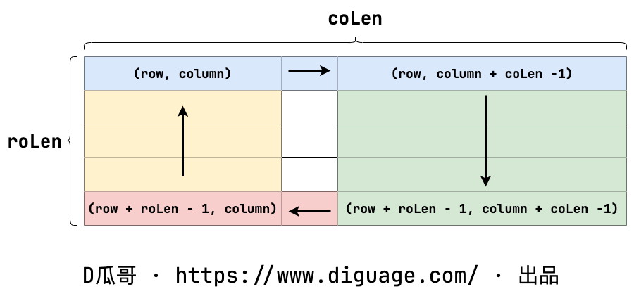

[#0059-spiral-matrix-ii]
= 59. Spiral Matrix II

{leetcode}/problems/spiral-matrix-ii/[LeetCode - Spiral Matrix II^]

Given a positive integer _n_, generate a square matrix filled with elements from 1 to _n_^2^ in spiral order.

*Example:*

[subs="verbatim,quotes,macros"]
----
*Input:* 3
*Output:*
[
 [ 1, 2, 3 ],
 [ 8, 9, 4 ],
 [ 7, 6, 5 ]
]
----

== 思路分析

利用 xref:0054-spiral-matrix.adoc[54. Spiral Matrix] 的思路，从回溯思想得到启发，使用递归来逐层推进。每次方法调用只负责指定层的遍历，向里推进层次的工作，交给递归来完成。这样避免了复杂的判断。

[[src-0059]]
[tabs]
====
一刷::
+
--
[{java_src_attr}]
----
include::{sourcedir}/_0059_SpiralMatrixII.java[tag=answer]
----
--

二刷::
+
--
[{java_src_attr}]
----
include::{sourcedir}/_0059_SpiralMatrixII_2.java[tag=answer]
----
--
====

== 参考资料

. https://leetcode.cn/problems/spiral-matrix-ii/solutions/12594/spiral-matrix-ii-mo-ni-fa-she-ding-bian-jie-qing-x/?envType=study-plan-v2&envId=selected-coding-interview[59. 螺旋矩阵 II - 模拟，清晰图解^]
. https://leetcode.cn/problems/spiral-matrix-ii/solutions/658676/luo-xuan-ju-zhen-ii-by-leetcode-solution-f7fp/?envType=study-plan-v2&envId=selected-coding-interview[59. 螺旋矩阵 II - 官方题解^]
