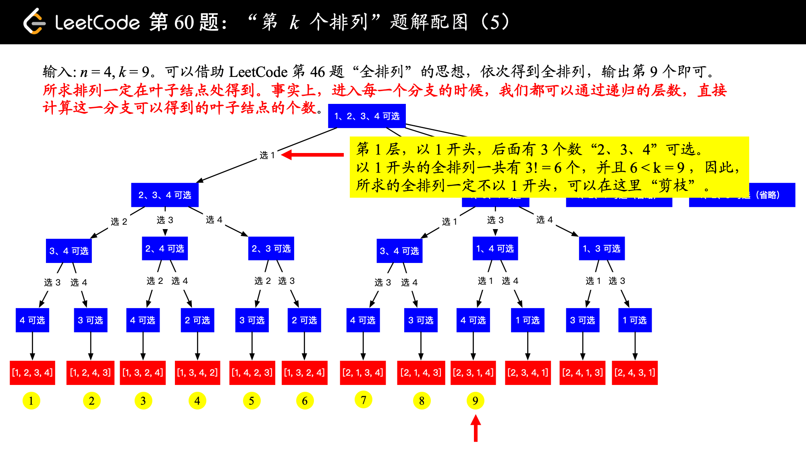
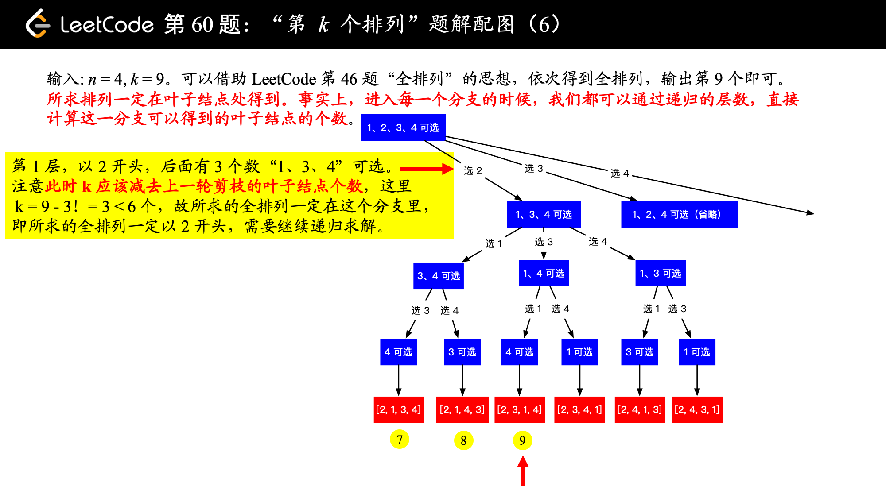

== 60. Permutation Sequence

https://leetcode.com/problems/permutation-sequence/[LeetCode - Permutation Sequence]

The set `[1,2,3,...,n]` contains a total of n! unique permutations.

By listing and labeling all of the permutations in order, we get the following sequence for `n` = 3:

. "123"
. "132"
. "213"
. "231"
. "312"
. "321"

Given `n` and `k`, return the `k`^th^ permutation sequence.

*Note:*

* Given `n` will be between 1 and 9 inclusive.
* Given `k` will be between 1 and n! inclusive.

.Example 1:
----
Input: n = 3, k = 3
Output: "213"
----

.Example 2:
----
Input: n = 4, k = 9
Output: "2314"
----

=== 解题分析

不需要生成所有的全排列。如图，通过剪枝，只需要生成需要的排列的路径即可。

这里的重点是如何剪枝！

=== 思考题

对回溯再推敲推敲！

=== 参考资料

. https://leetcode-cn.com/problems/permutation-sequence/solution/hui-su-jian-zhi-python-dai-ma-java-dai-ma-by-liwei/[深度优先遍历 + 剪枝、双链表模拟 - 第k个排列 - 力扣（LeetCode）]

The set `[1,2,3,...,_n_]` contains a total of _n_! unique permutations.

By listing and labeling all of the permutations in order, we get the following sequence for _n_ = 3:

* `"123"`
* `"132"`
* `"213"`
* `"231"`
* `"312"`
* `"321"`

Given _n_ and _k_, return the _k_^th^ permutation sequence.

*Note:*

* Given _n_ will be between 1 and 9 inclusive.
* Given _k_ will be between 1 and _n_! inclusive.

*Example 1:*

[subs="verbatim,quotes,macros"]
----
*Input:* n = 3, k = 3
*Output:* "213"
----

*Example 2:*

[subs="verbatim,quotes,macros"]
----
*Input:* n = 4, k = 9
*Output:* "2314"
----

