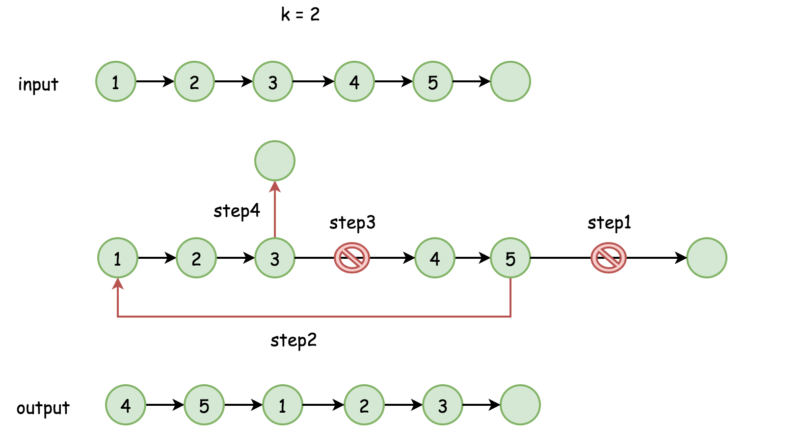

[#0061-rotate-list]
= 61. Rotate List

{leetcode}/problems/rotate-list/[LeetCode - Rotate List^]

Given a linked list, rotate the list to the right by `k` places, where k is non-negative.

.Example 1:
----
Input: 1->2->3->4->5->NULL, k = 2
Output: 4->5->1->2->3->NULL
Explanation:
rotate 1 steps to the right: 5->1->2->3->4->NULL
rotate 2 steps to the right: 4->5->1->2->3->NULL
----

.Example 2:
----
Input: 0->1->2->NULL, k = 4
Output: 2->0->1->NULL
Explanation:
rotate 1 steps to the right: 2->0->1->NULL
rotate 2 steps to the right: 1->2->0->NULL
rotate 3 steps to the right: 0->1->2->NULL
rotate 4 steps to the right: 2->0->1->NULL
----

== 解题分析

这个环形解题法很赞！

[[src-0061]]
[{java_src_attr}]
----
include::{sourcedir}/_0061_RotateList.java[tag=answer]
----

== 参考资料

. https://leetcode-cn.com/problems/rotate-list/solution/xuan-zhuan-lian-biao-by-leetcode/[旋转链表 - 旋转链表 - 力扣（LeetCode）^]

