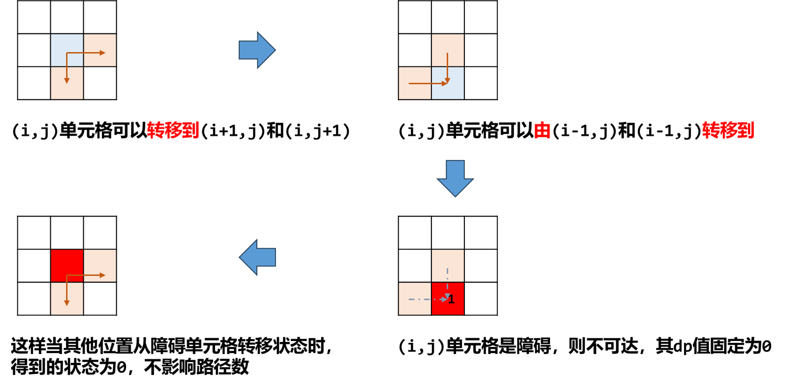

[#0063-unique-paths-ii]
= 63. Unique Paths II

{leetcode}/problems/unique-paths-ii/[LeetCode - Unique Paths II^]

A robot is located at the top-left corner of a _m_ x _n_ grid (marked 'Start' in the diagram below).

The robot can only move either down or right at any point in time. The robot is trying to reach the bottom-right corner of the grid (marked 'Finish' in the diagram below).

Now consider if some obstacles are added to the grids. How many unique paths would there be?

image::https://assets.leetcode.com/uploads/2018/10/22/robot_maze.png[{image_attr}]

An obstacle and empty space is marked as `1` and `0` respectively in the grid.

*Note:* _m_ and _n_ will be at most 100.

*Example 1:*

[subs="verbatim,quotes,macros"]
----
*Input:
*[
  [0,0,0],
  [0,1,0],
  [0,0,0]
]
*Output:* 2
*Explanation:*
There is one obstacle in the middle of the 3x3 grid above.
There are two ways to reach the bottom-right corner:
1. Right -> Right -> Down -> Down
2. Down -> Down -> Right -> Right
----

== 思路分析

[[src-0063]]
[tabs]
====
一刷::
+
--
[{java_src_attr}]
----
include::{sourcedir}/_0063_UniquePathsII.java[tag=answer]
----
--

二刷::
+
--
[{java_src_attr}]
----
include::{sourcedir}/_0063_UniquePathsII_2.java[tag=answer]
----
--
====

== 参考资料

. https://leetcode.cn/problems/unique-paths-ii/solutions/316968/bu-tong-lu-jing-ii-by-leetcode-solution-2/[63. 不同路径 II - 官方题解^]
. https://leetcode.cn/problems/unique-paths-ii/solutions/2732049/javapython3cdong-tai-gui-hua-kong-jian-y-nyjy/[63. 不同路径 II - 动态规划 + 空间优化^]

