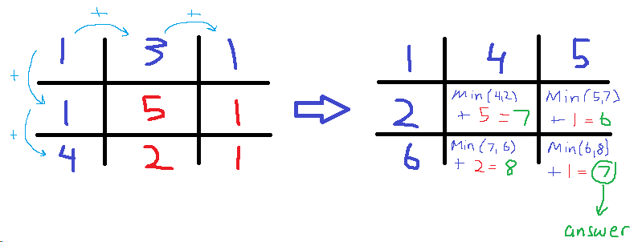
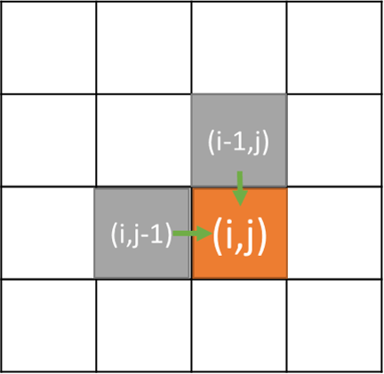

= 64. Minimum Path Sum

https://leetcode.com/problems/minimum-path-sum/[LeetCode - Minimum Path Sum]

Given a _m x n_ grid filled with non-negative numbers, find a path from top left to bottom right which _minimizes_ the sum of all numbers along its path.

*Note:* You can only move either down or right at any point in time.

.Example:
[source]
----
Input:
[
  [1,3,1],
  [1,5,1],
  [4,2,1]
]
Output: 7
Explanation: Because the path 1→3→1→1→1 minimizes the sum.
----

思考题：尝试使用一维数组做备忘录来实现一下。

Given a _m_ x _n_ grid filled with non-negative numbers, find a path from top left to bottom right which _minimizes_ the sum of all numbers along its path.

*Note:* You can only move either down or right at any point in time.

*Example:*

[subs="verbatim,quotes,macros"]
----
*Input:*
[
  [1,3,1],
  [1,5,1],
  [4,2,1]
]
*Output:* 7
*Explanation:* Because the path 1&rarr;3&rarr;1&rarr;1&rarr;1 minimizes the sum.
----

[[src-0064]]
[{java_src_attr}]
----
include::{sourcedir}/_0064_MinimumPathSum.java[]
----

