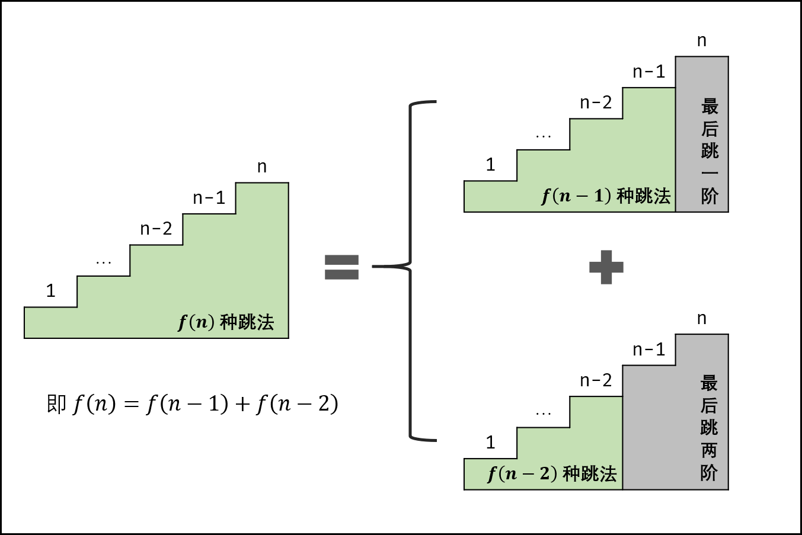

[#0070-climbing-stairs]
= 70. Climbing Stairs

https://leetcode.com/problems/climbing-stairs/[LeetCode - Climbing Stairs]

You are climbing a stair case. It takes _n_ steps to reach to the top.

Each time you can either climb 1 or 2 steps. In how many distinct ways can you climb to the top?

*Note:* Given _n_ will be a positive integer.

*Example 1:*

[subs="verbatim,quotes,macros"]
----
*Input:* 2
*Output:* 2
*Explanation:* There are two ways to climb to the top.
1. 1 step + 1 step
2. 2 steps
----

*Example 2:*

[subs="verbatim,quotes,macros"]
----
*Input:* 3
*Output:* 3
*Explanation:* There are three ways to climb to the top.
1. 1 step + 1 step + 1 step
2. 1 step + 2 steps
3. 2 steps + 1 step
----

== 解题分析

最简单只有一个台阶，只有 1 种方法；

当有两个台阶时，可以从地面跳起；也可以从第一个台阶跳起；

以此类推：当第 n 个台阶时，可以从第 n-2 个台阶跳起；也可以从第 n-1 个台阶跳起。

到这里就很明显了，这是一个斐波那契数列。

让 D瓜哥 使用 https://www.diguage.com/post/dynamic-programming/[动态规划的模式] 来重新解读一下：

. 刻画一个最优解的结构特征：跳到第 n 个台阶最多的跳法。
. 递归地定义最优解的值： `dp[n] = dp[n-2] + dp[n-1]`。
. 计算最优解的值，通常采用自底向上的方法：D瓜哥也按照动态规划（注意表格）的方式来实现，采用自底向上+备忘录的方式来求解，创建一个长度为 n+1 的数组，第 i 个元素表示有相应的跳法，则第 1 个元素为 1，第 2 个元素为 2。然后以此类推……
. 利用计算出的信息构造一个最优解。这一步不需要，暂时忽略。

D瓜哥 再插播一句，知道是斐波那契数列，各种解法都好搞了，甚至可以使用斐波那契数列公式来解题了。😆

[asciimath]
++++
F_{n}=1 / \sqrt{5}\left[\left(\frac{1+\sqrt{5}}{2}\right)^{n}-\left(\frac{1-\sqrt{5}}{2}\right)^{n}\right]
++++

[[src-0070]]
[{java_src_attr}]
----
include::{sourcedir}/_0070_ClimbingStairs.java[]
----

