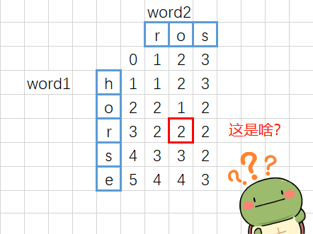
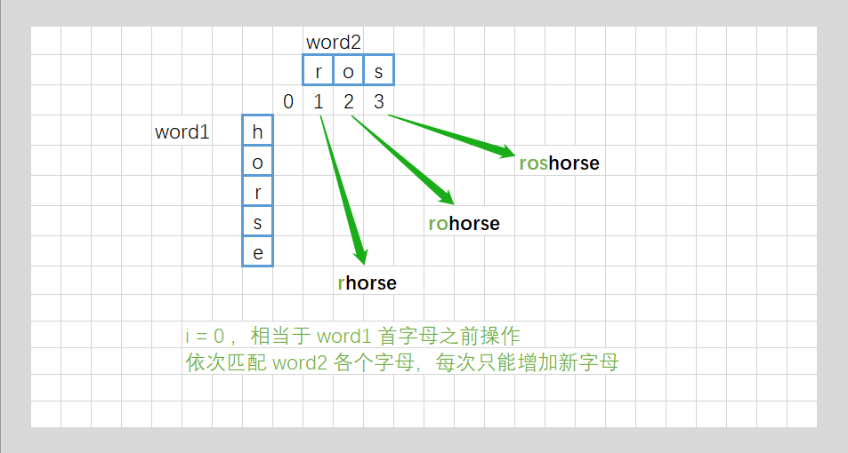
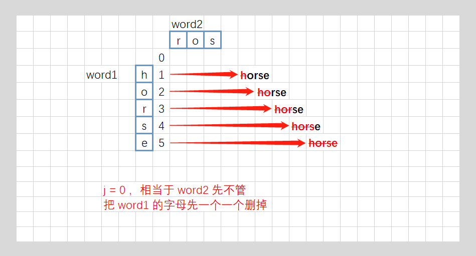
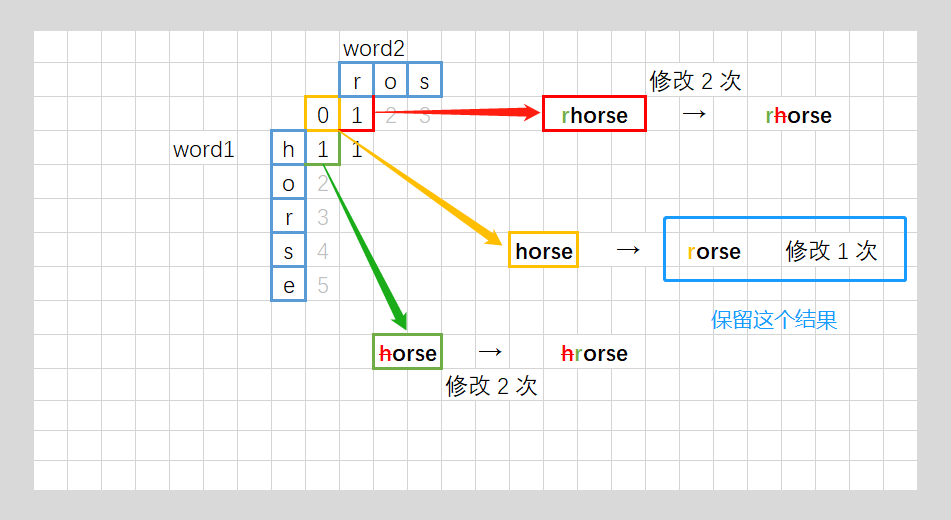
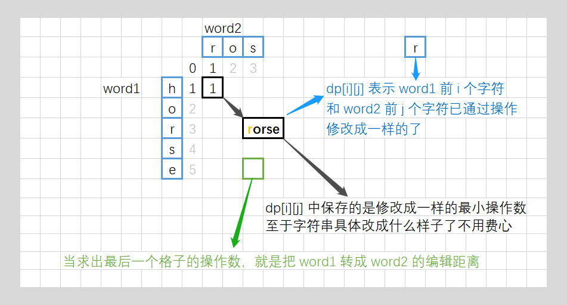
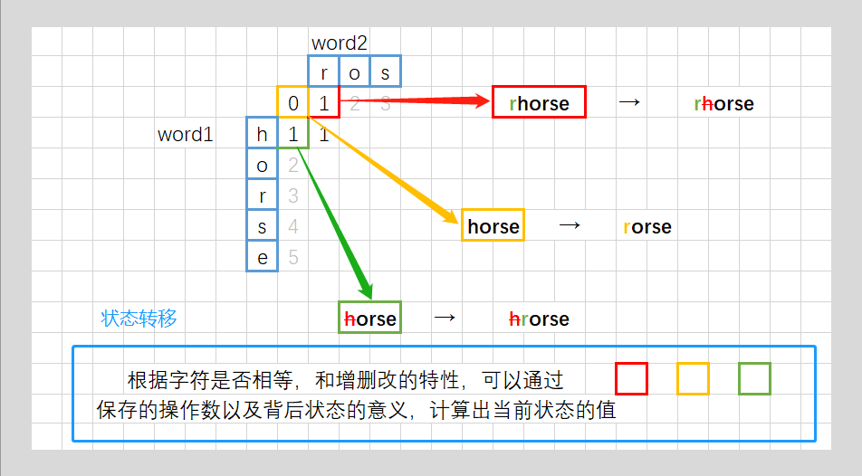
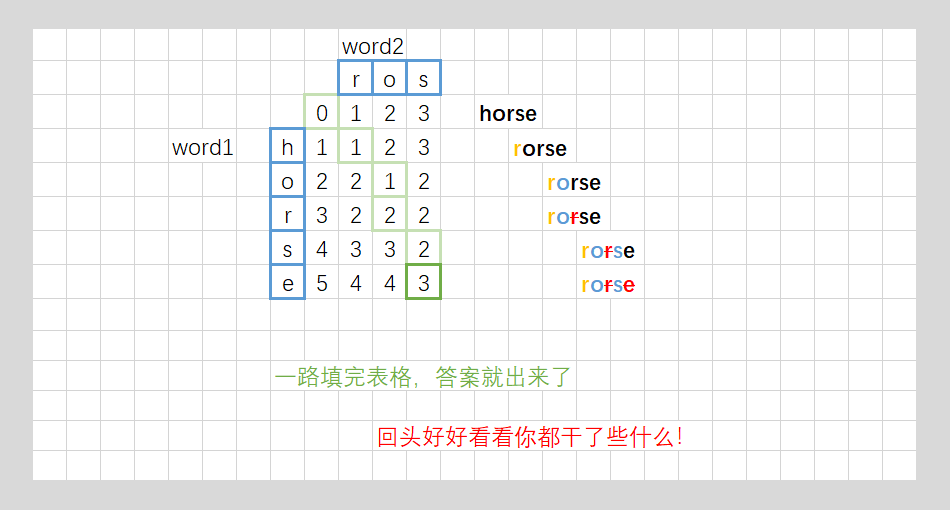

[#0072-edit-distance]
= 72. 编辑距离

https://leetcode.cn/problems/edit-distance/[LeetCode - 72. 编辑距离^]

给你两个单词 `word1` 和 `word2`，_请返回将 `word1` 转换成 `word2` 所使用的最少操作数_ 。

你可以对一个单词进行如下三种操作：

* 插入一个字符
* 删除一个字符
* 替换一个字符

*示例1：*

....
输入：word1 = "horse", word2 = "ros"
输出：3
解释：
horse -> rorse (将 'h' 替换为 'r')
rorse -> rose (删除 'r')
rose -> ros (删除 'e')
....

*示例2：*

....
输入：word1 = "intention", word2 = "execution"
输出：5
解释：
intention -> inention (删除 't')
inention -> enention (将 'i' 替换为 'e')
enention -> exention (将 'n' 替换为 'x')
exention -> exection (将 'n' 替换为 'c')
exection -> execution (插入 'u')
....

*提示：*

* `0 \<= word1.length, word2.length \<= 500`
* `word1` 和 `word2` 由小写英文字母组成

== 思路分析

动态规划：计算 `dp[c][r]` 时，从相邻三个元素获取递推的含义还要好好思考一下，“增”、“删”和“改”的含义要理解清楚。

`dp[i][j]` 代表 `word1` 中前 `i` 个字符，变换到 `word2` 中前 `j` 个字符，最短需要操作的次数。

[[src-0072]]
[tabs]
====
一刷::
+
--
[{java_src_attr}]
----
include::{sourcedir}/_0072_EditDistance.java[tag=answer]
----
--

二刷::
+
--
[{java_src_attr}]
----
include::{sourcedir}/_0072_EditDistance_2.java[tag=answer]
----
--

三刷::
+
--
[{java_src_attr}]
----
include::{sourcedir}/_0072_EditDistance_3.java[tag=answer]
----
--
====

== 思考题

思考如何进一步优化成一维数组？

== 参考资料

. https://leetcode.cn/problems/edit-distance/solutions/189676/edit-distance-by-ikaruga/[72. 编辑距离 - 【编辑距离】入门动态规划，你定义的 dp 里到底存了啥^]
. https://leetcode.cn/problems/edit-distance/solutions/188223/bian-ji-ju-chi-by-leetcode-solution/[72. 编辑距离 - 官方题解^]
. https://leetcode.cn/problems/edit-distance/solutions/2133222/jiao-ni-yi-bu-bu-si-kao-dong-tai-gui-hua-uo5q/[72. 编辑距离 - 【视频】教你一步步思考动态规划，从记忆化搜索到递推到空间优化！^] -- 从递归到动态规划，从矩阵到一维数组，逐步优化。

