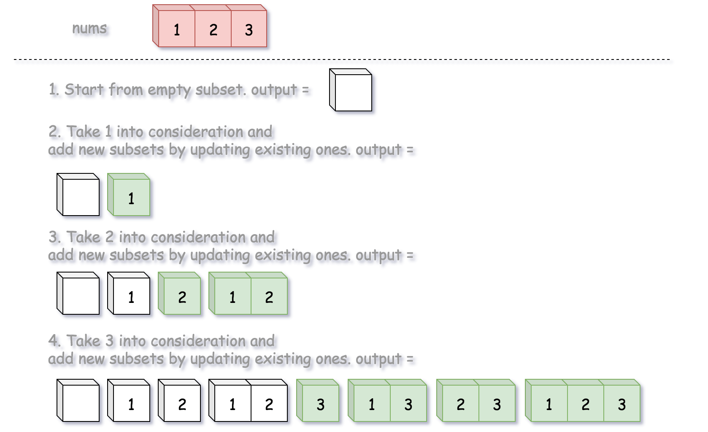
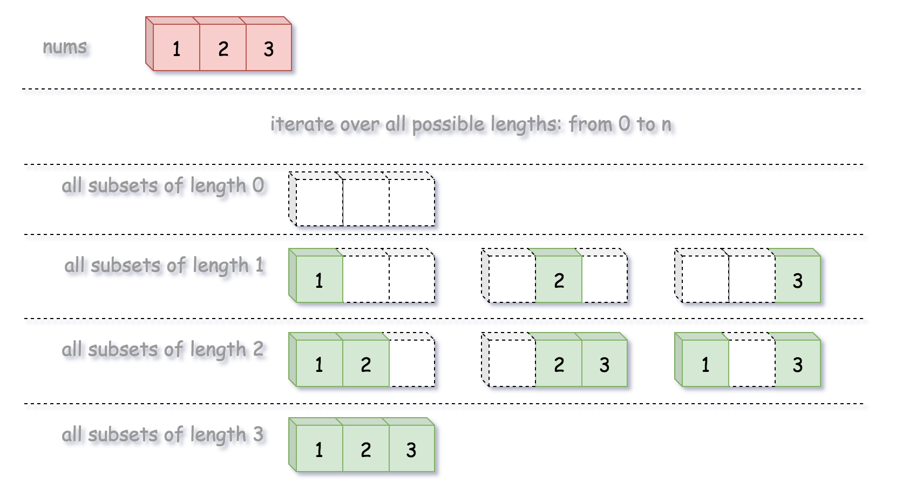
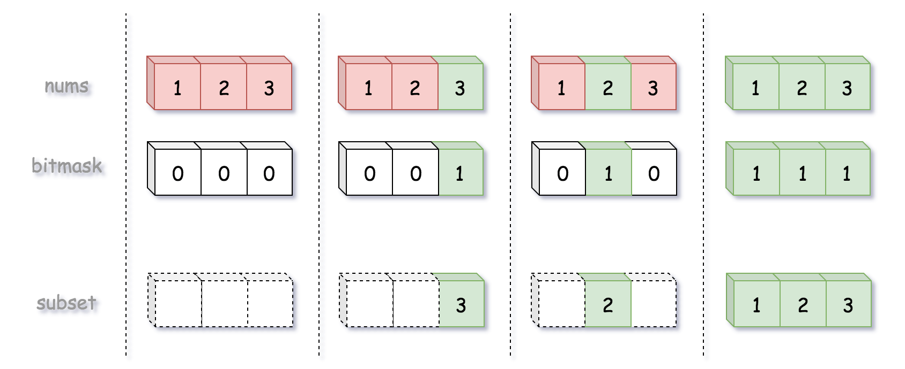

== 78. Subsets

https://leetcode.com/problems/subsets/[LeetCode - Subsets]

Given a set of *distinct* integers, nums, return all possible subsets (the power set).

*Note:* The solution set must not contain duplicate subsets.

.Example:
----
Input: nums = [1,2,3]
Output:
[
  [3],
  [1],
  [2],
  [1,2,3],
  [1,3],
  [2,3],
  [1,2],
  []
]
----

=== 解题分析

这道题跟 xref:0090-subsets-ii.adoc[90. Subsets II] 类似。

image::images/0078-subsets-backtracking.png[]

=== 参考资料

. https://leetcode.com/problems/subsets/solution/[Subsets solution - LeetCode]

Given a set of *distinct* integers, _nums_, return all possible subsets (the power set).

*Note:* The solution set must not contain duplicate subsets.

*Example:*

[subs="verbatim,quotes,macros"]
----
*Input:* nums = [1,2,3]
*Output:*
[
  [3],
  [1],
  [2],
  [1,2,3],
  [1,3],
  [2,3],
  [1,2],
  []
]
----

